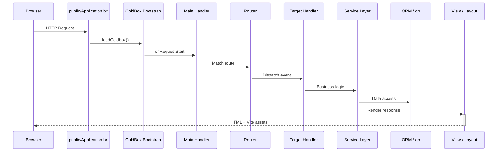

# CB Genesis

A production-ready ColdBox starter template for [BoxLang](https://boxlang.io) — the modern, dynamic JVM language. Ships with authentication, role-based permissions, API tokens, dark mode, and an Alpine-powered admin panel. Think Laravel starter kits, but for the JVM.

---

## Table of Contents

- [About the Stack](#about-the-stack)
- [Architecture Overview](#architecture-overview)
- [System Requirements](#system-requirements)
- [Quick Start](#quick-start)
- [Project Structure](#project-structure)
- [Configuration](#configuration)
- [Frontend](#frontend)
- [Authentication & Security](#authentication--security)
- [Database & ORM](#database--orm)
- [Email](#email)
- [Testing](#testing)
- [Route Map](#route-map)
- [Growing Your Application](#growing-your-application)
- [Deployment](#deployment)
- [Resources](#resources)

---

## About the Stack

| Layer | Technology |
|-------|-----------|
| **Runtime** | BoxLang 1.0+ (JVM) |
| **Framework** | ColdBox HMVC (bleeding edge) |
| **CLI / Server** | CommandBox + BoxLang MiniServer |
| **Dependency Injection** | WireBox |
| **Security** | cbsecurity + cbauth (session-based + JWT) |
| **Database** | MySQL via Hibernate ORM (cborm) |
| **Query Builder** | qb (fluent SQL) |
| **Migrations** | cfmigrations |
| **Validation** | cbvalidation |
| **Email** | cbmailservices |
| **Serialization** | mementifier |
| **Frontend** | Bootstrap 5.3 · Alpine.js 3.x · Vite 6 |
| **Icons** | Phosphor Duotone |
| **Tooltips** | Tippy.js |

---

## Architecture Overview

CB Genesis follows the **ColdBox Modern Template** layout — application code is separated from the public webroot for enhanced security.

```
Browser Request
      │
      ▼
┌─────────────────────────────────┐
│  public/                        │  ◄── Webroot (only public files)
│  ├─ Application.bx              │      Entry point, bootstrap ColdBox + ORM
│  ├─ index.bxm                   │
│  └─ includes/                   │      Vite compiled assets
└──────────┬──────────────────────┘
           │
           ▼
┌─────────────────────────────────┐
│  app/                           │  ◄── Application code (not web-accessible)
│  ├─ config/                     │      ColdBox, Router, CacheBox, WireBox
│  ├─ handlers/                   │      Controllers (Auth, Dashboard, Users…)
│  ├─ models/                     │      Entities, Services, Repositories
│  ├─ views/                      │      BXM templates + reusable components
│  ├─ layouts/                    │      Master layouts (Admin, AuthCenter…)
│  ├─ email_templates/            │      Token-based email body templates
│  └─ interceptors/               │      Cross-cutting request interceptors
└──────────┬──────────────────────┘
           │
           ▼
┌─────────────────────────────────┐
│  resources/                     │  ◄── Source assets (compiled by Vite)
│  ├─ assets/js/                  │      Alpine components + stores
│  ├─ assets/scss/                │      Bootstrap + custom SCSS
│  └─ database/                   │      Migrations + seeders
└──────────┬──────────────────────┘
           │
           ▼
┌─────────────────────────────────┐
│  lib/                           │  ◄── Dependencies (not source-controlled)
│  ├─ coldbox/                    │
│  ├─ testbox/                    │
│  └─ modules/                    │      qb, cbsecurity, cborm, etc.
└─────────────────────────────────┘
```

### Request Lifecycle



---

## System Requirements

- **Java 21+** (JDK or JRE)
- **Node.js 18+** (for Vite frontend)
- **MySQL 8+** (or compatible)
- **macOS**, **Linux**, or **Windows**

---

## Quick Start

### 1. Install BoxLang

Choose one of two methods:

**Option A — Quick Installer (simplest)**

```bash
# Mac & Linux
/bin/bash -c "$(curl -fsSL https://install.boxlang.io)"

# With automatic Java 21 installation
curl -fsSL https://install.boxlang.io | bash -s -- --with-jre

# Windows (PowerShell)
powershell -NoExit -Command "iex ((New-Object System.Net.WebClient).DownloadString('https://install-windows.boxlang.io'))"
```

**Option B — BVM (BoxLang Version Manager, for multiple versions)**

```bash
curl -fsSL https://install-bvm.boxlang.io | bash

# Install and activate the latest BoxLang
bvm install latest && bvm use latest
```

Verify:

```bash
boxlang --version
```

### 2. Install CommandBox Module

Once BoxLang is installed, add the CommandBox CLI module:

```bash
install-bx-module bx-cli
```

This gives you the `box` command for dependency management, server control, migrations, and more.

### 3. Clone & Install Dependencies

```bash
# Clone the template
git clone https://github.com/coldbox-templates/cbGenesis my-app
cd my-app

# Install BoxLang dependencies (framework + modules)
box install

# Install Node.js dependencies (Alpine, Bootstrap, Vite)
npm install
```

### 4. Configure Environment

```bash
# Copy environment file
cp .env.example .env

# Edit .env with your database credentials
# DB_HOST, DB_PORT, DB_DATABASE, DB_USER, DB_PASSWORD
```

### 5. Run Migrations & Seed

```bash
# Create database tables
box migrate up

# Seed admin user and permissions
box migrate seed
```

Default admin credentials:
- **Email:** `admin@cbgenesis.com`
- **Password:** `admin`

> Change this immediately after logging in.

### 6. Start the Server

```bash
box server start
```

This starts the BoxLang server with CommandBox. The first time, it installs BoxLang modules specified in `server.json` (esapi, password-encrypt, mail, orm, mysql).

### 7. Start Vite Dev Server (in another terminal)

```bash
npm run dev
```

### 8. Open the App

Visit **http://127.0.0.1:8080** — you'll see the login page.

---

## Project Structure

```
cbgenesis/
├── .agents/                 AI guidelines + skills (ColdBox CLI managed)
├── .vscode/                 Editor settings: BoxLang mappings, debug, MCP servers
├── app/                     Application code
│   ├── Application.bx       Abort-only gate (prevents direct /app access)
│   ├── config/
│   │   ├── Coldbox.bx       Framework settings, environments, logging
│   │   ├── Router.bx        All application routes
│   │   ├── CacheBox.bx      Cache regions (default, template, sessions)
│   │   ├── WireBox.bx       DI container configuration
│   │   ├── Scheduler.bx     Scheduled tasks (purge expired tokens)
│   │   └── modules/         Module-specific configuration
│   │       ├── cbauth.bx          Authentication (UserService, session storage)
│   │       ├── cbsecurity.bx      Firewall, CSRF, JWT, security headers
│   │       ├── cbmailservices.bx  Email protocol (BXMail / files in dev)
│   │       ├── cborm.bx           ORM (entity injection, pagination)
│   │       ├── cbstorages.bx      Cache + cookie storage backends
│   │       └── mementifier.bx     Serialization format (ISO8601, UTC)
│   ├── handlers/
│   │   ├── Auth.bx               Login, register, forgot/reset password
│   │   ├── BaseSecureHandler.bx  Base class: Admin layout, @secured, API helpers
│   │   ├── Dashboard.bx          Main dashboard (secured)
│   │   ├── Main.bx               Lifecycle events (onAppInit, onException)
│   │   ├── Permissions.bx        CRUD for permission slugs (AJAX, secured)
│   │   ├── Profile.bx            User profile management (secured)
│   │   ├── Roles.bx              Role CRUD + user assignment (AJAX, secured)
│   │   ├── Settings.bx           App settings key-value editor (secured)
│   │   └── Users.bx              User listing + detail (secured)
│   ├── layouts/
│   │   ├── Admin.bxm             Main admin shell (sidebar + topbar)
│   │   ├── AuthCenter.bxm        Centered card auth pages
│   │   ├── AuthSplit.bxm         Split-panel auth (brand left, form right)
│   │   └── Main.bxm              Simple standalone layout
│   ├── models/
│   │   ├── BaseEntity.bx         ORM base: timestamps, soft delete, memento
│   │   ├── BaseService.bx        Service base: cborm + qb + cache + validation
│   │   ├── security/
│   │   │   ├── APIToken.bx            SHA-256 hashed tokens per user
│   │   │   ├── APITokenService.bx     Token lifecycle + purge
│   │   │   ├── Permission.bx          Permission entity (e.g. "users:read")
│   │   │   ├── PermissionService.bx   Permission CRUD
│   │   │   ├── Role.bx                Role with M2M permissions + users
│   │   │   ├── RoleService.bx         Role CRUD with cascade delete
│   │   │   └── SecurityService.bx     cbauth wrapper + password reset tokens
│   │   └── system/
│   │       ├── Setting.bx             Key-value settings entity
│   │       ├── SettingService.bx      Cached settings, preFlight, env overrides
│   │       ├── User.bx                User entity (ORM, roles, permissions, preferences)
│   │       └── UserService.bx         User CRUD, bcrypt, email, search
│   ├── views/
│   │   ├── _components/               Reusable UI partials
│   │   │   ├── app/                     Sidebar, topbar, footer, breadcrumbs, includes
│   │   │   ├── auth/                    Password input with toggle
│   │   │   └── ui/                      Logo, messagebox, modal, drawer, confirm, switch
│   │   ├── auth/                       Login, register, forgot/reset password
│   │   ├── dashboard/                  Dashboard landing page
│   │   ├── permissions/                Permission grid, edit form, delete confirm
│   │   ├── roles/                      Role grid, edit form, user assignment, delete confirm
│   │   ├── settings/                   Settings form (bulk save)
│   │   └── users/                      User listing + detail
│   └── email_templates/
│       ├── user_welcome.bxm            Sent on new account creation
│       ├── password_verification.bxm   Reset link email
│       └── password_reset.bxm          Confirmation after password change
├── public/
│   ├── Application.bx        Entry point — ColdBox + ORM bootstrap
│   ├── index.bxm             Front controller placeholder
│   └── includes/             Vite production build output
├── resources/
│   ├── assets/
│   │   ├── js/
│   │   │   ├── App.js               Alpine entry — registers everything
│   │   │   ├── stores/
│   │   │   │   ├── theme.js         Dark/light mode (localStorage + Bootstrap)
│   │   │   │   └── sidebar.js       Collapse state + mobile overlay
│   │   │   └── components/
│   │   │       ├── app/             AdminBody, Sidebar, TopBar, Footer
│   │   │       ├── auth/            AuthForm, RegisterForm, ForgotPassword, ResetPassword
│   │   │       ├── security/        PermissionsForm, RoleForm
│   │   │       ├── settings/        SettingsForm
│   │   │       └── ui/              Drawer, Logo, MessageBox, PasswordMeter, Switch
│   │   └── scss/
│   │       ├── app.scss             Main entry (imports Bootstrap + components)
│   │       ├── _variables.scss      Brand colors, Bootstrap overrides
│   │       ├── _base.scss           CSS custom properties for light/dark
│   │       ├── components/          9 component stylesheets
│   │       ├── layouts/             Admin + Auth layout styles
│   │       └── views/               Dashboard + Security admin styles
│   └── database/
│       ├── migrations/              Security, settings, users tables
│       └── seeds/                   AdminData (role, 16 permissions, admin user)
├── tests/
│   ├── Application.bx              Virtual ColdBox app for testing
│   ├── runner.bxm                  TestBox test runner entry
│   ├── specs/
│   │   ├── integration/            Auth, Main implicit events
│   │   └── unit/                   Security + System services & entities
│   └── resources/                  Base Integration Spec
├── lib/                            Dependencies (gitignored, installed by box install)
├── runtime/
│   ├── boxlang.json                BoxLang engine configuration
│   └── lib/                        BoxLang runtime libraries
├── server.json                     CommandBox server config (BoxLang engine, webroot, aliases)
├── box.json                        Package manifest — deps, scripts, ForgeBox metadata
├── package.json                    NPM — Alpine, Bootstrap, Vite, ESLint
├── vite.config.mjs                 Vite with coldbox-vite-plugin
├── .env.example                    Environment template
└── AGENTS.md                       AI agent instructions (auto-managed by ColdBox CLI)
```

---

## Configuration

### Environment Variables (`.env`)

| Variable | Purpose |
|----------|---------|
| `APPNAME` | Application display name |
| `ENVIRONMENT` | `development` or `production` |
| `ASSET_URL` | Public URL prefix for Vite production assets |
| `BOXLANG_DEBUG` | Enable BoxLang debug output |
| `DB_CONNECTIONSTRING` | Full JDBC connection string |
| `DB_DRIVER` | Database driver (`MySQL`, `PostgreSQL`, etc.) |
| `DB_HOST` / `DB_PORT` / `DB_DATABASE` | Database connection details |
| `DB_USER` / `DB_PASSWORD` | Database credentials |

### Framework Settings (`app/config/Coldbox.bx`)

Key framework settings are configured in `Coldbox.bx`:

- **Default event:** `Auth.login` (unauthenticated users land on login)
- **Request start handler:** `Main.onRequestStart`
- **Exception handler:** `Main.onException`
- **Development mode:** handler auto-reload, JSON auto-parsing, Whoops error pages
- **LogBox:** Console + rolling file appender → `/app/logs`

### Module Configuration

Each module has its own config file in `app/config/modules/`:

| Module | Key Settings |
|--------|-------------|
| **cbsecurity** | cbauth provider, CSRF (rotating 30min), firewall with `@secured` annotation scanning, XSS/frameOptions/referrerPolicy security headers, JWT (AES-256, HS512, 60min expiry) |
| **cbauth** | `UserService` as identity provider, cache-based session storage |
| **cbmailservices** | BXMail protocol (production), files protocol (development) |
| **cborm** | Entity injection enabled, pagination max 25–500 |
| **cbstorages** | Cache storage (sessions cache, 60min), AES-encrypted cookie storage |
| **mementifier** | ISO8601 dates, ORM auto-includes, UTC conversion |

---

## Frontend

### How It Works

The frontend is a **hybrid server-rendered + Alpine.js** application:

1. **ColdBox layouts** (`Admin.bxm`, `AuthSplit.bxm`) provide the HTML shell
2. **BXM templates** in `app/views/` render server-side with `rc`/`prc` data
3. **Alpine.js components** add interactivity — forms, modals, drawers, toggles
4. **Vite** compiles SCSS + JS from `resources/assets/` into `public/includes/`

### Alpine.js Architecture

```
App.js (entry)
  ├── Registers all Alpine stores + components
  ├── Imports Bootstrap JS + Phosphor icons + Tippy.js
  │
  ├── Stores ($store.*)
  │   ├── theme.js       → dark/light mode, syncs data-bs-theme + localStorage
  │   └── sidebar.js     → collapse/open, mobile overlay, localStorage persistence
  │
  └── Components (x-data)
      ├── auth/          → AuthForm, RegisterForm, ForgotPasswordForm, PasswordResetForm
      ├── security/      → PermissionsForm (create/edit/delete), RoleForm (CRUD + user assignment)
      ├── settings/      → SettingsForm (bulk save)
      └── ui/            → Drawer, Logo, MessageBox, PasswordMeter, Switch, Modal, Confirm
```

### Component Pattern

Each component is a standalone JS module returning an Alpine `x-data` object with properties and methods. Example:

```js
// resources/assets/js/components/ui/MessageBox.js
export default () => ({
    visible: true,
    init() {
        setTimeout(() => this.visible = false, 5000);
    }
});
```

Used in views:

```html
<div x-data="messageBox" x-show="visible" x-transition>
    <!-- alert content -->
</div>
```

### SCSS Structure

```
app.scss
  ├── _variables.scss         Bootstrap variable overrides
  ├── bootstrap               Full Bootstrap 5.3 import
  ├── _base.scss              CSS custom properties (light/dark theme)
  ├── components/             9 component partials
  ├── layouts/                Admin + Auth layout partials
  └── views/                  Page-specific styles
```

### Available Scripts

```bash
npm run dev        # Vite dev server with HMR
npm run build      # Production build (outputs to public/includes/)
npm run lint       # ESLint check
npm run lint:fix   # ESLint auto-fix
```

---

## Authentication & Security

### Login Flow

```
┌──────────┐    POST /login     ┌──────────────┐    authenticate()    ┌────────────────┐
│  Login    │ ──────────────────▶│  Auth.bx      │ ──────────────────▶│ SecurityService │
│  Form     │    email + pass    │  doLogin()    │                     │ authenticate() │
└──────────┘                    └──────┬───────┘                     └───────┬────────┘
                                       │                                     │
                                       │ CSRF check + cbvalidation           │ bcrypt verify
                                       │                                     │
                                       ▼                                     ▼
                                ┌──────────────┐                     ┌────────────────┐
                                │  Redirect     │◀────────────────────│  cbauth.login() │
                                │  /dashboard   │                     │  session store  │
                                └──────────────┘                     └────────────────┘
```

### Security Layers

| Layer | Implementation |
|-------|---------------|
| **Session auth** | cbauth with `CacheStorage@cbStorages` — server-side session cache |
| **Password hashing** | bcrypt via `bx-password-encrypt` module |
| **CSRF protection** | cbsecurity rotating token (30min), auto-verifier on state-changing routes |
| **Handler security** | `@secured` annotation on handlers → firewall auto-redirects to login |
| **JWT support** | Configured for API access (AES-256, HS512, 60min, cache token storage) |
| **Security headers** | XSS protection, frameOptions (DENY), referrerPolicy (same-origin) |
| **API tokens** | SHA-256 hashed per-user tokens with expiration, daily purge scheduler |

### `BaseSecureHandler`

All protected handlers extend `BaseSecureHandler`, which:

- Sets the `Admin` layout
- Provides `getApiResults()` helper for AJAX responses
- Inherits `@secured` enforcement from the firewall

```boxlang
// Example: secure a new handler
component extends="BaseSecureHandler" secured {

    function index( event, rc, prc ){
        prc.pageTitle = "My Page";
        event.setView( "myhandler/index" );
    }

}
```

---

## Database & ORM

### Entity Hierarchy

```
BaseEntity (cborm.models.ActiveEntity)
  ├── createdDate, modifiedDate  (auto-timestamps)
  ├── isActive                   (soft-delete flag)
  └── memento defaults           (serialization)

User ─────────── extends BaseEntity
  ├── M2M → Role
  ├── M2M → Permission
  ├── O2M → APIToken
  └── preferences (JSON)

Role ─────────── extends BaseEntity
  ├── M2M → Permission (role_permissions)
  └── M2M → User (user_roles)

Permission ───── extends BaseEntity
  ├── M2M → Role
  └── M2M → User

APIToken ─────── extends BaseEntity
  └── M2O → User

Setting ──────── extends BaseEntity
  └── name (unique), value (text)
```

### Service Layer Pattern

All services extend `BaseService` and follow this pattern:

```boxlang
component
    extends="BaseService"
    singleton
    threadSafe
{

    property name="qb"        inject="provider:QueryBuilder@qb";
    property name="cache"     inject="cachebox:template";

    function list( struct criteria = {} ){
        return newCriteria()
            .when( criteria.search, function( c, term ){
                c.like( "name", "%#term#%" );
            } )
            .list();
    }
}
```

### Migrations

```bash
box migrate up           # Run pending migrations
box migrate down         # Rollback last batch
box migrate reset        # Rollback all + re-migrate
box migrate seed         # Run database seeders
```

### Seed Data

The `AdminData` seeder creates:

- **Admin role** → `Administrator`
- **16 permissions** across 4 groups (roles, users, permissions, settings — each with read/write/delete/admin)
- **Admin user** → `admin@cbgenesis.com` with all permissions

---

## Email

Email templates use `cbmailservices` with token placeholders:

```html
<!-- app/email_templates/password_verification.bxm -->
<h1>Reset Your Password</h1>
<p>Click the link below to reset your password:</p>
<a href="@linkToken@">Reset Password</a>
<p>This link expires @expiration@.</p>
```

Sent from a service:

```boxlang
mailService.newMail()
    .config( from="noreply@app.com", to=user.getEmail(), subject="Reset Password" )
    .setBodyTokens({ linkToken: resetLink, expiration: "in 60 minutes" })
    .setBodyTemplate( "password_verification" )
    .send();
```

In development, email is written to disk (files protocol). In production, configure SMTP in `app/config/modules/cbmailservices.bx`.

---

## Testing

### Running Tests

```bash
box testbox run                  # All tests
box testbox run --labels=unit    # Unit tests only
box testbox run --labels=integration  # Integration tests only
```

### Test Structure

```
tests/
├── Application.bx              Virtual ColdBox app (appMapping="/app")
├── runner.bxm                  TestBox CLI runner entry
├── specs/
│   ├── integration/
│   │   ├── MainSpec.bx         Lifecycle events (onAppInit, onException…)
│   │   └── AuthSpec.bx         Registration form, CSRF, validation
│   └── unit/
│       ├── security/           APIToken, Permission, Role, SecurityService tests
│       └── system/             Setting, User tests
└── resources/
    └── BaseIntegrationSpec.bx  Shared helper for integration tests
```

### Writing Tests

```boxlang
component extends="tests.resources.BaseIntegrationSpec" {

    function run(){
        describe( "Registration", () => {
            it( "renders the registration form", () => {
                var event = execute( event = "Auth.register", renderResults = true );
                expect( event.getValue( "cbox_rendered_content" ) ).toInclude( "register" );
            } );
        } );
    }

}
```

---

## Route Map

| Method | URL | Handler.Action | Auth |
|--------|-----|---------------|------|
| `GET` | `/login` | `Auth.login` | Guest |
| `POST` | `/login` | `Auth.doLogin` | Guest |
| `GET` | `/register` | `Auth.register` | Guest |
| `POST` | `/register` | `Auth.doRegister` | Guest |
| `GET` | `/forgot-password` | `Auth.forgotPassword` | Guest |
| `POST` | `/forgot-password` | `Auth.doForgotPassword` | Guest |
| `GET` | `/reset-password` | `Auth.resetPassword` | Guest |
| `POST` | `/reset-password` | `Auth.doResetPassword` | Guest |
| `POST` | `/logout` | `Auth.logout` | Auth |
| `GET` | `/dashboard` | `Dashboard.index` | Auth |
| `GET` | `/users` | `Users.index` | Auth |
| `GET` | `/users/:id` | `Users.detail` | Auth |
| `GET` | `/roles` | `Roles.index` | Auth |
| `POST` | `/roles` | `Roles.create` | Auth |
| `PUT` | `/roles/:id` | `Roles.update` | Auth |
| `DELETE` | `/roles/:id` | `Roles.delete` | Auth |
| `GET` | `/roles/:roleId/users` | `Roles.users` | Auth |
| `POST` | `/roles/:roleId/users/:userId` | `Roles.addUser` | Auth |
| `DELETE` | `/roles/:roleId/users/:userId` | `Roles.removeUser` | Auth |
| `GET` | `/permissions` | `Permissions.index` | Auth |
| `POST` | `/permissions` | `Permissions.create` | Auth |
| `PUT` | `/permissions/:id` | `Permissions.update` | Auth |
| `DELETE` | `/permissions/:id` | `Permissions.delete` | Auth |
| `GET` | `/profile` | `Profile.index` | Auth |
| `POST` | `/profile` | `Profile.update` | Auth |
| `GET` | `/settings` | `Settings.index` | Auth |
| `POST` | `/settings` | `Settings.save` | Auth |
| `GET` | `/healthcheck` | Returns `Ok!` | Public |

All routes support a catch-all convention pattern: `/:handler/:action?`

---

## Growing Your Application

CB Genesis is designed as a launchpad. Here's how to extend it:

### Adding a New CRUD Module

1. **Create the entity** in `app/models/<domain>/` extending `BaseEntity`
2. **Create the service** extending `BaseService` with `singleton threadSafe`
3. **Create the handler** extending `BaseSecureHandler` with `@secured`
4. **Add routes** in `app/config/Router.bx`
5. **Create views** in `app/views/<domain>/` using existing components
6. **Create Alpine component** in `resources/assets/js/components/<domain>/`
7. **Register** the new component in `App.js`
8. **Add SCSS** in `resources/assets/scss/views/` and import in `app.scss`
9. **Write tests** in `tests/specs/unit/<domain>/`

### Adding a New Permission

1. Add the permission slug to the `AdminData` seeder
2. Register it in the `SettingService` defaults
3. Check it in handlers via `hasPermission()` or `@secured`

### Adding a Setting

Add a new key to the `DEFAULTS` struct in `SettingService.bx`. It automatically appears in the Settings admin page.

### Customizing Layouts

Layouts are in `app/layouts/`. The layout is selected per-handler:

```boxlang
// In BaseSecureHandler
function preHandler( event, rc, prc ){
    event.setLayout( "Admin" );
}
```

### Adding a Scheduled Task

Tasks are registered in `app/config/Scheduler.bx`:

```boxlang
task( "My Task" )
    .call( () => getInstance( "MyService" ).doWork() )
    .everyDayAt( "03:00" )
    .when( isClusterReady )
    .withoutOverlaps();
```

### Overriding Module Configuration

Module configs in `app/config/modules/` extend the original module configs. Override any key — changes take effect on next `?fwreinit`.

---

## Deployment

### Production Build

```bash
# Build frontend assets
npm run build

# Outputs to public/includes/
```

### Docker

A `Dockerfile` and `docker-compose.yml` are provided in `resources/docker/`:

```bash
npm run docker:build
npm run docker:stack -- up -d
```

### BoxLang MiniServer (Alternative to CommandBox)

```bash
cd my-app
boxlang-miniserver --port 8080 --webroot ./public --dev
```

### Production Checklist

1. Set `ENVIRONMENT=production` in `.env`
2. Set `BOXLANG_DEBUG=false`
3. Configure a real mail driver (SMTP / Postmark / SendGrid) in `cbmailservices.bx`
4. Change the default admin password
5. Set `reinitPassword` in `Coldbox.bx` to a strong value
6. Enable HTTPS via SSL configuration in `server.json`
7. Run `npm run build` for minified assets
8. Remove or restrict the `/healthcheck` endpoint if desired

---

## Resources

| Resource | URL |
|----------|-----|
| BoxLang Documentation | [boxlang.ortusbooks.com](https://boxlang.ortusbooks.com) |
| ColdBox Documentation | [coldbox.ortusbooks.com](https://coldbox.ortusbooks.com) |
| CommandBox Documentation | [commandbox.ortusbooks.com](https://commandbox.ortusbooks.com) |
| ForgeBox (Package Registry) | [forgebox.io](https://forgebox.io) |
| Ortus Community | [community.ortussolutions.com](https://community.ortussolutions.com) |
| BoxLang Slack | [slack.ortussolutions.com](https://slack.ortussolutions.com) |

### MCP Documentation Servers

This project includes `.vscode/mcp.json` with configured MCP servers for AI-assisted development. Supported servers: BoxLang, ColdBox, CommandBox, TestBox, WireBox, CacheBox, LogBox, qb, cbsecurity, cbmailservices, cborm, cfmigrations.
