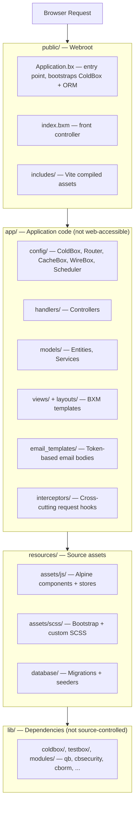
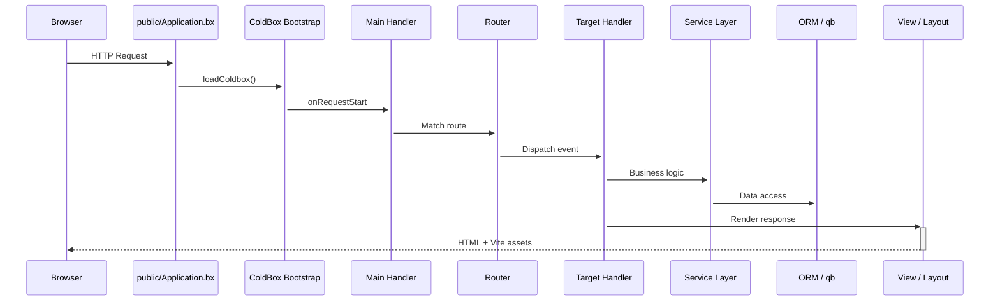

# Architecture

CB Genesis follows ColdBox's **modern template** layout: application code is fully separated from the public webroot, so nothing under `app/` is ever directly web-accessible.

## Layered overview



!!! note "Why the split?"
    Anything an attacker could otherwise browse to directly - handler source, config, view templates - simply doesn't live under the webroot. `app/Application.bx` is a one-line `abort;` guard, kept only so the framework convention holds even if a web server is ever misconfigured to serve `app/` directly.

## Request lifecycle

Every request enters through `public/Application.bx`, which bootstraps ColdBox before handing off to the router and, eventually, your handler:



`Main.bx` (`app/handlers/Main.bx`) is the implicit-event handler wired up in `app/config/Coldbox.bx`:

- `onAppInit` - runs `settingService.preFlightCheck()`, seeding any missing app settings into the database
- `onRequestStart` - loads `prc.settings` and `prc.authUser` for every request
- `onException` - the app-wide exception handler

## Full project tree

```text title="Project structure" linenums="1"
cbgenesis/
├── app/                      Application code
│   ├── Application.bx        Abort-only gate (prevents direct /app access)
│   ├── config/
│   │   ├── Coldbox.bx        Framework settings, environments, logging
│   │   ├── Router.bx         All application routes
│   │   ├── CacheBox.bx       Cache regions (default, template, sessions)
│   │   ├── WireBox.bx        DI container configuration
│   │   ├── Scheduler.bx      Scheduled tasks
│   │   └── modules/          Per-module settings (cbsecurity, cbauth, cborm, ...)
│   ├── handlers/              Controllers (Auth, Dashboard, Users, Roles, ...)
│   ├── layouts/                Admin, AuthCenter, AuthSplit, Main
│   ├── models/
│   │   ├── BaseEntity.bx      ORM base: timestamps, soft delete, memento
│   │   ├── BaseService.bx     Service base: cborm + qb + cache + validation
│   │   ├── security/            Role, Permission, APIToken, RememberToken, Passkey, ...
│   │   └── system/              User, UserService, Setting, SettingService
│   ├── views/                  BXM templates, one folder per handler
│   │   └── _components/        Reusable UI partials (app, auth, ui)
│   ├── email_templates/       Token-based email body templates
│   ├── helpers/               ApplicationHelper.bxm — global view helpers
│   └── interceptors/           Extension point (empty by default)
├── public/
│   ├── Application.bx         Entry point — ColdBox + ORM bootstrap
│   ├── index.bxm               Front controller placeholder
│   └── includes/               Vite production build output
├── resources/
│   ├── assets/js/              Alpine entry, stores, components
│   ├── assets/scss/            Bootstrap + custom SCSS
│   └── database/
│       ├── migrations/         Schema migrations (cfmigrations)
│       └── seeds/              AdminData seeder
├── tests/
│   ├── specs/integration/      Full HTTP-level specs
│   └── specs/unit/             Entity + service specs
├── lib/                        Dependencies (gitignored, installed by `box install`)
├── runtime/                    BoxLang engine config (boxlang.json)
├── server.json                 CommandBox server config (engine, webroot, aliases)
├── box.json                    Package manifest — deps, scripts
├── package.json                 NPM — Alpine, Bootstrap, Vite, ESLint
├── vite.config.mjs              Vite + coldbox-vite-plugin
└── .env.example                  Environment template
```

## The stack

| Layer | Technology |
|---|---|
| Runtime | BoxLang 1.0+ (JVM) |
| Framework | ColdBox HMVC (bleeding edge) |
| CLI / Server | CommandBox + BoxLang MiniServer |
| Dependency Injection | WireBox |
| Security | cbsecurity + cbauth (session-based + JWT) |
| Database | MySQL (default) via Hibernate ORM (cborm) — any JDBC-compatible DB |
| Query Builder | qb (fluent SQL) |
| Migrations | cfmigrations |
| Validation | cbvalidation |
| Email | cbmailservices |
| Serialization | mementifier |
| Frontend | Bootstrap 5.3 · Alpine.js 3.x · Vite 6 |
| Icons | Phosphor Duotone |
| Tooltips | Tippy.js |

::: cards
::: card title="Handlers & Routing" icon="phosphor-duotone:signpost" href="guides/handlers-routing.md"
Every controller and route, and the conventions tying them together.
:::
::: card title="Database & ORM" icon="phosphor-duotone:database" href="guides/database-orm.md"
The entity hierarchy, migrations, and the `BaseService` pattern.
:::
::: card title="Security & Permissions" icon="phosphor-duotone:shield-check" href="guides/security.md"
How `@secured` handlers, CSRF, and the permission model fit together.
:::
:::
