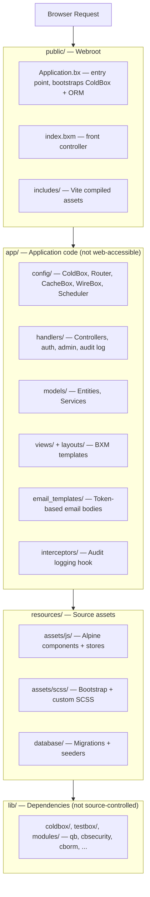
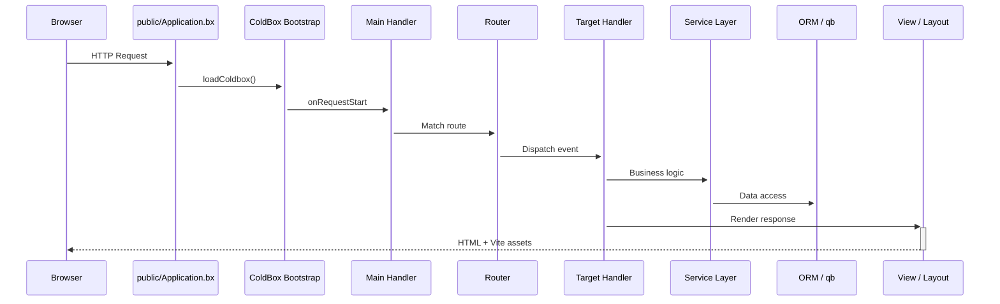

# Architektur

CBGenesis folgt ColdBoxs **modernem Template**-Layout: Anwendungscode ist vollständig vom öffentlichen Webroot getrennt, sodass nichts unter `app/` jemals direkt über das Web erreichbar ist.

## Schichtenübersicht



!!! note "Warum die Trennung?"
    Alles, was ein Angreifer sonst direkt aufrufen könnte - Handler-Quellcode, Konfiguration, View-Templates - liegt schlicht nicht unter dem Webroot. `app/Application.bx` ist eine einzeilige `abort;`-Schranke, die nur beibehalten wird, damit die Framework-Konvention auch dann greift, wenn ein Webserver jemals falsch konfiguriert wird, um `app/` direkt auszuliefern.

## Request-Lebenszyklus

Jeder Request kommt über `public/Application.bx` herein, das ColdBox bootstrapt, bevor es an den Router und schließlich an deinen Handler übergibt:



`Main.bx` (`app/handlers/Main.bx`) ist der implizite Event-Handler, der in `app/config/Coldbox.bx` verdrahtet ist:

- `onAppInit` - führt `settingService.preFlightCheck()` aus und sät fehlende App-Einstellungen in die Datenbank
- `onRequestStart` - lädt `prc.settings` und `prc.authUser` für jeden Request
- `onException` - der app-weite Exception-Handler

## Interceptoren

`app/config/Coldbox.bx` registriert drei Anwendungs-Interceptoren, in dieser Reihenfolge:

**`app/interceptors/AuditLogger.bx`** schreibt an vier Interception-Points in den Audit-Trail:

| Punkt | Aufgezeichnet |
|---|---|
| `postAuthentication` | Eine erfolgreiche Anmeldung |
| `preLogout` | Eine Abmeldung |
| `cbSecurity_onInvalidAuthentication` | Ein Request, der eine Session benötigte und keine hatte |
| `cbSecurity_onInvalidAuthorization` | Ein authentifizierter Benutzer ohne die erforderliche Berechtigung |

**`app/interceptors/RateLimiter.bx`** feuert bei `preProcess` - vor dem Routing, vor jedem Handler - und drosselt fünf nicht authentifizierte `Auth`-Aktionen (Login, Registrierung, Passwort vergessen/zurücksetzen, Einladungsaktivierung) nach Client-IP. Siehe [Rate Limiting](guides/security.md#rate-limiting) für die Einstellungen und die Funktionsweise.

**`app/interceptors/SSOAuthorization.bx`** behandelt cbSSOs
`CBSSOAuthorization`-Interception-Point. Er verbindet eine verifizierte Provider-Identität
mit dem lokalen Benutzermodell, setzt die Login-versus-Linking-Policy durch,
provisioniert Benutzer, wenn erlaubt, und erstellt die cbauth-Session. Siehe
[Single Sign-on](guides/security.md#single-sign-on) für den Callback-Ablauf und
den Grund, warum cbGenesis einen eigenen Handler statt cbSSOs generischer cbAuth-
Integration verwendet.

Füge deine eigenen zum `variables.interceptors`-Array in `Coldbox.bx` hinzu; sie feuern in Deklarationsreihenfolge.

## Geplante Aufgaben

`app/config/Scheduler.bx` registriert drei tägliche Hintergrundaufgaben, jede `onOneServer()` und `withNoOverlaps()`, damit ein Multi-Instanz-Deployment jede genau einmal ausführt:

| Aufgabe | Läuft | Löscht | Gesteuert durch |
|---|---|---|---|
| Abgelaufene API-Tokens bereinigen | `03:00` | `user_api_tokens`-Zeilen nach ihrer `expiration` | Token-Lebensdauer bei Ausstellung gesetzt aus `cbApiTokenMaxValidityMonths` (Standard `12` Monate) - siehe [App-Einstellungen](reference/settings.md#password--token-policy) |
| Abgelaufene Remember-Tokens bereinigen | `03:15` | `user_remember_tokens`-Zeilen nach ihrer `expiration` | Feste Ablaufzeit bei Ausstellung des Tokens (`SecurityService`/`RememberTokenService`) |
| Alte Audit-Logs bereinigen | `03:30` | `audit_logs`-Zeilen älter als das Aufbewahrungsfenster | `cbAuditLogRetentionDays` (Standard `90`; `0` deaktiviert die Bereinigung) - siehe [App-Einstellungen](reference/settings.md#password--token-policy) |

Alle drei rufen eine `purgeExpiredTokens()`/`purgeOlderThan()`-Methode am zuständigen Service auf, statt die Tabelle direkt abzufragen, sodass dieselbe Bereinigungslogik auch außerhalb des Schedulers erreichbar (und testbar) ist. Füge eine neue Aufgabe auf dieselbe Weise hinzu - siehe [Die App erweitern](guides/extending.md#adding-a-scheduled-task).

## Vollständiger Projektbaum

```text title="Project structure" linenums="1"
cbgenesis/
├── app/                      Application code
│   ├── Application.bx        Abort-only gate (prevents direct /app access)
│   ├── config/
│   │   ├── Coldbox.bx        Framework settings, environments, logging
│   │   ├── Router.bx         All application routes
│   │   ├── CacheBox.bx       Cache regions (default, template, sessions, rateLimit)
│   │   ├── WireBox.bx        DI container configuration
│   │   ├── Scheduler.bx      Scheduled tasks
│   │   └── modules/          Per-module settings (cbsecurity, cbauth, cborm, ...)
│   ├── handlers/              Controllers (Auth, Dashboard, Users, Roles, ...)
│   ├── layouts/                Admin, AuthCenter, AuthSplit, Main
│   ├── models/
│   │   ├── BaseEntity.bx      ORM base: timestamps, soft delete, memento
│   │   ├── BaseService.bx     Service base: cborm + qb + cache + validation
│   │   ├── security/            Role, Permission, APIToken, RememberToken,
│   │   │                        Passkey, UserActionToken, SecurityService, ...
│   │   └── system/              User, Setting, AuditLog + their services
│   ├── views/                  BXM templates, one folder per handler
│   │   └── _components/        Reusable UI partials (app, auth, ui)
│   ├── email_templates/       Token-based email body templates
│   ├── helpers/               ApplicationHelper.bxm — global view helpers
│   └── interceptors/           AuditLogger, RateLimiter, SSOAuthorization
├── public/
│   ├── Application.bx         Entry point — ColdBox + ORM bootstrap
│   ├── index.bxm               Front controller placeholder
│   └── includes/               Vite production build output
├── resources/
│   ├── assets/js/              Alpine entry, stores, components
│   ├── assets/scss/            Bootstrap + custom SCSS
│   └── database/
│       ├── migrations/         Schema migrations (cfmigrations)
│       └── seeds/              AdminData seeder
├── tests/
│   ├── specs/integration/      Full HTTP-level specs
│   └── specs/unit/             Entity + service specs
├── lib/                        Dependencies (gitignored, installed by `box install`)
├── runtime/                    BoxLang engine config (boxlang.json)
├── server.json                 CommandBox server config (engine, webroot, aliases)
├── box.json                    Package manifest — deps, scripts
├── package.json                 NPM — Alpine, Bootstrap, Vite, ESLint
├── vite.config.mjs              Vite + coldbox-vite-plugin
└── .env.example                  Environment template
```

## Der Stack

| Schicht | Technologie |
|---|---|
| Laufzeitumgebung | BoxLang 1.0+ (JVM) |
| Framework | ColdBox HMVC (bleeding edge) |
| CLI / Server | CommandBox + BoxLang MiniServer |
| Dependency Injection | WireBox |
| Sicherheit | cbsecurity + cbauth (session-basiert + JWT) |
| Datenbank | MySQL, MariaDB, PostgreSQL und MSSQL über Hibernate ORM (cborm); alle vier Datenbank-Ziele werden unterstützt und vom Datenbank-Testworkflow des Projekts abgedeckt |
| Query Builder | qb (fluent SQL) |
| Migrationen | cfmigrations |
| Validierung | cbvalidation |
| E-Mail | cbmailservices |
| Serialisierung | mementifier |
| Frontend | Bootstrap 5.3 · Alpine.js 3.x · Vite 6 |
| Icons | Phosphor Duotone |
| Tooltips | Tippy.js |

::: cards
::: card title="Handler & Routing" icon="phosphor-duotone:signpost" href="guides/handlers-routing.md"
Jeder Controller und jede Route, und die Konventionen, die sie verbinden.
:::
::: card title="Datenbank & ORM" icon="phosphor-duotone:database" href="guides/database-orm.md"
Die Entitätshierarchie, Migrationen und das `BaseService`-Muster.
:::
::: card title="Sicherheit & Berechtigungen" icon="phosphor-duotone:shield-check" href="guides/security.md"
Wie `@secured`-Handler, CSRF und das Berechtigungsmodell zusammenpassen.
:::
:::
