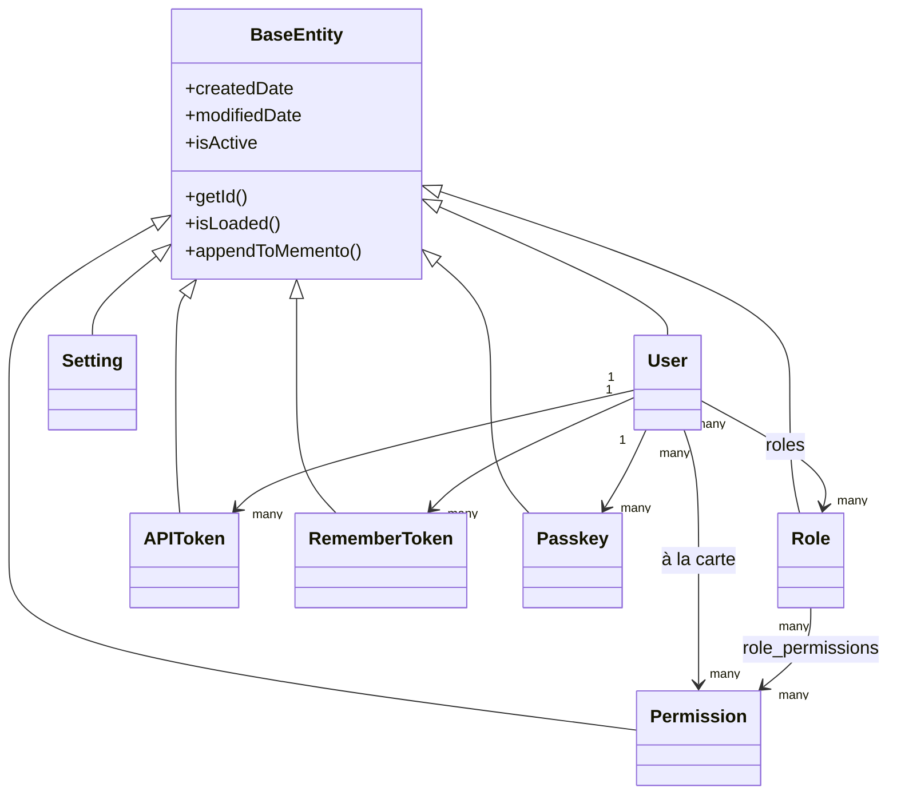

# Datenbank & ORM

## Entitätshierarchie

Jede Entität erweitert `BaseEntity` (`@mappedsuperclass`, selbst eine Erweiterung von `cborm.models.ActiveEntity`), das jeder Tabelle automatisch `createdDate`, `modifiedDate` und ein `isActive`-Soft-Delete-Flag hinzufügt:



`dbcreate: "none"` (gesetzt in `public/Application.bx`s `ormSettings`) bedeutet, dass das Schema ausschließlich von Migrationen verwaltet wird — das ORM erzeugt oder ändert niemals automatisch Tabellen.

## Service-Layer-Muster

Jeder Service erweitert `BaseService` (`@singleton`, erweitert `cborm.models.VirtualEntityService`), das `qb`, `coldbox`, `wirebox` und `cachebox:template` injiziert und `ensureSortOrder()` bereitstellt:

```boxlang title="Example service" linenums="1"
component
    extends="BaseService"
    singleton
    threadSafe
{

    property name="qb"    inject="provider:QueryBuilder@qb";
    property name="cache" inject="cachebox:template";

    function list( struct criteria = {} ){
        return newCriteria()
            .when( criteria.search, function( c, term ){
                c.like( "name", "%#term#%" );
            } )
            .list();
    }

}
```

=== "Entität"
    ```boxlang title="app/models/security/Role.bx" linenums="1"
    /**
     * A role: a named bundle of permissions.
     */
    class extends="app.models.BaseEntity" table="roles" {

        property name="roleId" fieldtype="id" generator="uuid2" ormtype="string";
        property name="name" type="string";

        property name="permissions"
            fieldtype="many-to-many"
            cfc="Permission"
            linktable="role_permissions";

    }
    ```
=== "Service"
    ```boxlang title="app/models/security/RoleService.bx" linenums="1"
    component extends="app.models.BaseService" singleton threadSafe {

        function getAllForLookup(){
            return newCriteria().resultTransformer( "distinct" ).list();
        }

    }
    ```

## Migrationen

Betrieben von [cfmigrations](https://cfmigrations.ortusbooks.com) über das `commandbox-migrations`-CLI-Modul, konfiguriert in `.cbmigrations.json` (`migrationsDirectory: resources/database/migrations/`, `seedsDirectory: resources/database/seeds/`, Verbindung aufgebaut aus denselben `DB_*`-Umgebungsvariablen wie `public/Application.bx`).

```bash frame="terminal" title="Terminal"
box migrate up           # Run pending migrations
box migrate down         # Rollback the last batch
box migrate reset        # Rollback everything, then re-migrate
box migrate seed run     # Run database seeders
```

Migrationen laufen in Dateiname-/Zeitstempel-Reihenfolge:

| Migration | Erstellt |
|---|---|
| `..._settings.bx` | `settings` (GUID-PK, eindeutiger `name`, Longtext-`value`) |
| `..._security.bx` | `permissions`, `roles`, `role_permissions` (Join-Tabelle mit zusammengesetztem PK, kaskadierende FKs) |
| `..._users.bx` | `users` (GUID-PK, eindeutige `email`, nullbares `pendingEmail` für Self-Service-E-Mail-Änderungsanfragen, nullbares `password`, JSON-`preferences`, boolesches `hasAvatar`, das verfolgt, ob ein Benutzer einen hochgeladenen Avatar auf der cbfs-`assets`-Disk hat), plus `user_roles`, `user_permissions`, `user_remember_tokens`, `user_api_tokens`, `user_action_tokens`, `user_passkeys`, `user_sso_identities` — jede Kindtabelle per FK mit `ON DELETE CASCADE` an `users.userId` gebunden (siehe [Sicherheit & Berechtigungen](security.md#related-security-services) und [Frontend](frontend.md#avatars-branding-logo)) |
| `..._auditlogs.bx` | `audit_logs`, append-only Aktivitätsdatensätze mit Schweregrad/Kategorie/Aktion, Akteur- und Request-Metadaten sowie Abfrage-Indizes |

## Seed-Daten

`resources/database/seeds/AdminData.bx`, ausgeführt über `box migrate seed run`, erstellt:

- Eine **Admin**-Rolle
- **20 Berechtigungen** über fünf Ressourcen (`users`, `roles`, `permissions`, `settings`, `auditlog`), jede mit `read`/`write`/`delete`/`admin` (`auditlog` verwendet `read`/`export`/`delete`/`admin`) — alle der Admin-Rolle zugewiesen
- Einen Admin-Benutzer, `admin@cbgenesis.com`, dem die Admin-Rolle zugewiesen ist, als reset-pending eingesät, sodass das öffentliche Bootstrap-Passwort bei der ersten Anmeldung ersetzt werden muss

Siehe [Sicherheit & Berechtigungen](security.md#permission-model) dafür, wie diese Slugs auf Handler-Ebene durchgesetzt werden.

::: cards
::: card title="Sicherheit & Berechtigungen" icon="phosphor-duotone:shield-check" href="security.md"
Wie die Tabellen `permissions`/`roles` auf `@secured`-Handler-Prüfungen abgebildet werden.
:::
::: card title="Die App erweitern" icon="phosphor-duotone:puzzle-piece" href="extending.md"
Eine neue Entität, einen Service und eine Migration für deine eigene Domäne hinzufügen.
:::
:::
