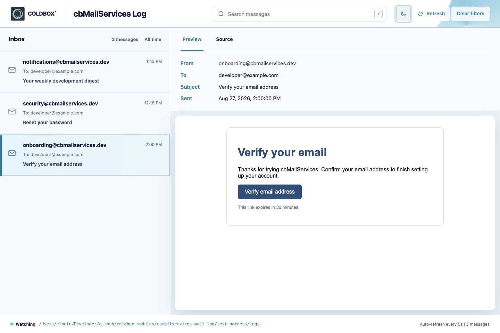
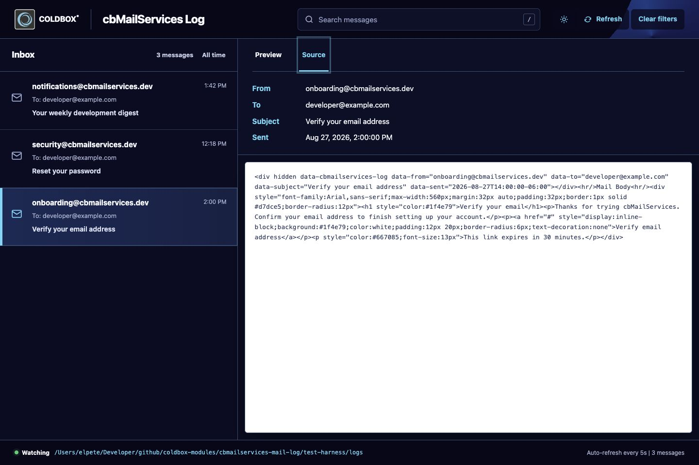

# E-Mail

E-Mail-Vorlagen verwenden [cbmailservices](https://coldbox-mailservices.ortusbooks.com) mit einfachen `@token@`-Platzhaltern, die beim Versand ersetzt werden:

```html title="app/email_templates/password_verification.bxm" linenums="1"
<h1>Reset Your Password</h1>
<p>Click the link below to reset your password:</p>
<a href="@linkToken@">Reset Password</a>
<p>This link expires @expiration@.</p>
```

Versendet über einen Service-Aufruf:

```boxlang title="Sending a templated email" linenums="1"
mailService.newMail()
    .config( from = "noreply@app.com", to = user.getEmail(), subject = "Reset Password" )
    .setBodyTokens( { linkToken: resetLink, expiration: "in 60 minutes" } )
    .setBodyTemplate( "password_verification" )
    .send();
```

## Mitgelieferte Vorlagen

| Vorlage | Gesendet wenn |
|---|---|
| `user_welcome.bxm` | Ein neues Konto wird erstellt |
| `registration_verification.bxm` | Ein neues Konto muss die E-Mail verifizieren |
| `password_verification.bxm` | Ein Link zum Zurücksetzen des Passworts wird angefordert |
| `password_reset.bxm` | Bestätigung nach einer Passwortänderung |
| `email_change_confirmation.bxm` | Ein Benutzer beantragt eine E-Mail-Änderung - gesendet an die neue Adresse zur Bestätigung |
| `email_change_notice.bxm` | Ein Benutzer beantragt eine E-Mail-Änderung - gesendet an die alte Adresse als Hinweis |

## Protokoll je Umgebung

!!! note "Files-Protokoll in der Entwicklung"
    In der Entwicklung schreibt `app/config/modules/cbmailservices.bx` ausgehende E-Mails auf die Festplatte, statt sie zu versenden - nichts verlässt deinen Rechner, während du entwickelst. Konfiguriere für die Produktion einen echten SMTP-Provider (Postmark, SendGrid oder reines SMTP) - siehe [Deployment](../deployment.md#production-checklist).

## Mail-Log-Viewer (Entwicklung)

Jede vom Files-Protokoll auf die Festplatte geschriebene E-Mail kann unter **`/cbmailservices/log`** durchsucht werden, während die App in der Entwicklung läuft. Es ist eine Seite von cbmailservices selbst (kein cbGenesis-Handler), die jede gesendete Nachricht mit einer gerenderten Vorschau und einer Rohquellen-Ansicht des tatsächlich erzeugten HTML auflistet:

<figure>
    
    <figcaption>Vorschau - die gerenderte E-Mail, genau wie ein Empfänger sie sehen würde.</figcaption>
</figure>

<figure>
    
    <figcaption>Quelle - das rohe HTML/die Metadaten, die cbmailservices auf die Festplatte geschrieben hat.</figcaption>
</figure>

Der Viewer erscheint nur in der Entwicklung: `Log.cfc` prüft bei jeder Aktion `controller.getSetting( "environment" ) == "development"` und gibt andernfalls einen 404 zurück, sodass vor dem Deployment nichts deaktiviert werden muss.

### Wie es deine E-Mails findet

Der Log-Service liest keinen festen Ordner - er untersucht jeden in `app/config/modules/cbmailservices.bx`s `mailers`-Einstellung registrierten Mailer und listet Nachrichten von jedem Mailer auf, der das `File`-Protokoll verwendet:

```boxlang title="app/config/modules/cbmailservices.bx" linenums="1"
mailers : {
    "default" : { class : "BXMail" },
    "files" : { class : "File", properties : { filePath : "/app/logs" } }
},
```

cbGenesis liefert diesen `files`-Mailer von Haus aus mit, und `development()` in derselben Datei schaltet `defaultProtocol` auf `"files"` um - sodass jede E-Mail, die die App sendet, während `environment` `development` ist, automatisch dort landet, ohne dass etwas Zusätzliches konfiguriert werden muss.

Um ihn auf einen anderen Ordner zu richten, oder um einen zweiten dateibasierten Mailer hinzuzufügen, um eine andere Konfiguration isoliert zu testen, füge unter `mailers` einen Eintrag mit `class: "File"` und einem `filePath` hinzu oder bearbeite einen bestehenden; der Viewer erfasst jeden passenden Mailer, nicht nur `files`.

### Nachrichten verwalten

Sowohl die Oberfläche als auch ihre zugrunde liegenden JSON-Routen unterstützen die Bereinigung, was nützlich ist, wenn ein Testlauf einen Haufen Nachrichten hinterlässt:

| Aktion | Route |
|---|---|
| Nachrichten auflisten (JSON) | `GET /cbmailservices/log/messages` |
| Eine Nachricht ansehen (JSON) | `GET /cbmailservices/log/message/:id` |
| Eine Nachricht löschen | `DELETE /cbmailservices/log/message/:id` |
| Eine bestimmte Menge löschen | `DELETE /cbmailservices/log/messages` mit `{ "ids": [...] }` |
| Alles löschen | `DELETE /cbmailservices/log/messages` mit `{ "all": true }` |
