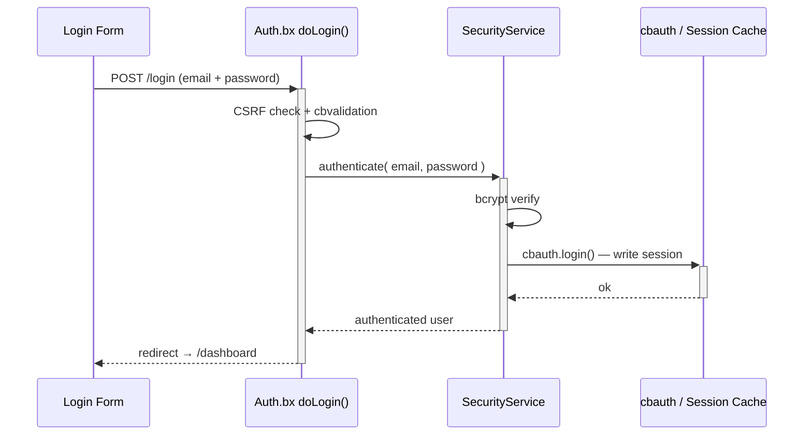
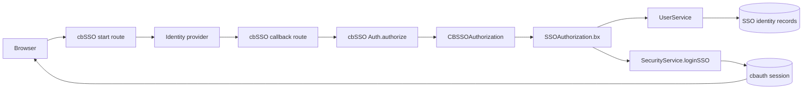
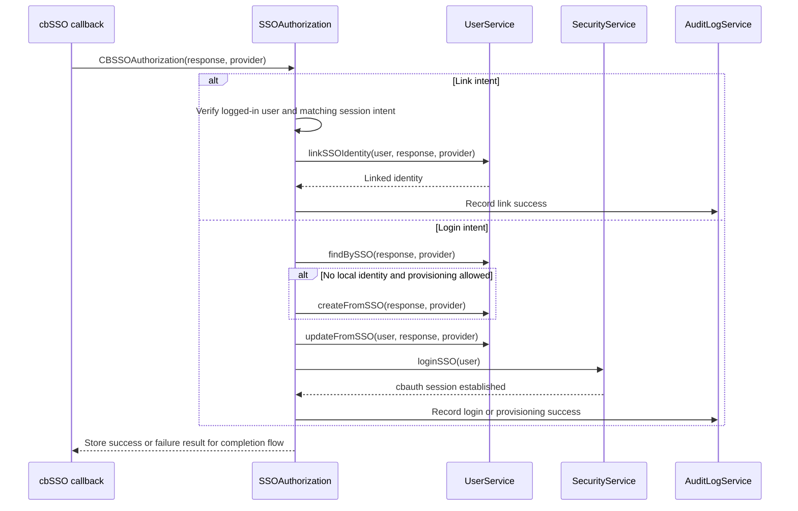

# Sicherheit & Berechtigungen

## Login-Ablauf



## Authentifizierungs-Layouts

Der Authentifizierungsablauf kann eines von zwei mitgelieferten Layouts über die Einstellung `cbLoginLayout` verwenden:

| Wert | Layout | Am besten geeignet für |
|---|---|---|
| `AuthSplit` | Gebrandetes Feature-Panel links mit dem Formular rechts; wird auf mobilen Geräten kompakt. | Anwendungen, die eine gebrandete, zweigeteilte Anmeldeerfahrung wollen. Dies ist der Standard. |
| `AuthCenter` | Zentrierte Authentifizierungskarte mit Logo, Formular und Footer. | Anwendungen, die eine fokussierte, kompakte Anmeldeerfahrung bevorzugen. |

Wähle **Auth Center** oder **Auth Split** auf der `/settings`-Seite. Das gewählte Layout gilt für Login-, Registrierungs-, Einladungsaktivierungs- und Passwort-Wiederherstellungsseiten. Siehe [App-Einstellungen](../reference/settings.md#login-layout-selection) für die Layout-Dateien und Anweisungen für ein eigenes Layout.

<figure>
	
	<figcaption>Der Login-Bildschirm mit dem Standard-Layout <code>AuthSplit</code>.</figcaption>
</figure>

## Single Sign-on

cbSSO wird über `app/config/modules/cbsso.bx` aktiviert. Es verwendet cbauth als
Session-Autorität, sodass lokaler Passwort-Login, Passkeys und SSO dieselbe
Session und dieselben Autorisierungsregeln teilen. Die Login-Seite rendert einen
Link für jeden konfigurierten Provider.

Google ist der mitgelieferte Beispiel-Provider. Setze diese Werte in `.env`,
nachdem du die Callback-URL `/cbsso/auth/Google` bei Google registriert hast:

```dotenv linenums="1"
GOOGLE_CLIENT_ID=
GOOGLE_CLIENT_SECRET=
GOOGLE_REDIRECT_URI=https://example.com/cbsso/auth/Google
```

### SSO aktivieren und deaktivieren

Es gibt keine separate `SSO_ENABLED`-Einstellung. Der effektive Provider-Schalter
liegt in [`app/config/modules/cbsso.bx`](../../app/config/modules/cbsso.bx):
cbGenesis registriert Google nur, wenn `GOOGLE_CLIENT_ID`, `GOOGLE_CLIENT_SECRET`
und `GOOGLE_REDIRECT_URI` alle gesetzt sind. Um Google-SSO zu deaktivieren,
leere einen dieser Werte und starte die Anwendung neu oder reinitialisiere sie.
Der Provider erscheint dann nicht mehr auf der Login- oder Profilseite.

Verwechsle dies nicht mit `enableCBAuthIntegration: false`. Diese Einstellung
deaktiviert cbSSOs optionalen generischen cbauth-Listener; cbGenesis verwendet
seinen eigenen `SSOAuthorization`-Interceptor, damit lokale Kontoverknüpfung,
Provisionierung, Identitätsabgleich und Audit-Regeln durchgesetzt werden können.
Siehe cbSSOs Dokumentation für
[Konfiguration](https://cbsso.ortusbooks.com/),
[Behandlung der Identity-Provider-Antwort](https://cbsso.ortusbooks.com/usage/handling-the-identity-provider-response.md),
[Interception-Points](https://cbsso.ortusbooks.com/usage/interception-points.md)
und [cbauth-Integration](https://cbsso.ortusbooks.com/cbauth-integration/enabling-integration.md).

::: stepper
::: step "Die Datenbank vorbereiten"
Führe vom Projekt-Root aus die SSO-Identitäts-Migration aus:

```bash linenums="1"
box migrate up
```

Dies erstellt die Tabelle `user_sso_identities`, die verwendet wird, um ein
lokales Konto mit einem Subjekt eines Identity-Providers zu verknüpfen. Führe
dies vor dem ersten SSO-Login aus.
:::

::: step "Den Google-OAuth-Client erstellen und konfigurieren"
Erstelle oder wähle in der [Google Cloud Console](https://console.cloud.google.com/)
ein Projekt, konfiguriere den OAuth-Consent-Screen und erstelle eine **OAuth-Client-ID**
mit Anwendungstyp **Webanwendung**. Füge genau diese autorisierte Redirect-URI
hinzu, mit der öffentlichen HTTPS-URL deiner App:

```text linenums="1"
https://your-domain.example/cbsso/auth/Google
```

Kopiere die Client-ID und das Client-Secret in die lokale `.env`-Datei. Die
Redirect-URI muss in der Google Cloud Console und in `GOOGLE_REDIRECT_URI`
denselben Wert haben:

```dotenv linenums="1"
GOOGLE_CLIENT_ID=your-google-client-id
GOOGLE_CLIENT_SECRET=your-google-client-secret
GOOGLE_REDIRECT_URI=https://your-domain.example/cbsso/auth/Google
```

Halte Zugangsdaten aus der Versionskontrolle heraus. cbGenesis registriert den
Google-Provider nur, wenn alle drei `GOOGLE_*`-Einstellungen gesetzt sind, sodass
die Anwendung auch starten kann, bevor SSO konfiguriert ist.

Die automatische Kontoerstellung ist standardmäßig deaktiviert. Um neuen
Google-Benutzern das zu erlauben, aktiviere sie explizit und beschränke die
zulässigen E-Mail-Domains:

```dotenv linenums="1"
CBSSO_AUTO_PROVISION=true
CBSSO_ALLOWED_DOMAINS=example.com,example.org
```

Lasse `CBSSO_AUTO_PROVISION=false`, wenn jeder SSO-Benutzer bereits ein lokales
Konto haben muss. Diese Benutzer müssen sich lokal anmelden und die Aktion
**Google-Konto verknüpfen** im Profil verwenden, bevor sie sich mit Google
anmelden können.
:::

::: step "Die App starten und den Ablauf verifizieren"
Starte die Anwendung mit deinem normalen Entwicklungs- oder Deployment-Befehl,
öffne dann `/login` und wähle **Mit Google fortfahren**. Bestätige, dass Google
zurück zu `/cbsso/auth/Google` weiterleitet und dass die Anwendung dich zum
Dashboard schickt.

Melde dich für ein bestehendes lokales Konto zuerst mit dem Passwort an, öffne
die Profilseite und verknüpfe das Google-Konto. Melde dich ab, kehre zu `/login`
zurück und verifiziere, dass Google-SSO dich wieder in dasselbe lokale Konto
einloggt. Falls Provisionierung aktiviert ist, verifiziere, dass eine zulässige
Domain einen lokalen Benutzer erstellt und dass eine Domain außerhalb von
`CBSSO_ALLOWED_DOMAINS` abgelehnt wird.
:::
:::

Nach der Einrichtung werden Identitäten anhand von Provider und unveränderlichem
Subjekt abgeglichen, niemals allein anhand der E-Mail-Adresse. Bestehende lokale
Konten müssen explizit verknüpft werden, bevor sie über SSO verwendet werden
können.

Für geclusterte SAML-Deployments konfiguriere cbSSOs `samlRequestCacheName` auf
eine verteilte CacheBox-Region statt den standardmäßigen In-Memory-Replay-Cache
zu verwenden.

### Wie cbSSO zu einer lokalen Session wird

cbSSO besitzt das Provider-Protokoll und die Callback-Validierung. cbGenesis
besitzt die anschließende Entscheidung: zu welchem lokalen Konto die verifizierte
Identität gehört, ob sie provisioniert oder verknüpft werden darf, und wie sie
zu einer authentifizierten Anwendungssession wird.



Die Anwendung registriert `app/interceptors/SSOAuthorization.bx` für cbSSOs
dokumentierten `CBSSOAuthorization`-Interception-Point. Die Callback-Payload
enthält die verifizierte Provider-Antwort und den Provider, der sie behandelt
hat. Der Interceptor folgt dann einem von zwei anwendungseigenen Pfaden:



### Warum es diesen Interceptor gibt

cbSSO stellt auch einen generischen `cbAuth`-Integrations-Listener bereit.
cbGenesis setzt absichtlich `enableCBAuthIntegration: false` in
`app/config/modules/cbsso.bx`, weil der generische Listener die
Identitäts- und Kontosicherheitsregeln der Anwendung nicht durchsetzen kann.
Der individuelle Interceptor ist verantwortlich für:

- Den Abgleich von Identitäten anhand von Provider und unveränderlichem Subjekt, niemals allein anhand der E-Mail-Adresse.
- Das Erfordern einer authentifizierten Session und einer übereinstimmenden Absicht für die Kontoverknüpfung.
- Das Anwenden der Provisionierungs- und Domain-Zulassungsrichtlinie vor der Benutzererstellung.
- Das Halten von lokalem Passwort-, Remember-me-, Passkey- und SSO-Authentifizierungspfaden unter derselben cbauth-Session-Autorität.
- Das Protokollieren erfolgreicher und fehlgeschlagener SSO-Operationen im Audit-Trail.

Diese Trennung ist beabsichtigt: cbSSO verifiziert, *wer der Provider sagt, dass
der Benutzer ist*; cbGenesis entscheidet, *was diese Identität in dieser
Anwendung tun darf*.

Für den vorgelagerten Vertrag und die alternative generische Integration siehe die
Dokumentation zu [cbSSO-Interception-Points](https://cbsso.ortusbooks.com/usage/interception-points.md),
[Behandlung der Identity-Provider-Antwort](https://cbsso.ortusbooks.com/usage/handling-the-identity-provider-response.md)
und [cbAuth-Integration](https://cbsso.ortusbooks.com/cbauth-integration/enabling-integration.md).

## Sicherheitsschichten

| Schicht | Implementierung |
|---|---|
| Session-Authentifizierung | cbauth mit `CacheStorage@cbStorages` — serverseitiger Session-Cache |
| Passwort-Hashing | bcrypt über `bx-password-encrypt` |
| Passwortrichtlinie | `SettingService.isValidPassword()` — `cbMinPasswordLength` plus einen Großbuchstaben, einen Kleinbuchstaben, eine Ziffer und ein Sonderzeichen. Serverseitig durchgesetzt bei Registrierung, Einladungsaktivierung, Passwort-Zurücksetzung und Profil-Passwortänderung; der Alpine-Helfer `$passwordMeetsPolicy` spiegelt es im Browser |
| CSRF-Schutz | Rotierendes cbsecurity-Token (30 Min); der Auto-Verifier ist aus, und `BaseSecureHandler` verifiziert stattdessen deny-by-default bei jeder unsicheren HTTP-Methode — siehe [Handler & Routing](handlers-routing.md#csrf-verification) |
| Handler-Sicherheit | `@secured`-Annotation → Firewall leitet nicht authentifizierte Besucher zu `login` um, authentifizierte, aber nicht berechtigte Benutzer zu `dashboard.notAuthorized` |
| JWT-Unterstützung | Konfiguriert für API-Zugriff (HS512, 60 Min, Cache-Token-Speicher) |
| Sicherheits-Header | XSS-Schutz, `frameOptions: SAMEORIGIN`, `referrerPolicy: same-origin` |
| API-Tokens | SHA/BCrypt-gehashte, personenbezogene Tokens mit Ablaufzeit und täglichem Bereinigungs-Scheduler |
| Rate Limiting | `RateLimiter`-Interceptor drosselt Login, Registrierung und Passwort-Zurücksetzung nach IP - siehe [Rate Limiting](#rate-limiting) unten |

## Rate Limiting

`app/interceptors/RateLimiter.bx` feuert bei `preProcess` - vor dem Routing, vor jedem laufenden Handler - und drosselt fünf nicht authentifizierte `Auth`-Endpunkte nach Client-IP:

- `doLogin`, `doRegister`, `doForgotPassword`, `doResetPassword`, `doActivateInvitation`

Ein Aufrufer, der das Limit überschreitet, wird mit einer Flash-Fehlermeldung zurück zum Formular geleitet; der Request erreicht den Handler nie, sodass ein korrektes Passwort, das während der Blockierung übermittelt wird, den Benutzer trotzdem nicht einloggt.

| Einstellung | Zweck |
|---|---|
| `cbRateLimitMaxAttempts` | Erlaubte Versuche pro IP, pro Endpunkt, innerhalb des Fensters (Standard: `5`) |
| `cbRateLimitWindowSeconds` | Fensterlänge in Sekunden (Standard: `300`). `0` deaktiviert Rate Limiting vollständig |
| `cbTrustProxyHeaders` | Ob das "pro IP" in "pro IP, pro Endpunkt" aus `X-Forwarded-For` oder der rohen Socket-Adresse stammt (Standard: `true`) - siehe [Deployment hinter einem Reverse-Proxy](../deployment.md#deploying-behind-a-reverse-proxy) |

Alle drei sind unter `/settings` wie jede andere App-Einstellung editierbar - siehe [App-Einstellungen](../reference/settings.md#password--token-policy).

!!! warning "`cbTrustProxyHeaders` ist eine Deployment-Entscheidung, keine Code-Entscheidung"
    `X-Forwarded-For` ist ein einfacher HTTP-Header - jeder Aufrufer kann ihn auf einen beliebigen Wert setzen, es sei denn, etwas vor der App (ein Reverse-Proxy oder Load-Balancer) entfernt, was der Client gesendet hat, und setzt ihn selbst. Ob das der Fall ist, weiß nur die Person, die die App deployt.

    - **Ein (Standard)**: vertraut `X-Forwarded-For`/`X-Cluster-Client-IP`, passend zu einem typischen Deployment dieser App hinter einem Reverse-Proxy oder Load-Balancer. Überschreibt dein Proxy diesen Header *nicht* (oder du hängst direkt am Internet ohne etwas davor), kann ein Aufrufer ihn fälschen, um bei jedem Request einen frischen Rate-Limit-Eimer zu bekommen und die im Audit-Trail aufgezeichnete IP zu fälschen - schalte dies in diesem Fall aus.
    - **Aus**: `getRealIP()` verwendet stattdessen die rohe Socket-Adresse. Korrekt, wenn die App direkt am Internet hängt, aber wenn du *tatsächlich* hinter einem Proxy sitzt, sieht jeder Aufrufer aus wie die eigene IP des Proxys - eine blockierte "IP" blockiert alle dahinter, und jeder Audit-Log-Eintrag zeigt die Adresse des Proxys statt der des echten Clients.

### Wie das Zählen funktioniert

`RateLimitService.attempt()` ist ein **gleitendes Fenster**: Jeder Versuch, ob erlaubt oder blockiert, setzt den Ablauf des Schlüssels auf das volle Fenster ab diesem Moment zurück. Ein Schlüssel kühlt erst ab, wenn er für ein ganzes Fenster still bleibt - was so lange weiter blockiert, wie ein Angriff andauert, statt sich mittendrin wieder zu öffnen. Jeder Endpunkt hat seinen eigenen Zähler (Schlüssel `event:ip`), sodass das Ausschöpfen des Login-Limits Registrierung oder Passwort-Zurücksetzung nicht beeinflusst.

!!! note "Standardmäßig in-memory"
    Zähler leben in der `rateLimit`-CacheBox-Region (`app/config/CacheBox.bx`), die in-memory und daher **pro Anwendungsinstanz** ist. Hinter einem Load-Balancer mit mehr als einer Instanz setzt jede Instanz ihr eigenes Limit unabhängig durch - ein Aufrufer könnte `cbRateLimitMaxAttempts` freie Versuche pro Instanz statt insgesamt bekommen. Um Zählungen über Instanzen hinweg zu teilen, tausche `provider`/`properties` der `rateLimit`-Region gegen einen verteilten CacheBox-Provider (Redis, Couchbase oder jeden von CacheBox unterstützten Provider) - keine Codeänderung in `RateLimitService` oder `RateLimiter` nötig, da beide über die injizierte `cachebox:rateLimit`-Region laufen.

## `cbsecurity`-Konfiguration

`app/config/modules/cbsecurity.bx` ist die einzige Quelle der Wahrheit für die Firewall:

```boxlang title="app/config/modules/cbsecurity.bx (excerpt)" hl_lines="3 8 9" linenums="1"
{
    authentication : {
        provider          : "authenticationService@cbauth",
        prcUserVariable   : "authUser"
    },
    firewall : {
        autoLoadFirewall         : true,
        validator                 : "CBAuthValidator@cbsecurity",
        handlerAnnotationSecurity : true,
        invalidAuthenticationEvent : "login",
        invalidAuthorizationEvent  : "dashboard.notAuthorized",
        rules                      : [] // authorization is annotation-based, not rule-based
    }
}
```

- **`prcUserVariable: "authUser"`** — der authentifizierte Benutzer ist in jedem Handler, jeder View und jedem Layout immer als `prc.authUser` verfügbar.
- **`handlerAnnotationSecurity: true`** — dies ist es, was `@secured`-Annotationen an einer Handler-Klasse oder -Aktion überhaupt durchsetzbar macht.
- **`rules: []`** — diese App erledigt ihre gesamte Autorisierung über Handler-Annotationen, nicht über cbsecuritys alternative URL-Muster-Regelliste.

## Berechtigungsmodell

Jede Berechtigung ist ein Slug der Form `resource:action`, eingesät von `resources/database/seeds/AdminData.bx`:

| Ressource | Aktionen |
|---|---|
| `users` | `read`, `write`, `delete`, `admin` |
| `roles` | `read`, `write`, `delete`, `admin` |
| `permissions` | `read`, `write`, `delete`, `admin` |
| `settings` | `read`, `write`, `delete`, `admin` |
| `auditlog` | `read`, `export`, `delete`, `admin` |

!!! info "`admin` ist eine Obermenge"
    `admin` bedeutet "vollständige Verwaltung dieser Ressource" und wird immer per ODER neben die spezifische Aktion gestellt, die eine Route benötigt, sodass ein Benutzer mit `roles:admin` jede `roles:*`-Prüfung besteht, ohne zusätzlich `roles:read`/`roles:write`/`roles:delete` einzeln zu benötigen. Der Seeder weist alle 20 eingebauten Berechtigungen einer einzigen **Admin**-Rolle zu, die dem eingesäten Benutzer `admin@cbgenesis.com` gewährt wird.

::: columns
::: column
<figure>
	
	<figcaption>Die Roles-Admin-Seite.</figcaption>
</figure>
:::
::: column
<figure>
	
	<figcaption>Die Permissions-Admin-Seite, gruppiert nach Ressource.</figcaption>
</figure>
:::
:::

**Am Handler durchsetzen** — dies ist die eigentliche Sicherheitsgrenze, aufgelöst von cbsecuritys `CBAuthValidator` gegen die Berechtigungen des authentifizierten Benutzers:

```boxlang title="app/handlers/Roles.bx" linenums="1"
@secured( "roles:admin,roles:read" )     // class-level: applies to index and any action without its own annotation
class extends="BaseSecureHandler" {

    @secured( "roles:admin,roles:write" )
    function create( event, rc, prc ) { ... }

    @secured( "roles:admin,roles:delete" )
    function delete( event, rc, prc ) { ... }

}
```

Eine kommagetrennte Liste ist eine **ODER**-Prüfung — jede einzelne der aufgeführten Berechtigungen genügt.

**In der View spiegeln** — nur UX, *niemals* allein die Sicherheitsgrenze. `User.bx` stellt `hasPermission()` auf `prc.authUser` bereit, verfügbar in jeder View oder jedem Layout, das über einen gesicherten Handler gerendert wird:

```html title="Example view guard" linenums="1"
<bx:if prc.authUser.hasPermission( "roles:write,roles:admin" )>
    <button type="button" class="btn btn-primary" @click="openCreate()">New Role</button>
</bx:if>
```

`hasPermission()` akzeptiert einen String, eine Komma-Liste oder ein Array und führt eine ODER-Prüfung durch; `hasAllPermissions()` macht das UND-Äquivalent. Beide werden pro Request über `getAllPermissions()` gecacht, das die à-la-carte-Berechtigungen eines Benutzers mit jeder über seine Rollen gewährten Berechtigung vereinigt. Jede bestehende Admin-View (Sidebar-Navigation, Users/Roles/Permissions/Settings) folgt bereits diesem Muster — behandle es als Vorlage für neue gesicherte Module.

Ein Benutzer, der eine `@secured`-Prüfung nicht besteht, wird umgeleitet:

- **Nicht authentifiziert** → `login`
- **Authentifiziert, fehlende Berechtigung** → `dashboard.notAuthorized`

## Verwandte Sicherheits-Services

| Modell | Zweck |
|---|---|
| `SecurityService` | Kapselt cbauths Authentifizierungsservice; `login()`/`authenticate()`, Remember-me-Cookie-Verwaltung mit Token-Rotation, `logout()`, Ausstellung/Verifizierung von Passwort-Reset-Tokens (cache-gestützt, nicht DB) |
| `UserService` | `requestEmailChange()`/`confirmEmailChange()`/`cancelEmailChange()` - Self-Service-E-Mail-Änderung, abgesichert hinter einem `PURPOSE_EMAIL_CHANGE`-Aktions-Token, sodass eine neue Adresse erst angewendet wird, sobald der Benutzer sie aus seinem Posteingang bestätigt |
| `APIToken` / `APITokenService` | SHA/BCrypt-gehashte persönliche Zugriffstokens — `createToken()` gibt das rohe Token genau einmal zurück, `revokeToken()`/`revokeAllForUser()`, `purgeExpiredTokens()` nach Zeitplan |
| `RememberToken` / `RememberTokenService` | Persistente "Angemeldet bleiben"-Browser-Tokens, bei jeder Verwendung rotiert |
| `UserActionToken` / `UserActionTokenService` | Zweckgebundene, einmal verwendbare Tokens — `issue()`, `resolve()`, `consume()`. Fünf Zwecke: `PURPOSE_REGISTRATION`, `PURPOSE_INVITATION`, `PURPOSE_PASSWORD_RESET`, `PURPOSE_FORCED_PASSWORD_CHANGE`, `PURPOSE_EMAIL_CHANGE` |
| `Passkey` / `PasskeyService` | WebAuthn-Credentials für passwortlose Anmeldung; `cbRequirePasskey` lässt `BaseSecureHandler` einen Benutzer ohne Passkey zu `profile/passkey-required` umleiten |
| `AuditLog` / `AuditLogService` | Der Audit-Trail. Der `AuditLogger`-Interceptor schreibt Anmeldungen, Abmeldungen und fehlgeschlagene Authentifizierung/Autorisierung automatisch — siehe [Architektur](../architecture.md#interceptors) |
| `Passkey` / `PasskeyService` | WebAuthn-Credential-Speicherung über den `ICredentialRepository`-Vertrag von `cbsecurity-passkeys` |

<figure>
	
	<figcaption>Die Audit-Log-Admin-Seite, mit einer aufgezeichneten Anmeldung.</figcaption>
</figure>

## Bekannte Probleme

### "This is an invalid domain" bei der Passkey-Registrierung

Passkeys sind während der lokalen Entwicklung für die Domain `localhost` konfiguriert. Öffnest du die Anwendung mit einer IP-Adresse wie `http://127.0.0.1:8080`, behandelt WebAuthn dies als anderen Origin und lehnt die Registrierung mit **"This is an invalid domain."** ab.

Öffne die Anwendung stattdessen unter **[http://localhost:8080](http://localhost:8080)**. Für einen Origin registrierte Passkeys sind nicht mit einem anderen austauschbar, also lösche und registriere den Passkey erneut, falls er erstellt wurde, während ein anderer Hostname verwendet wurde.

::: cards
::: card title="Handler & Routing" icon="phosphor-duotone:signpost" href="handlers-routing.md"
Jede `@secured`-Annotation im Kontext sehen, Handler für Handler.
:::
::: card title="Routen-Übersicht" icon="phosphor-duotone:map-trifold" href="../reference/routes.md"
Welche Berechtigung welche URL schützt, auf einen Blick.
:::
::: card title="Die App erweitern" icon="phosphor-duotone:puzzle-piece" href="extending.md"
Eine brandneue Berechtigung hinzufügen und durch Handler, View und Seeder verdrahten.
:::
:::
