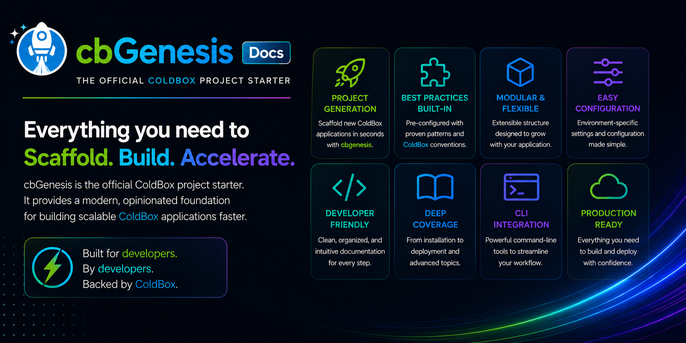
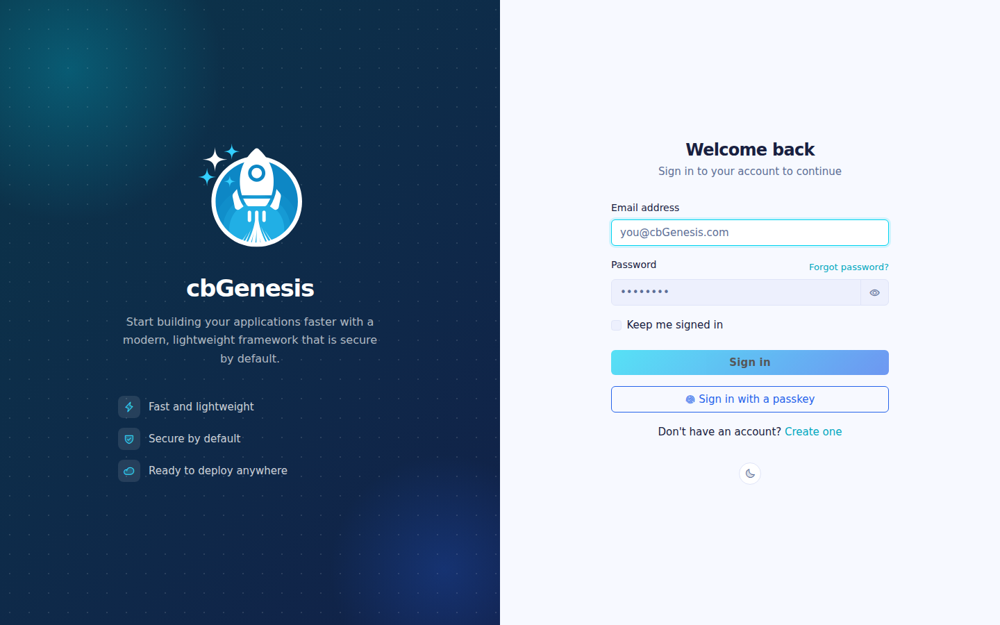
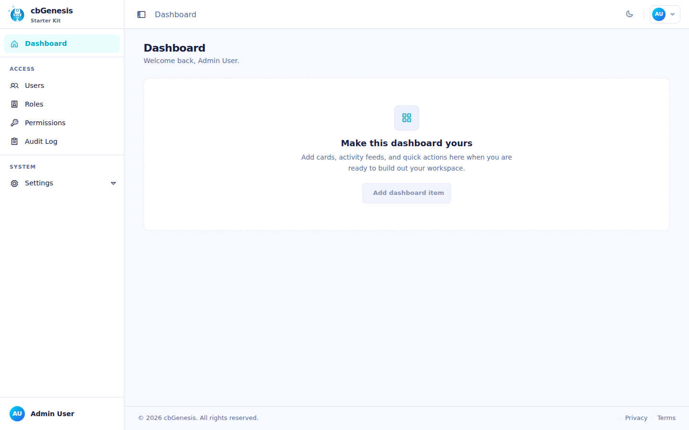
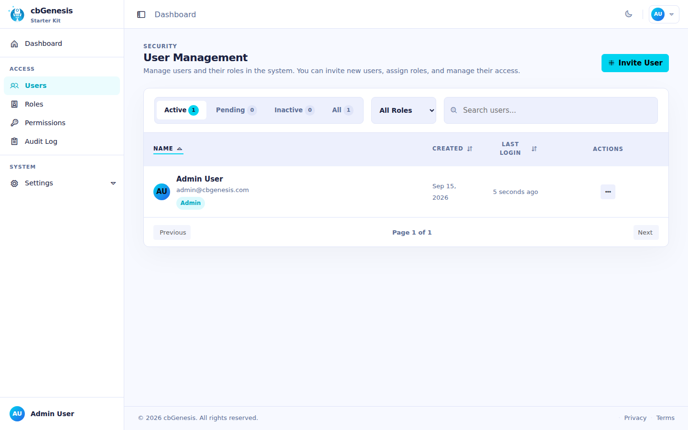
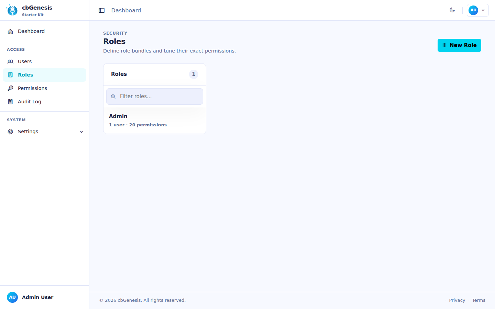
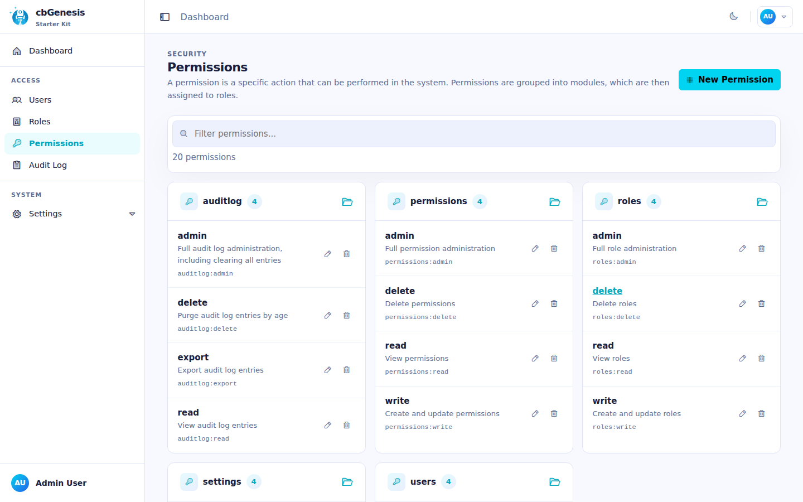
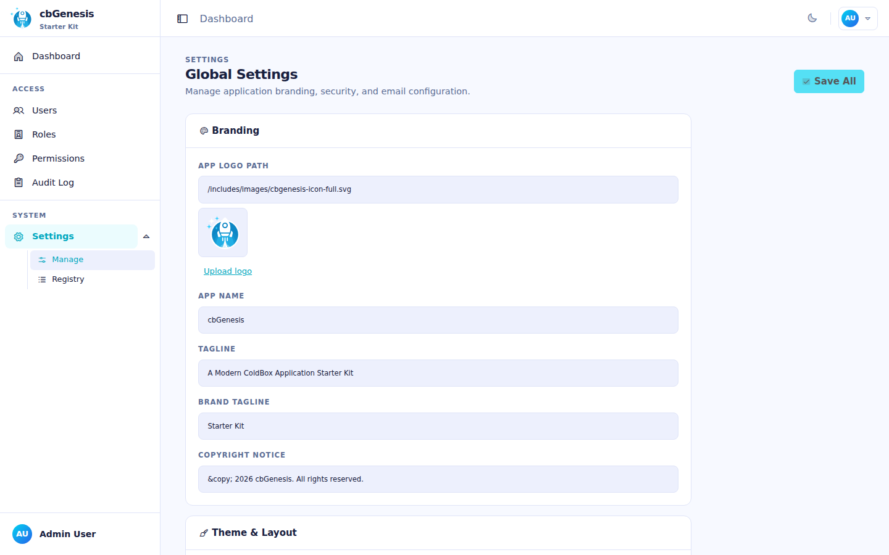
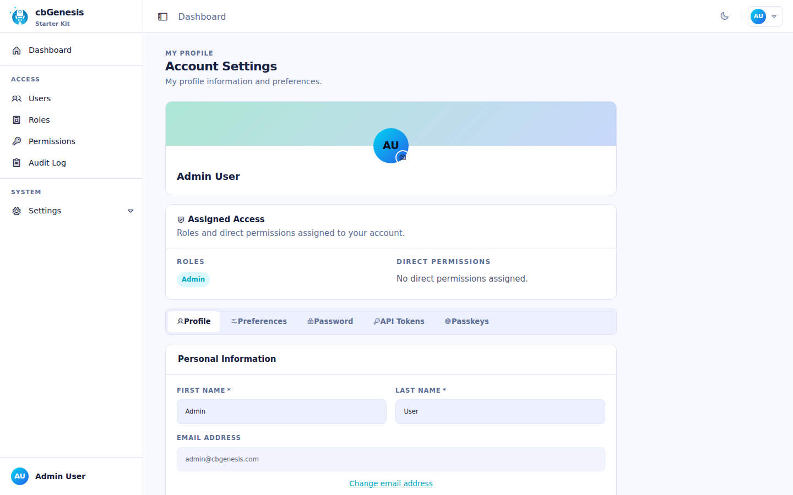
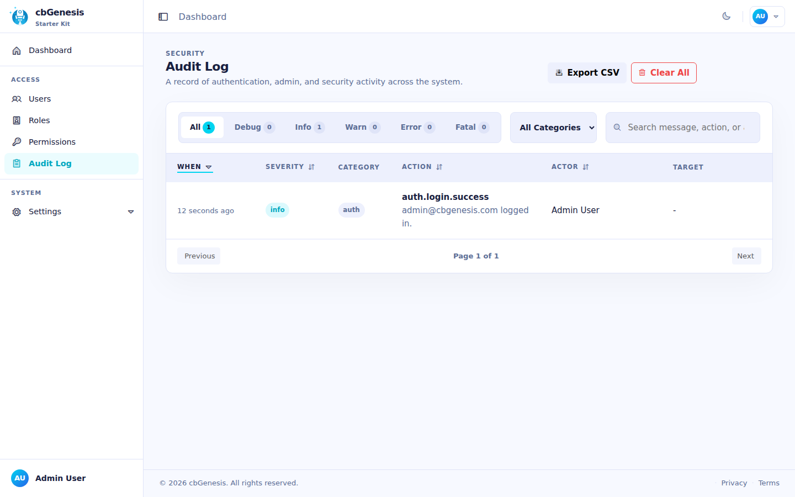
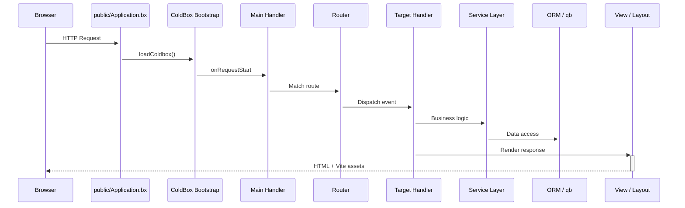

<!--
	This page renders through docs/.theme/home.bxm (the `layout: home` above),
	which hardcodes the whole page and never includes this file's own
	rendered body - everything below is kept, unused, as the starting
	point for reverting to the normal layout.bxm + page.bxm rendering if
	`layout: home` is ever removed.
-->

	
	

		<a class="bxsites-hero__btn bxsites-hero__btn--primary" href="getting-started.md">Loslegen</a>
		<a class="bxsites-hero__btn bxsites-hero__btn--secondary" href="https://github.com/coldbox-templates/cbGenesis">Auf GitHub ansehen</a>
	

Eine produktionsreife **ColdBox-HMVC**-Starter-Vorlage für [BoxLang](https://boxlang.io) - die moderne, dynamische JVM-Sprache. Sie bringt Authentifizierung, SSO, Passkeys, rollenbasierte Berechtigungen, API-Tokens, Dark Mode und ein Alpine-gestütztes Admin-Panel mit, sodass du deinen ersten Tag mit dem Bauen von Features statt mit dem Aufbau der Authentifizierung verbringst.

::: cards
::: card title="In Minuten startklar" icon="phosphor-duotone:rocket-launch" href="getting-started.md"
BoxLang installieren, die Vorlage klonen, Migrationen ausführen und in unter zehn Minuten den Login-Bildschirm sehen.
:::
::: card title="Gebaut für KI-gestützte Entwicklung" icon="phosphor-duotone:robot" href="ai-native.md"
AGENTS.md, MCP-Dokumentationsserver und individuelle Skills, die beim Weiterbauen dieser Codebasis mit einem KI-Agenten gegenüber einem Neuanfang echte, gemessene Tokens einsparen.
:::
::: card title="Moderne Vorlagenstruktur" icon="phosphor-duotone:folders" href="architecture.md"
Anwendungscode liegt in `app/`, vollständig getrennt vom öffentlichen Webroot in `public/` - erhöhte Sicherheit von Haus aus.
:::
::: card title="Auth & RBAC inklusive" icon="phosphor-duotone:shield-check" href="guides/security.md"
Session-Authentifizierung über cbauth, `@secured`-Handler-Annotationen, CSRF-Rotation, JWT-Unterstützung und ein `resource:action`-Berechtigungsmodell.
:::
::: card title="SSO & Passkeys" icon="phosphor-duotone:key" href="guides/security.md#single-sign-on"
cbSSO mit einem mitgelieferten Google-OAuth-Provider und Kontoverknüpfung sowie WebAuthn-Passkeys für passwortlose Anmeldung.
:::
::: card title="Hibernate ORM + qb" icon="phosphor-duotone:database" href="guides/database-orm.md"
`BaseEntity`/`BaseService`-Konventionen auf Basis von cborm, Migrationen über cfmigrations und qb für alles, was rohes SQL besser kann.
:::
::: card title="Alpine.js + Bootstrap 5 UI" icon="phosphor-duotone:palette" href="guides/frontend.md"
Serverseitig gerenderte BXM-Views, angereichert mit kleinen Alpine-Komponenten, von Vite mit Hot Module Reload kompiliert.
:::
::: card title="Eine echte Testsuite" icon="phosphor-duotone:test-tube" href="guides/testing.md"
TestBox-Unit-Specs für jede Entität und jeden Service, plus Integrations-Specs, die echte HTTP-Requests ausführen.
:::
::: card title="Einfache Konfiguration" icon="phosphor-duotone:sliders" href="guides/configuration.md"
Umgebungsvariablen für das Wesentliche, DB-gestützte Admin-Einstellungen für alles andere - kein Redeploy nötig, um sie zu ändern.
:::
::: card title="Produktionsreif" icon="phosphor-duotone:cloud-arrow-up" href="deployment.md"
Eine echte Go-Live-Checkliste, Docker-Unterstützung und die Wahl zwischen CommandBox oder dem BoxLang MiniServer.
:::
:::

## Screenshots

Das Admin-Panel, Ende-zu-Ende, vom Login bis zum Audit-Trail:

::: columns
::: column
<figure>
	
	<figcaption>Login - das Standard-Layout <code>AuthSplit</code>.</figcaption>
</figure>
:::
::: column
<figure>
	
	<figcaption>Dashboard - nach der Anmeldung.</figcaption>
</figure>
:::
:::

::: columns
::: column
<figure>
	
	<figcaption>Benutzer - Konten suchen, einladen und verwalten.</figcaption>
</figure>
:::
::: column
<figure>
	
	<figcaption>Rollen - Berechtigungen gruppieren und Benutzern zuweisen.</figcaption>
</figure>
:::
:::

::: columns
::: column
<figure>
	
	<figcaption>Berechtigungen - das <code>resource:action</code>-Modell, gruppiert nach Ressource.</figcaption>
</figure>
:::
::: column
<figure>
	
	<figcaption>Einstellungen - DB-gestützte Konfiguration, kein Redeploy nötig.</figcaption>
</figure>
:::
:::

::: columns
::: column
<figure>
	
	<figcaption>Profil - Avatar, Passkeys, API-Tokens und Kontoeinstellungen.</figcaption>
</figure>
:::
::: column
<figure>
	
	<figcaption>Audit-Log - jede Anmeldung, Abmeldung und jeder Zugriffsfehler.</figcaption>
</figure>
:::
:::

## Sehen statt nur lesen

Der Request-Lebenszyklus von CBGenesis, vom Browser bis zur Datenbank und zurück:

::: columns
::: column
!!! tip "Per Konvention abgesichert"
    Jeder Admin-Handler erweitert `BaseSecureHandler` und trägt eine `@secured( "resource:action,resource:admin" )`-Annotation. Die Firewall setzt sie durch - keine handgestrickten `if`-Prüfungen, verstreut über deine Controller. Siehe [Sicherheit & Berechtigungen](guides/security.md).
:::
::: column
!!! faq "Wachse auf deine Art"
    Neues CRUD-Modul? Neue Einstellung? Neue geplante Aufgabe? [CBGenesis erweitern](guides/extending.md) führt genau durch die Dateien, die dafür anzufassen sind, in der Reihenfolge, die der bestehende Code bereits vorgibt.
:::
:::

## Wie es weitergeht

::: cards
::: card title="Erste Schritte" icon="phosphor-duotone:rocket-launch" href="getting-started.md"
Installieren, konfigurieren, migrieren und die App lokal ausführen.
:::
::: card title="Gebaut für KI-gestützte Entwicklung" icon="phosphor-duotone:robot" href="ai-native.md"
Warum der Start hier besser ist, als Auth, RBAC und CSRF mit einem Agenten von Grund auf zu bauen - mit einem gemessenen Vergleich.
:::
::: card title="Architektur" icon="phosphor-duotone:tree-structure" href="architecture.md"
Die moderne app/public-Trennung, der vollständige Projektbaum und der Request-Lebenszyklus.
:::
::: card title="Handler & Routing" icon="phosphor-duotone:signpost" href="guides/handlers-routing.md"
Jeder Handler, jede Route und die Konventionen, die sie verbinden.
:::
::: card title="Sicherheit & Berechtigungen" icon="phosphor-duotone:shield-check" href="guides/security.md"
cbsecurity, cbauth, CSRF, JWT und das `resource:action`-Berechtigungsmodell.
:::
::: card title="Datenbank & ORM" icon="phosphor-duotone:database" href="guides/database-orm.md"
Entitäten, Services, Migrationen und Seed-Daten.
:::
::: card title="Frontend" icon="phosphor-duotone:palette" href="guides/frontend.md"
Alpine.js-Komponenten, SCSS-Struktur und die Vite-Pipeline.
:::
::: card title="Die App erweitern" icon="phosphor-duotone:puzzle-piece" href="guides/extending.md"
Ein CRUD-Modul, eine Berechtigung, eine Einstellung oder eine geplante Aufgabe hinzufügen.
:::
::: card title="Deployment" icon="phosphor-duotone:cloud-arrow-up" href="deployment.md"
Produktions-Build, Docker, BoxLang MiniServer und eine Go-Live-Checkliste.
:::
:::

## Erstellt mit BX Sites

Diese Dokumentationsseite wird mit [BX Sites](https://ortus-boxlang.github.io/bx-sites/) erzeugt - dem offiziellen statischen Seitengenerator von BoxLang - direkt aus dem Markdown im `docs/`-Ordner dieses Repositories, unter Verwendung des Standard-Themes `bootstrap`. Siehe [`.github/workflows/docs.yml`](https://github.com/coldbox-templates/cbGenesis/blob/development/.github/workflows/docs.yml), wie sie bei jedem Push gebaut und veröffentlicht wird.
