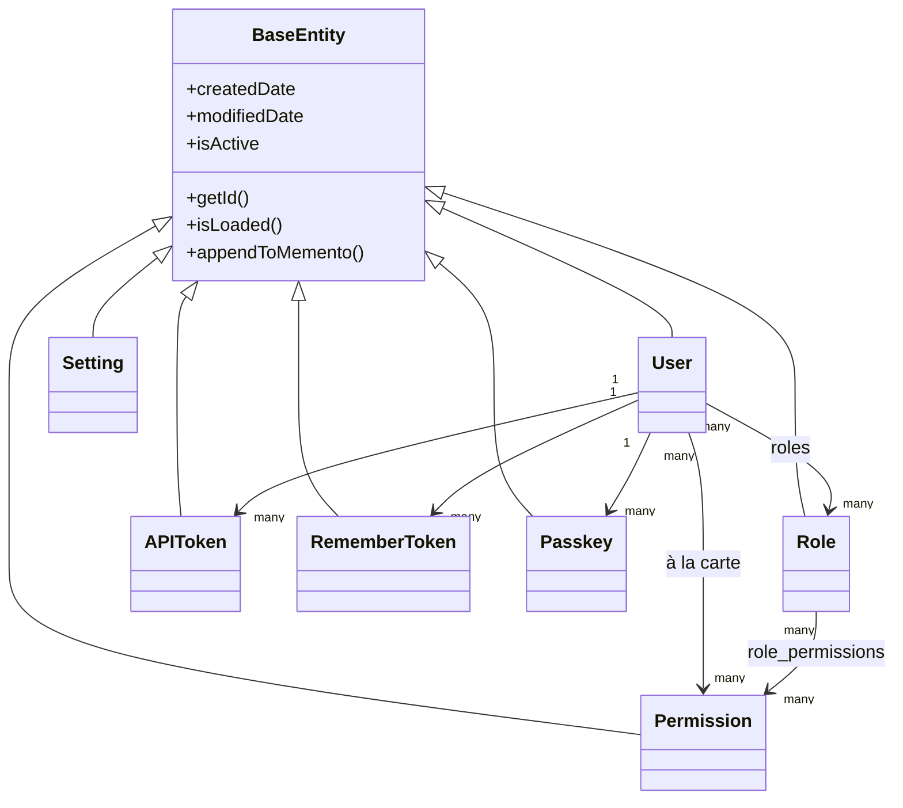

# Database & ORM

## Entity hierarchy

Every entity extends `BaseEntity` (`@mappedsuperclass`, itself extending `cborm.models.ActiveEntity`), which adds `createdDate`, `modifiedDate`, and an `isActive` soft-delete flag to every table automatically:



`dbcreate: "none"` (set in `public/Application.bx`'s `ormSettings`) means schema is owned exclusively by migrations — the ORM never auto-generates or alters tables.

## Service layer pattern

Every service extends `BaseService` (`@singleton`, extends `cborm.models.VirtualEntityService`), which injects `qb`, `coldbox`, `wirebox`, and `cachebox:template`, and provides `ensureSortOrder()`:

```boxlang title="Example service" linenums="1"
component
    extends="BaseService"
    singleton
    threadSafe
{

    property name="qb"    inject="provider:QueryBuilder@qb";
    property name="cache" inject="cachebox:template";

    function list( struct criteria = {} ){
        return newCriteria()
            .when( criteria.search, function( c, term ){
                c.like( "name", "%#term#%" );
            } )
            .list();
    }

}
```

=== "Entity"
    ```boxlang title="app/models/security/Role.bx"
    /**
     * A role: a named bundle of permissions.
     */
    class extends="app.models.BaseEntity" table="roles" {

        property name="roleId" fieldtype="id" generator="uuid2" ormtype="string";
        property name="name" type="string";

        property name="permissions"
            fieldtype="many-to-many"
            cfc="Permission"
            linktable="role_permissions";

    }
    ```
=== "Service"
    ```boxlang title="app/models/security/RoleService.bx"
    component extends="app.models.BaseService" singleton threadSafe {

        function getAllForLookup(){
            return newCriteria().resultTransformer( "distinct" ).list();
        }

    }
    ```

## Migrations

Powered by [cfmigrations](https://cfmigrations.ortusbooks.com) via the `commandbox-migrations` CLI module, configured in `.cbmigrations.json` (`migrationsDirectory: resources/database/migrations/`, `seedsDirectory: resources/database/seeds/`, connection built from the same `DB_*` env vars as `public/Application.bx`).

```bash frame="terminal" title="Terminal"
box migrate up           # Run pending migrations
box migrate down         # Rollback the last batch
box migrate reset        # Rollback everything, then re-migrate
box migrate seed         # Run database seeders
```

Migrations run in filename/timestamp order:

| Migration | Creates |
|---|---|
| `..._settings.bx` | `settings` (GUID PK, unique `name`, longtext `value`) |
| `..._security.bx` | `permissions`, `roles`, `role_permissions` (composite-PK join table, cascading FKs) |
| `..._users.bx` | `users` (GUID PK, unique `email`, nullable `password`, JSON `preferences`), plus `user_roles`, `user_permissions`, `user_remember_tokens`, `user_api_tokens`, `user_action_tokens`, `user_passkeys` — every child table FK'd to `users.userId` with `ON DELETE CASCADE` |

## Seed data

`resources/database/seeds/AdminData.bx`, run via `box migrate seed`, creates:

- An **Administrator** role
- **16 permissions** across four resources (`users`, `roles`, `permissions`, `settings`), each with `read`/`write`/`delete`/`admin` — all assigned to the Administrator role
- One admin user, `admin@cbgenesis.com`, assigned the Administrator role

See [Security & Permissions](security.md#permission-model) for how those slugs are enforced at the handler level.

::: cards
::: card title="Security & Permissions" icon="phosphor-duotone:shield-check" href="security.md"
How the `permissions`/`roles` tables map onto `@secured` handler checks.
:::
::: card title="Extending the App" icon="phosphor-duotone:puzzle-piece" href="extending.md"
Add a new entity, service, and migration for your own domain.
:::
:::
