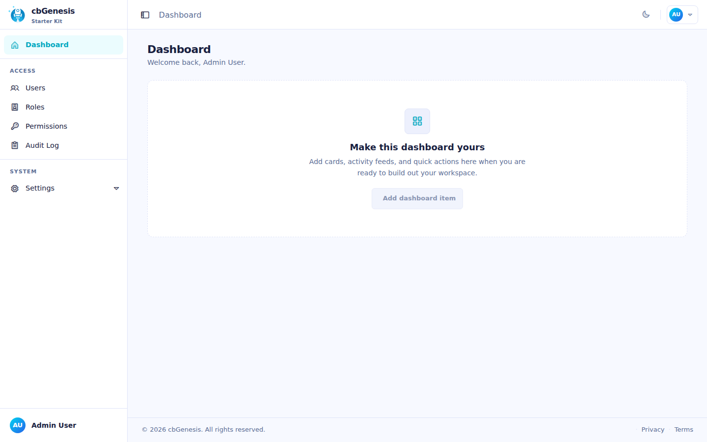

# Getting Started

## System requirements

- **Java 21+** (JDK or JRE)
- **BoxLang 1.17+**
- **CommandBox 7+** (`bx-cli`)
- **Node.js 22+** (for the Vite frontend)
- **A supported database**: MySQL 8+ (default), MariaDB, PostgreSQL, SQLite, Oracle, or MSSQL
- Any operating system

## Install BoxLang

=== "Quick installer"

	### MacOS & Linux

	```bash frame="terminal" title="Terminal"
	# macOS & Linux
	/bin/bash -c "$(curl -fsSL https://install.boxlang.io)"

	# ...with automatic Java 21 installation
	curl -fsSL https://install.boxlang.io | bash -s -- --with-jre
	```

	### Windows

	```powershell frame="terminal" title="PowerShell (Windows)"
	powershell -NoExit -Command "iex ((New-Object System.Net.WebClient).DownloadString('https://install-windows.boxlang.io'))"
	```

=== "BVM (version manager)"

	Use [BVM](https://boxlang.ortusbooks.com) instead if you need to switch between multiple BoxLang versions:

	```bash frame="terminal" title="Terminal"
	curl -fsSL https://install-bvm.boxlang.io | bash

	bvm install latest && bvm use latest
	```

	Verify the install:

	```bash frame="terminal" title="Terminal"
	boxlang --version
	```

!!! danger "Use bx-cli, not regular CommandBox"
    CBGenesis is a BoxLang template. Do not install the standard Lucee-based CommandBox distribution. After installing BoxLang with the quick installer or BVM, install the BoxLang-native CLI module. This is required before running `box install`, `box server`, `box migrate`, or `box testbox`:

    ```bash frame="terminal" title="Terminal"
    install-bx-module bx-cli
    ```

    Verify that the BoxLang CLI is active:

    ```bash frame="terminal" title="Terminal"
    box version
    ```

    Current developers using the Lucee-based CommandBox distribution should clean cached artifacts to ensure they are running the latest versions of the required modules:

    ```bash frame="terminal" title="Terminal"
    box artifacts clean
    ```

    If `box` is not found after installation, restart the terminal or add the directory reported by the installer to your `PATH`.

## Scaffold your app

Go into the CommandBox Shell by typing `box` first:

::: stepper
::: step "Install the latest ColdBox CLI"
```bash frame="terminal" title="Terminal"
install coldbox-cli
```
:::

::: step "Create the CBGenesis app"
```bash frame="terminal" title="Terminal"
coldbox create app name="my-app" skeleton="cbgenesis"
```
:::

::: step "Install Node dependencies"
```bash frame="terminal" title="Terminal"
!npm install
```
:::

::: step "Update Database Credentials & Configuration"
Open the `.env` file in your preferred text editor and update the database credentials accordingly.  The template ships pre-configured for MySQL. MySQL, MariaDB, PostgreSQL, and MSSQL are supported and tested database targets. `server.json`'s `onServerInitialInstall` installs the JDBC driver module matching your `DB_DRIVER` setting (`bx-${DB_DRIVER}`, defaulting to `bx-mysql`) the first time you run `box server start`. To use another database, set `DB_DRIVER` in `.env` **before** that first server start
:::

::: step "Migrate & Seed"

Once your `.env` is set, then run the following commands to initialize and seed the database.  It should automatically download the necessary drivers to connect the CLI to the configured database.  If there are any issues connecting, ensure that the correct `DB_DRIVER` is set and that the corresponding JDBC driver module is installed.

```bash frame="terminal" title="Terminal"
migrate init
migrate up --seed
```

??? tip "What does the seeder create?"
    `resources/database/seeds/AdminData.bx` creates an **Admin** role with all 20 built-in permissions, and one admin user:

    | Field | Value |
    |---|---|
    | Email | `admin@cbgenesis.com` |
    | Password | `test` (reset-pending) |

    This account is seeded as reset-pending, so signing in with `test` does not give you a session - it takes you straight to the reset-password form to choose a real password. That is deliberate: the bootstrap hash ships in this repository and is public. See the [production checklist](deployment.md#production-checklist).

:::

::: step "Start the server" color="success"

```bash frame="terminal" title="Terminal"
server start
```

This is the BoxLang CLI server command. The first run installs the BoxLang modules listed in `server.json` (`bx-esapi`, `bx-password-encrypt`, `bx-mail`, `bx-orm`, the JDBC driver selected by `DB_DRIVER`, and `bx-image`).

??? tip "Switching drivers after the server has already started once"
    `onServerInitialInstall` only fires on a server's first-ever start, so changing `DB_DRIVER` afterward won't reinstall the driver on its own. Run `server forget` (which clears the server's install state) before starting it again so the new driver gets installed:

    ```bash frame="terminal" title="Terminal"
    server forget
    server start
    ```
:::
::: step "Start Vite (in a second terminal)" color="success"
```bash frame="terminal" title="Terminal"
npm run dev
```
:::
:::

## Open the app

Visit **[http://127.0.0.1:8080](http://127.0.0.1:8080)** - you'll land on the login page. Sign in with the seeded admin credentials above.

<figure>
	
	<figcaption>The login screen using the default <code>AuthSplit</code> layout.</figcaption>
</figure>

Once you're in, you'll land on the dashboard, with the admin sidebar ready for Users, Roles, Permissions, Audit Log, and Settings:

<figure>
	
	<figcaption>The admin dashboard after signing in.</figcaption>
</figure>

::: cards
::: card title="Architecture" icon="phosphor-duotone:tree-structure" href="architecture.md"
See how `public/`, `app/`, `resources/` and `lib/` fit together, and walk the request lifecycle.
:::
::: card title="Security & Permissions" icon="phosphor-duotone:shield-check" href="guides/security.md"
Understand the login flow and the `resource:action` permission model before you add your first protected page.
:::
::: card title="Extending the App" icon="phosphor-duotone:puzzle-piece" href="guides/extending.md"
Ready to build? Start here for the exact steps to add a new CRUD module.
:::
:::
