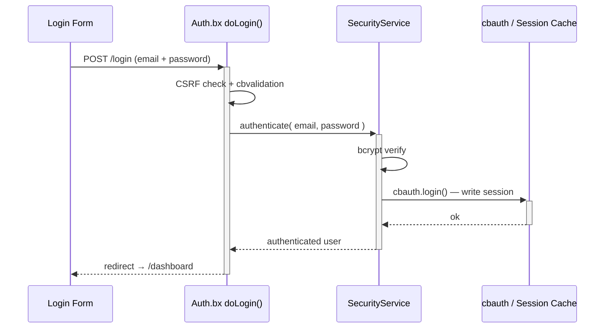
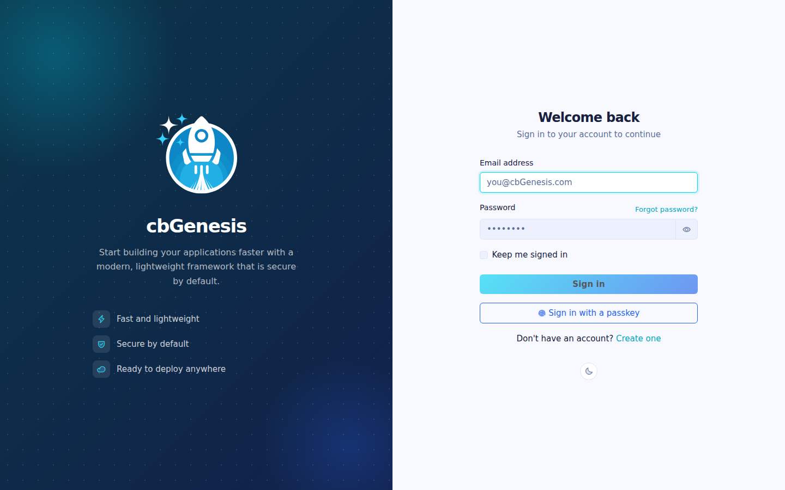
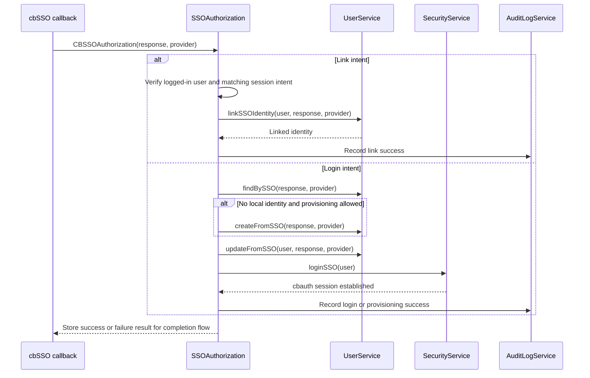
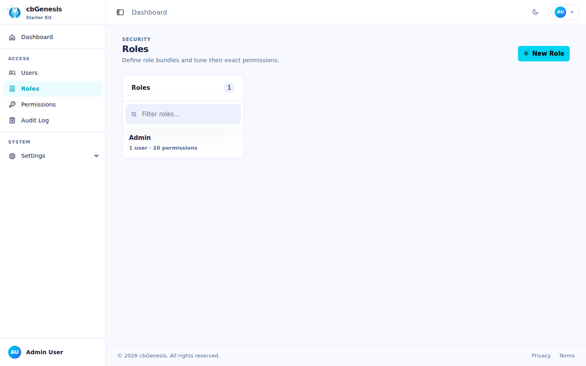
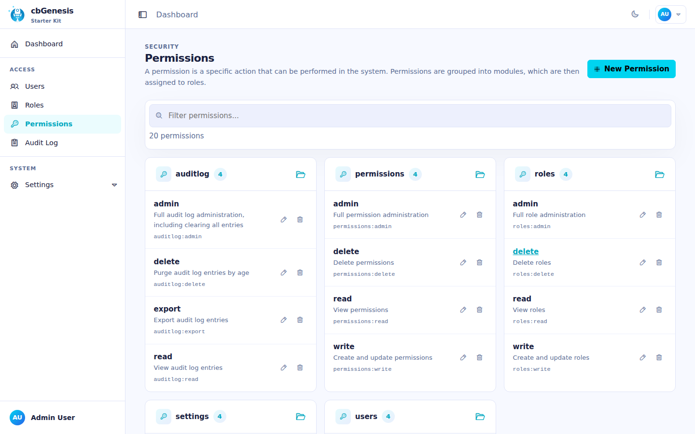
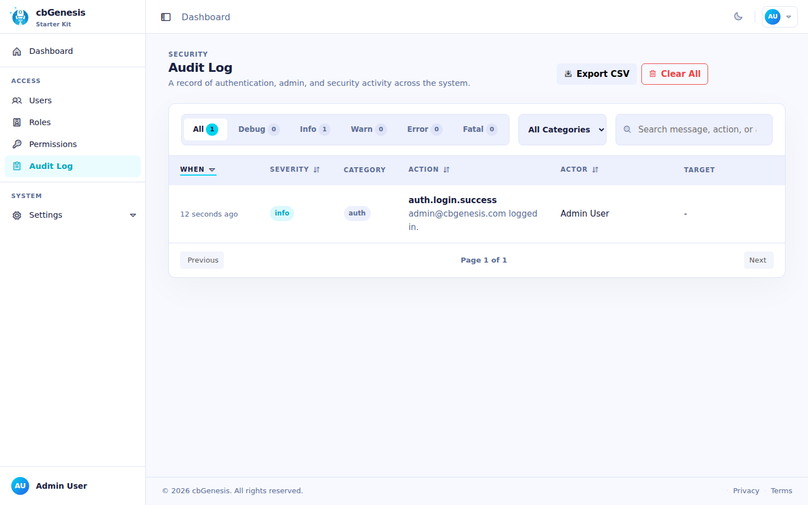

# Security & Permissions

## Login flow



## Authentication layouts

The authentication flow can use either shipped layout through the `cbLoginLayout` setting:

| Value | Layout | Best for |
|---|---|---|
| `AuthSplit` | Branded feature panel on the left with the form on the right; it becomes compact on mobile. | Applications that want a branded, two-panel sign-in experience. This is the default. |
| `AuthCenter` | Centered authentication card with the logo, form, and footer. | Applications that prefer a focused, compact sign-in experience. |

Choose **Auth Center** or **Auth Split** on the `/settings` page. The selected layout applies to login, registration, invitation activation, and password-recovery pages. See [App Settings](../reference/settings.md#login-layout-selection) for the layout files and custom-layout instructions.



## Single sign-on

cbSSO is enabled through `app/config/modules/cbsso.bx`. It uses cbauth as the
session authority, so local password login, passkeys, and SSO share the same
session and authorization rules. The login page renders a link for every
configured provider.

Google is the shipped example provider. Set these values in `.env` after
registering the callback URL `/cbsso/auth/Google` with Google:

```dotenv
GOOGLE_CLIENT_ID=
GOOGLE_CLIENT_SECRET=
GOOGLE_REDIRECT_URI=https://example.com/cbsso/auth/Google
```

### Enabling and disabling SSO

There is no separate `SSO_ENABLED` setting. The effective provider switch is in
[`app/config/modules/cbsso.bx`](../../app/config/modules/cbsso.bx): cbGenesis
registers Google only when `GOOGLE_CLIENT_ID`, `GOOGLE_CLIENT_SECRET`, and
`GOOGLE_REDIRECT_URI` are all populated. To disable Google SSO, clear any one of
those values and restart or reinitialize the application. The provider will no
longer appear on the login or profile pages.

Do not confuse this with `enableCBAuthIntegration: false`. That setting disables
cbSSO's optional generic cbauth listener; cbGenesis uses its own
`SSOAuthorization` interceptor so it can enforce local account-linking,
provisioning, identity-matching, and audit rules. See cbSSO's documentation for
[configuration](https://cbsso.ortusbooks.com/),
[identity-provider response handling](https://cbsso.ortusbooks.com/usage/handling-the-identity-provider-response.md),
[interception points](https://cbsso.ortusbooks.com/usage/interception-points.md),
and [cbauth integration](https://cbsso.ortusbooks.com/cbauth-integration/enabling-integration.md).

::: stepper
::: step "Prepare the database"
From the project root, run the SSO identity migration:

```bash
box migrate up
```

This creates the `user_sso_identities` table used to link a local account to an
identity-provider subject. Run this before attempting the first SSO login.
:::

::: step "Create and configure the Google OAuth client"
In [Google Cloud Console](https://console.cloud.google.com/), create or select
a project, configure the OAuth consent screen, and create an **OAuth client ID**
with application type **Web application**. Add this exact authorized redirect
URI, using the public HTTPS URL of your app:

```text
https://your-domain.example/cbsso/auth/Google
```

Copy the client ID and client secret into the local `.env` file. The redirect
URI must be the same value in Google Cloud and `GOOGLE_REDIRECT_URI`:

```dotenv
GOOGLE_CLIENT_ID=your-google-client-id
GOOGLE_CLIENT_SECRET=your-google-client-secret
GOOGLE_REDIRECT_URI=https://your-domain.example/cbsso/auth/Google
```

Keep credentials out of source control. cbGenesis registers the Google provider
only when all three `GOOGLE_*` settings are populated, so the application can
still boot before SSO is configured.

Automatic account creation is disabled by default. To allow new Google users,
explicitly enable it and restrict the permitted email domains:

```dotenv
CBSSO_AUTO_PROVISION=true
CBSSO_ALLOWED_DOMAINS=example.com,example.org
```

Leave `CBSSO_AUTO_PROVISION=false` when every SSO user must already have a local
account. Those users must sign in locally and use the profile's **Link Google
account** action before they can sign in with Google.
:::

::: step "Start the app and verify the flow"
Start the application with your normal development or deployment command, then
open `/login` and select **Continue with Google**. Confirm that Google redirects
back to `/cbsso/auth/Google` and that the application sends you to the dashboard.

For an existing local account, first sign in with the password, open the profile
page, and link the Google account. Sign out, return to `/login`, and verify that
Google SSO signs you back into the same local account. If provisioning is
enabled, verify that a permitted domain creates a local user and that a domain
outside `CBSSO_ALLOWED_DOMAINS` is rejected.
:::
:::

After setup, identities are matched by provider and immutable subject, never by
email alone. Existing local accounts must be explicitly linked before they can
be used through SSO.

For clustered SAML deployments, configure cbSSO's `samlRequestCacheName` to a
distributed CacheBox region instead of using the default in-memory replay cache.

### How cbSSO becomes a local session

cbSSO owns the provider protocol and callback validation. cbGenesis owns the
decision that follows: which local account the verified identity belongs to,
whether it may be provisioned or linked, and how it becomes an authenticated
application session.

```mermaid
flowchart LR
    Browser[Browser] --> Start[cbSSO start route]
    Start --> Provider[Identity provider]
    Provider --> Callback[cbSSO callback route]
    Callback --> Authorize[cbSSO Auth.authorize()]
    Authorize --> Event[CBSSOAuthorization]
    Event --> Interceptor[SSOAuthorization.bx]
    Interceptor --> UserService[UserService]
    UserService --> Identity[(SSO identity records)]
    Interceptor --> Security[SecurityService.loginSSO()]
    Security --> Session[(cbauth session)]
    Session --> Browser
```

The application registers `app/interceptors/SSOAuthorization.bx` for cbSSO's
documented `CBSSOAuthorization` interception point. The callback payload
contains the verified provider response and the provider that handled it. The
interceptor then follows one of two application-owned paths:



### Why this interceptor exists

cbSSO also provides a generic `cbAuth` integration listener. cbGenesis
intentionally sets `enableCBAuthIntegration: false` in
`app/config/modules/cbsso.bx`, because the generic listener cannot enforce the
application's identity and account-security rules. The custom interceptor is
responsible for:

- Matching identities by provider and immutable subject, never by email alone.
- Requiring an authenticated session and matching intent for account linking.
- Applying the provisioning and allowed-domain policy before creating users.
- Keeping local password, remember-me, passkey, and SSO authentication paths
  under the same cbauth session authority.
- Recording successful and failed SSO operations in the audit trail.

This separation is deliberate: cbSSO verifies *who the provider says the user
is*; cbGenesis decides *what that identity is allowed to do in this application*.

For the upstream contract and the alternative generic integration, see the
[cbSSO interception points](https://cbsso.ortusbooks.com/usage/interception-points.md),
[identity-provider response handling](https://cbsso.ortusbooks.com/usage/handling-the-identity-provider-response.md),
and [cbAuth integration](https://cbsso.ortusbooks.com/cbauth-integration/enabling-integration.md)
documentation.

## Security layers

| Layer | Implementation |
|---|---|
| Session auth | cbauth with `CacheStorage@cbStorages` — server-side session cache |
| Password hashing | bcrypt via `bx-password-encrypt` |
| Password policy | `SettingService.isValidPassword()` — `cbMinPasswordLength` plus an uppercase letter, a lowercase letter, a digit, and a special character. Enforced server-side on registration, invitation activation, password reset, and profile password change; the Alpine `$passwordMeetsPolicy` helper mirrors it in the browser |
| CSRF protection | cbsecurity rotating token (30 min); the auto-verifier is off, and `BaseSecureHandler` verifies deny-by-default on every unsafe HTTP method instead — see [Handlers & Routing](handlers-routing.md#csrf-verification) |
| Handler security | `@secured` annotation → firewall redirects unauthenticated visitors to `login`, authorized-but-unpermitted users to `dashboard.notAuthorized` |
| JWT support | Configured for API access (HS512, 60 min, cache token storage) |
| Security headers | XSS protection, `frameOptions: SAMEORIGIN`, `referrerPolicy: same-origin` |
| API tokens | SHA/BCrypt-hashed per-user tokens with expiration and a daily purge scheduler |
| Rate limiting | `RateLimiter` interceptor throttles login, registration, and password reset by IP - see [Rate limiting](#rate-limiting) below |

## Rate limiting

`app/interceptors/RateLimiter.bx` fires on `preProcess` - before routing, before any handler runs - and throttles five unauthenticated `Auth` endpoints by client IP:

- `doLogin`, `doRegister`, `doForgotPassword`, `doResetPassword`, `doActivateInvitation`

A caller that exceeds the limit is redirected back to the form with a flash error; the request never reaches the handler, so a correct password submitted while blocked still does not log the user in.

| Setting | Purpose |
|---|---|
| `cbRateLimitMaxAttempts` | Attempts allowed per IP, per endpoint, within the window (default: `5`) |
| `cbRateLimitWindowSeconds` | Window length, in seconds (default: `300`). `0` disables rate limiting entirely |
| `cbTrustProxyHeaders` | Whether the "per IP" in "per IP, per endpoint" comes from `X-Forwarded-For` or the raw socket address (default: `true`) - see [Deploying behind a reverse proxy](../deployment.md#deploying-behind-a-reverse-proxy) |

All three are editable at `/settings` like any other app setting - see [App Settings](../reference/settings.md#password--token-policy).

!!! warning "`cbTrustProxyHeaders` is a deployment decision, not a code decision"
    `X-Forwarded-For` is a plain HTTP header - any caller can set it to anything unless something in front of the app (a reverse proxy or load balancer) strips whatever the client sent and sets it itself. Whether that's true is something only the person deploying the app knows.

    - **On (default)**: trusts `X-Forwarded-For`/`X-Cluster-Client-IP`, matching a typical deployment of this app behind a reverse proxy or load balancer. If your proxy does *not* overwrite that header (or you're directly internet-facing with nothing in front of the app), a caller can spoof it to get a fresh rate-limit bucket on every request and to fake the IP recorded in the audit trail - turn this off in that case.
    - **Off**: `getRealIP()` uses the raw socket address instead. Correct when the app is directly internet-facing, but if you *are* behind a proxy, every caller looks like the proxy's own IP - one blocked "IP" blocks everyone behind it, and every audit log entry shows the proxy's address instead of the real client's.

::: cards
::: card title="How counting works" icon="phosphor-duotone:hourglass"
`RateLimitService.attempt()` is a **sliding window**: every attempt, allowed or blocked, resets the key's expiration to the full window from that moment. A key only cools down once it goes quiet for an entire window - which keeps blocking for as long as an attack continues, rather than reopening partway through. Each endpoint has its own counter (keyed by `event:ip`), so exhausting the login limit does not affect registration or password reset.
:::
:::

!!! note "In-memory by default"
    Counters live in the `rateLimit` CacheBox region (`app/config/CacheBox.bx`), which is in-memory and therefore **per application instance**. Behind a load balancer with more than one instance, each instance enforces its own limit independently - a caller could get `cbRateLimitMaxAttempts` free attempts per instance rather than in total. To share counts across instances, swap the `rateLimit` region's `provider`/`properties` for a distributed CacheBox provider (Redis, Couchbase, or any provider CacheBox supports) - no code change needed in `RateLimitService` or `RateLimiter`, since both go through the injected `cachebox:rateLimit` region.

## `cbsecurity` configuration

`app/config/modules/cbsecurity.bx` is the single source of truth for the firewall:

```boxlang title="app/config/modules/cbsecurity.bx (excerpt)" hl_lines="3 8 9"
{
    authentication : {
        provider          : "authenticationService@cbauth",
        prcUserVariable   : "authUser"
    },
    firewall : {
        autoLoadFirewall         : true,
        validator                 : "CBAuthValidator@cbsecurity",
        handlerAnnotationSecurity : true,
        invalidAuthenticationEvent : "login",
        invalidAuthorizationEvent  : "dashboard.notAuthorized",
        rules                      : [] // authorization is annotation-based, not rule-based
    }
}
```

- **`prcUserVariable: "authUser"`** — the authenticated user is always available as `prc.authUser` in every handler, view, and layout.
- **`handlerAnnotationSecurity: true`** — this is what makes `@secured` annotations on a handler class or action actually enforce anything.
- **`rules: []`** — this app does all of its authorization via handler annotations, not cbsecurity's alternative URL-pattern rule list.

## Permission model

Every permission is a slug in the form `resource:action`, seeded by `resources/database/seeds/AdminData.bx`:

| Resource | Actions |
|---|---|
| `users` | `read`, `write`, `delete`, `admin` |
| `roles` | `read`, `write`, `delete`, `admin` |
| `permissions` | `read`, `write`, `delete`, `admin` |
| `settings` | `read`, `write`, `delete`, `admin` |
| `auditlog` | `read`, `export`, `delete`, `admin` |

!!! info "`admin` is a superset"
    `admin` means "full administration of that resource" and is always OR'd alongside the specific action a route needs, so a user holding `roles:admin` passes any `roles:*` check without also needing `roles:read`/`roles:write`/`roles:delete` individually. The seeder assigns all 20 built-in permissions to a single **Admin** role, granted to the seeded `admin@cbgenesis.com` user.

::: columns
::: column

:::
::: column

:::
:::

**Enforce it on the handler** — this is the real security boundary, resolved by cbsecurity's `CBAuthValidator` against the authenticated user's permissions:

```boxlang title="app/handlers/Roles.bx" linenums="1"
@secured( "roles:admin,roles:read" )     // class-level: applies to index and any action without its own annotation
class extends="BaseSecureHandler" {

    @secured( "roles:admin,roles:write" )
    function create( event, rc, prc ) { ... }

    @secured( "roles:admin,roles:delete" )
    function delete( event, rc, prc ) { ... }

}
```

A comma-separated list is an **OR** check — any one of the listed permissions is enough.

**Mirror it in the view** — UX only, *never* the security boundary on its own. `User.bx` exposes `hasPermission()` on `prc.authUser`, available in any view or layout rendered through a secured handler:

```html title="Example view guard"
<bx:if prc.authUser.hasPermission( "roles:write,roles:admin" )>
    <button type="button" class="btn btn-primary" @click="openCreate()">New Role</button>
</bx:if>
```

`hasPermission()` accepts a string, comma-list, or array and does an OR check; `hasAllPermissions()` does the AND equivalent. Both are cached per-request via `getAllPermissions()`, which unions a user's à-la-carte permissions with every permission granted through their roles. Every existing admin view (sidebar nav, Users/Roles/Permissions/Settings) already follows this pattern — treat it as the template for new secured modules.

A user who fails an `@secured` check is redirected:

- **Unauthenticated** → `login`
- **Authenticated, missing permission** → `dashboard.notAuthorized`

## Related security services

| Model | Purpose |
|---|---|
| `SecurityService` | Wraps `cbauth`'s authentication service; `login()`/`authenticate()`, remember-me cookie management with token rotation, `logout()`, password-reset token issue/verify (cache-backed, not DB) |
| `UserService` | `requestEmailChange()`/`confirmEmailChange()`/`cancelEmailChange()` - self-service email change, gated behind a `PURPOSE_EMAIL_CHANGE` action token so a new address is only applied once the user confirms it from their inbox |
| `APIToken` / `APITokenService` | SHA/BCrypt-hashed personal access tokens — `createToken()` returns the raw token exactly once, `revokeToken()`/`revokeAllForUser()`, `purgeExpiredTokens()` on a schedule |
| `RememberToken` / `RememberTokenService` | Persistent "remember me" browser tokens, rotated on every use |
| `UserActionToken` / `UserActionTokenService` | Purpose-bound, single-use tokens — `issue()`, `resolve()`, `consume()`. Five purposes: `PURPOSE_REGISTRATION`, `PURPOSE_INVITATION`, `PURPOSE_PASSWORD_RESET`, `PURPOSE_FORCED_PASSWORD_CHANGE`, `PURPOSE_EMAIL_CHANGE` |
| `Passkey` / `PasskeyService` | WebAuthn credentials for passwordless sign-in; `cbRequirePasskey` makes `BaseSecureHandler` redirect a user with none to `profile/passkey-required` |
| `AuditLog` / `AuditLogService` | The audit trail. The `AuditLogger` interceptor writes sign-ins, sign-outs, and failed authentication/authorization automatically — see [Architecture](../architecture.md#interceptors) |
| `Passkey` / `PasskeyService` | WebAuthn credential storage via `cbsecurity-passkeys`' `ICredentialRepository` contract |



## Known issues

### "This is an invalid domain" when registering a passkey

Passkeys are configured for the `localhost` domain during local development. If you open the application with an IP address such as `http://127.0.0.1:8080`, WebAuthn treats that as a different origin and rejects the registration with **"This is an invalid domain."**

Open the application at **[http://localhost:8080](http://localhost:8080)** instead. Passkeys registered for one origin are not interchangeable with another, so delete and register the passkey again if it was created while using a different host name.

::: cards
::: card title="Handlers & Routing" icon="phosphor-duotone:signpost" href="handlers-routing.md"
See every `@secured` annotation in context, handler by handler.
:::
::: card title="Route Map" icon="phosphor-duotone:map-trifold" href="../reference/routes.md"
Which permission guards which URL, at a glance.
:::
::: card title="Extending the App" icon="phosphor-duotone:puzzle-piece" href="extending.md"
Add a brand-new permission and wire it through handler, view, and seeder.
:::
:::
