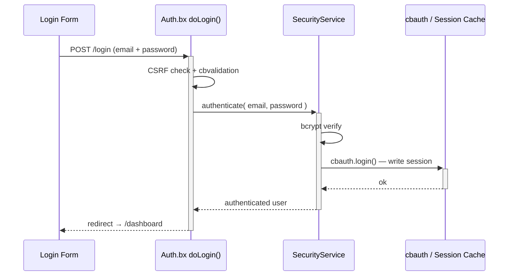

# Security & Permissions

## Login flow



## Authentication layouts

The authentication flow can use either shipped layout through the `cbLoginLayout` setting:

| Value | Layout | Best for |
|---|---|---|
| `AuthSplit` | Branded feature panel on the left with the form on the right; it becomes compact on mobile. | Applications that want a branded, two-panel sign-in experience. This is the default. |
| `AuthCenter` | Centered authentication card with the logo, form, and footer. | Applications that prefer a focused, compact sign-in experience. |

Choose **Auth Center** or **Auth Split** on the `/settings` page. The selected layout applies to login, registration, invitation activation, and password-recovery pages. See [App Settings](../reference/settings.md#login-layout-selection) for the layout files and custom-layout instructions.

## Security layers

| Layer | Implementation |
|---|---|
| Session auth | cbauth with `CacheStorage@cbStorages` — server-side session cache |
| Password hashing | bcrypt via `bx-password-encrypt` |
| Password policy | `SettingService.isValidPassword()` — `cbMinPasswordLength` plus an uppercase letter, a lowercase letter, a digit, and a special character. Enforced server-side on registration, invitation activation, password reset, and profile password change; the Alpine `$passwordMeetsPolicy` helper mirrors it in the browser |
| CSRF protection | cbsecurity rotating token (30 min); the auto-verifier is off, and `BaseSecureHandler` verifies deny-by-default on every unsafe HTTP method instead — see [Handlers & Routing](handlers-routing.md#csrf-verification) |
| Handler security | `@secured` annotation → firewall redirects unauthenticated visitors to `login`, authorized-but-unpermitted users to `dashboard.notAuthorized` |
| JWT support | Configured for API access (AES-256, HS512, 60 min, cache token storage) |
| Security headers | XSS protection, `frameOptions: SAMEORIGIN`, `referrerPolicy: same-origin` |
| API tokens | SHA/BCrypt-hashed per-user tokens with expiration and a daily purge scheduler |
| Rate limiting | `RateLimiter` interceptor throttles login, registration, and password reset by IP - see [Rate limiting](#rate-limiting) below |

## Rate limiting

`app/interceptors/RateLimiter.bx` fires on `preProcess` - before routing, before any handler runs - and throttles five unauthenticated `Auth` endpoints by client IP:

- `doLogin`, `doRegister`, `doForgotPassword`, `doResetPassword`, `doActivateInvitation`

A caller that exceeds the limit is redirected back to the form with a flash error; the request never reaches the handler, so a correct password submitted while blocked still does not log the user in.

| Setting | Purpose |
|---|---|
| `cbRateLimitMaxAttempts` | Attempts allowed per IP, per endpoint, within the window (default: `5`) |
| `cbRateLimitWindowSeconds` | Window length, in seconds (default: `300`). `0` disables rate limiting entirely |

Both are editable at `/settings` like any other app setting - see [App Settings](../reference/settings.md#password--token-policy).

::: cards
::: card title="How counting works" icon="phosphor-duotone:hourglass"
`RateLimitService.attempt()` is a **sliding window**: every attempt, allowed or blocked, resets the key's expiration to the full window from that moment. A key only cools down once it goes quiet for an entire window - which keeps blocking for as long as an attack continues, rather than reopening partway through. Each endpoint has its own counter (keyed by `event:ip`), so exhausting the login limit does not affect registration or password reset.
:::
:::

!!! note "In-memory by default"
    Counters live in the `rateLimit` CacheBox region (`app/config/CacheBox.bx`), which is in-memory and therefore **per application instance**. Behind a load balancer with more than one instance, each instance enforces its own limit independently - a caller could get `cbRateLimitMaxAttempts` free attempts per instance rather than in total. To share counts across instances, swap the `rateLimit` region's `provider`/`properties` for a distributed CacheBox provider (Redis, Couchbase, or any provider CacheBox supports) - no code change needed in `RateLimitService` or `RateLimiter`, since both go through the injected `cachebox:rateLimit` region.

## `cbsecurity` configuration

`app/config/modules/cbsecurity.bx` is the single source of truth for the firewall:

```boxlang title="app/config/modules/cbsecurity.bx (excerpt)" hl_lines="3 8 9"
{
    authentication : {
        provider          : "authenticationService@cbauth",
        prcUserVariable   : "authUser"
    },
    firewall : {
        autoLoadFirewall         : true,
        validator                 : "CBAuthValidator@cbsecurity",
        handlerAnnotationSecurity : true,
        invalidAuthenticationEvent : "login",
        invalidAuthorizationEvent  : "dashboard.notAuthorized",
        rules                      : [] // authorization is annotation-based, not rule-based
    }
}
```

- **`prcUserVariable: "authUser"`** — the authenticated user is always available as `prc.authUser` in every handler, view, and layout.
- **`handlerAnnotationSecurity: true`** — this is what makes `@secured` annotations on a handler class or action actually enforce anything.
- **`rules: []`** — this app does all of its authorization via handler annotations, not cbsecurity's alternative URL-pattern rule list.

## Permission model

Every permission is a slug in the form `resource:action`, seeded by `resources/database/seeds/AdminData.bx`:

| Resource | Actions |
|---|---|
| `users` | `read`, `write`, `delete`, `admin` |
| `roles` | `read`, `write`, `delete`, `admin` |
| `permissions` | `read`, `write`, `delete`, `admin` |
| `settings` | `read`, `write`, `delete`, `admin` |
| `auditlog` | `read`, `export`, `delete`, `admin` |

!!! info "`admin` is a superset"
    `admin` means "full administration of that resource" and is always OR'd alongside the specific action a route needs, so a user holding `roles:admin` passes any `roles:*` check without also needing `roles:read`/`roles:write`/`roles:delete` individually. The seeder assigns all 20 built-in permissions to a single **Admin** role, granted to the seeded `admin@cbgenesis.com` user.

**Enforce it on the handler** — this is the real security boundary, resolved by cbsecurity's `CBAuthValidator` against the authenticated user's permissions:

```boxlang title="app/handlers/Roles.bx" linenums="1"
@secured( "roles:admin,roles:read" )     // class-level: applies to index and any action without its own annotation
class extends="BaseSecureHandler" {

    @secured( "roles:admin,roles:write" )
    function create( event, rc, prc ) { ... }

    @secured( "roles:admin,roles:delete" )
    function delete( event, rc, prc ) { ... }

}
```

A comma-separated list is an **OR** check — any one of the listed permissions is enough.

**Mirror it in the view** — UX only, *never* the security boundary on its own. `User.bx` exposes `hasPermission()` on `prc.authUser`, available in any view or layout rendered through a secured handler:

```html title="Example view guard"
<bx:if prc.authUser.hasPermission( "roles:write,roles:admin" )>
    <button type="button" class="btn btn-primary" @click="openCreate()">New Role</button>
</bx:if>
```

`hasPermission()` accepts a string, comma-list, or array and does an OR check; `hasAllPermissions()` does the AND equivalent. Both are cached per-request via `getAllPermissions()`, which unions a user's à-la-carte permissions with every permission granted through their roles. Every existing admin view (sidebar nav, Users/Roles/Permissions/Settings) already follows this pattern — treat it as the template for new secured modules.

A user who fails an `@secured` check is redirected:

- **Unauthenticated** → `login`
- **Authenticated, missing permission** → `dashboard.notAuthorized`

## Related security services

| Model | Purpose |
|---|---|
| `SecurityService` | Wraps `cbauth`'s authentication service; `login()`/`authenticate()`, remember-me cookie management with token rotation, `logout()`, password-reset token issue/verify (cache-backed, not DB) |
| `UserService` | `requestEmailChange()`/`confirmEmailChange()`/`cancelEmailChange()` - self-service email change, gated behind a `PURPOSE_EMAIL_CHANGE` action token so a new address is only applied once the user confirms it from their inbox |
| `APIToken` / `APITokenService` | SHA/BCrypt-hashed personal access tokens — `createToken()` returns the raw token exactly once, `revokeToken()`/`revokeAllForUser()`, `purgeExpiredTokens()` on a schedule |
| `RememberToken` / `RememberTokenService` | Persistent "remember me" browser tokens, rotated on every use |
| `UserActionToken` / `UserActionTokenService` | Purpose-bound, single-use tokens — `issue()`, `resolve()`, `consume()`. Five purposes: `PURPOSE_REGISTRATION`, `PURPOSE_INVITATION`, `PURPOSE_PASSWORD_RESET`, `PURPOSE_FORCED_PASSWORD_CHANGE`, `PURPOSE_EMAIL_CHANGE` |
| `Passkey` / `PasskeyService` | WebAuthn credentials for passwordless sign-in; `cbRequirePasskey` makes `BaseSecureHandler` redirect a user with none to `profile/passkey-required` |
| `AuditLog` / `AuditLogService` | The audit trail. The `AuditLogger` interceptor writes sign-ins, sign-outs, and failed authentication/authorization automatically — see [Architecture](../architecture.md#interceptors) |
| `Passkey` / `PasskeyService` | WebAuthn credential storage via `cbsecurity-passkeys`' `ICredentialRepository` contract |

::: cards
::: card title="Handlers & Routing" icon="phosphor-duotone:signpost" href="handlers-routing.md"
See every `@secured` annotation in context, handler by handler.
:::
::: card title="Route Map" icon="phosphor-duotone:map-trifold" href="../reference/routes.md"
Which permission guards which URL, at a glance.
:::
::: card title="Extending the App" icon="phosphor-duotone:puzzle-piece" href="extending.md"
Add a brand-new permission and wire it through handler, view, and seeder.
:::
:::
