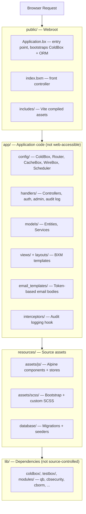
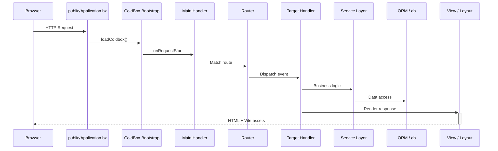

# Arquitectura

CBGenesis sigue el diseño de **plantilla moderna** de ColdBox: el código de la aplicación está completamente separado del webroot público, de modo que nada bajo `app/` es jamás accesible directamente desde la web.

## Vista general por capas



!!! note "¿Por qué la división?"
    Todo aquello a lo que un atacante podría, de otro modo, navegar directamente - código fuente de handlers, configuración, plantillas de vista - simplemente no vive bajo el webroot. `app/Application.bx` es una protección de una sola línea con `abort;`, mantenida solo para que la convención del framework se sostenga incluso si alguna vez un servidor web se configura mal para servir `app/` directamente.

## Ciclo de vida de una solicitud

Cada solicitud entra a través de `public/Application.bx`, que inicializa ColdBox antes de pasar el control al router y, finalmente, a tu handler:



`Main.bx` (`app/handlers/Main.bx`) es el handler de eventos implícitos configurado en `app/config/Coldbox.bx`:

- `onAppInit` - ejecuta `settingService.preFlightCheck()`, sembrando en la base de datos cualquier ajuste de la aplicación que falte
- `onRequestStart` - carga `prc.settings` y `prc.authUser` en cada solicitud
- `onException` - el manejador de excepciones a nivel de toda la aplicación

## Interceptores

`app/config/Coldbox.bx` registra tres interceptores de aplicación, en este orden:

**`app/interceptors/AuditLogger.bx`** escribe en el registro de auditoría en cuatro puntos de intercepción:

| Punto | Se registra |
|---|---|
| `postAuthentication` | Un inicio de sesión exitoso |
| `preLogout` | Un cierre de sesión |
| `cbSecurity_onInvalidAuthentication` | Una solicitud que requería sesión y no tenía ninguna |
| `cbSecurity_onInvalidAuthorization` | Un usuario autenticado al que le falta el permiso requerido |

**`app/interceptors/RateLimiter.bx`** se dispara en `preProcess` - antes del enrutamiento, antes de cualquier handler - y limita cinco acciones no autenticadas de `Auth` (inicio de sesión, registro, olvido/restablecimiento de contraseña, activación de invitación) por IP del cliente. Consulta [Limitación de tasa](guides/security.md#rate-limiting) para conocer los ajustes y cómo funciona.

**`app/interceptors/SSOAuthorization.bx`** gestiona el punto de intercepción
`CBSSOAuthorization` de cbSSO. Conecta una identidad de proveedor verificada
con el modelo de usuario local, hace cumplir la política de inicio de
sesión versus vinculación, aprovisiona usuarios cuando está permitido, y
crea la sesión de cbauth. Consulta
[Inicio de sesión único](guides/security.md#single-sign-on) para el flujo de
callback y la razón por la que cbGenesis usa un handler personalizado en
lugar de la integración genérica de cbAuth de cbSSO.

Añade el tuyo propio al arreglo `variables.interceptors` en `Coldbox.bx`; se disparan en el orden de declaración.

## Tareas programadas

`app/config/Scheduler.bx` registra tres tareas diarias en segundo plano, cada una `onOneServer()` y `withNoOverlaps()` para que un despliegue con múltiples instancias ejecute cada una exactamente una vez:

| Tarea | Se ejecuta | Elimina | Regida por |
|---|---|---|---|
| Purgar tokens de API expirados | `03:00` | Filas de `user_api_tokens` cuya `expiration` ya pasó | Vida útil del token establecida al emitirlo a partir de `cbApiTokenMaxValidityMonths` (predeterminado `12` meses) - consulta [Ajustes de la aplicación](reference/settings.md#password--token-policy) |
| Purgar tokens de recordarme expirados | `03:15` | Filas de `user_remember_tokens` cuya `expiration` ya pasó | Expiración fija establecida cuando se emite el token (`SecurityService`/`RememberTokenService`) |
| Purgar registros de auditoría antiguos | `03:30` | Filas de `audit_logs` más antiguas que la ventana de retención | `cbAuditLogRetentionDays` (predeterminado `90`; `0` desactiva la purga) - consulta [Ajustes de la aplicación](reference/settings.md#password--token-policy) |

Las tres llaman a un método `purgeExpiredTokens()`/`purgeOlderThan()` en el servicio propietario en lugar de consultar la tabla directamente, de modo que la misma lógica de purga es alcanzable (y comprobable) fuera del programador. Añade una nueva tarea de la misma manera - consulta [Extendiendo la aplicación](guides/extending.md#adding-a-scheduled-task).

## Árbol completo del proyecto

```text title="Project structure" linenums="1"
cbgenesis/
├── app/                      Application code
│   ├── Application.bx        Abort-only gate (prevents direct /app access)
│   ├── config/
│   │   ├── Coldbox.bx        Framework settings, environments, logging
│   │   ├── Router.bx         All application routes
│   │   ├── CacheBox.bx       Cache regions (default, template, sessions, rateLimit)
│   │   ├── WireBox.bx        DI container configuration
│   │   ├── Scheduler.bx      Scheduled tasks
│   │   └── modules/          Per-module settings (cbsecurity, cbauth, cborm, ...)
│   ├── handlers/              Controllers (Auth, Dashboard, Users, Roles, ...)
│   ├── layouts/                Admin, AuthCenter, AuthSplit, Main
│   ├── models/
│   │   ├── BaseEntity.bx      ORM base: timestamps, soft delete, memento
│   │   ├── BaseService.bx     Service base: cborm + qb + cache + validation
│   │   ├── security/            Role, Permission, APIToken, RememberToken,
│   │   │                        Passkey, UserActionToken, SecurityService, ...
│   │   └── system/              User, Setting, AuditLog + their services
│   ├── views/                  BXM templates, one folder per handler
│   │   └── _components/        Reusable UI partials (app, auth, ui)
│   ├── email_templates/       Token-based email body templates
│   ├── helpers/               ApplicationHelper.bxm — global view helpers
│   └── interceptors/           AuditLogger, RateLimiter, SSOAuthorization
├── public/
│   ├── Application.bx         Entry point — ColdBox + ORM bootstrap
│   ├── index.bxm               Front controller placeholder
│   └── includes/               Vite production build output
├── resources/
│   ├── assets/js/              Alpine entry, stores, components
│   ├── assets/scss/            Bootstrap + custom SCSS
│   └── database/
│       ├── migrations/         Schema migrations (cfmigrations)
│       └── seeds/              AdminData seeder
├── tests/
│   ├── specs/integration/      Full HTTP-level specs
│   └── specs/unit/             Entity + service specs
├── lib/                        Dependencies (gitignored, installed by `box install`)
├── runtime/                    BoxLang engine config (boxlang.json)
├── server.json                 CommandBox server config (engine, webroot, aliases)
├── box.json                    Package manifest — deps, scripts
├── package.json                 NPM — Alpine, Bootstrap, Vite, ESLint
├── vite.config.mjs              Vite + coldbox-vite-plugin
└── .env.example                  Environment template
```

## El stack

| Capa | Tecnología |
|---|---|
| Runtime | BoxLang 1.0+ (JVM) |
| Framework | ColdBox HMVC (bleeding edge) |
| CLI / Servidor | CommandBox + BoxLang MiniServer |
| Inyección de dependencias | WireBox |
| Seguridad | cbsecurity + cbauth (basado en sesión + JWT) |
| Base de datos | MySQL, MariaDB, PostgreSQL y MSSQL vía Hibernate ORM (cborm); los cuatro destinos de base de datos son compatibles y están cubiertos por el flujo de pruebas de base de datos del proyecto |
| Constructor de consultas | qb (SQL fluido) |
| Migraciones | cfmigrations |
| Validación | cbvalidation |
| Correo electrónico | cbmailservices |
| Serialización | mementifier |
| Frontend | Bootstrap 5.3 · Alpine.js 3.x · Vite 6 |
| Íconos | Phosphor Duotone |
| Tooltips | Tippy.js |

::: cards
::: card title="Handlers y enrutamiento" icon="phosphor-duotone:signpost" href="guides/handlers-routing.md"
Cada controlador y ruta, y las convenciones que los conectan entre sí.
:::
::: card title="Base de datos y ORM" icon="phosphor-duotone:database" href="guides/database-orm.md"
La jerarquía de entidades, las migraciones y el patrón `BaseService`.
:::
::: card title="Seguridad y permisos" icon="phosphor-duotone:shield-check" href="guides/security.md"
Cómo encajan entre sí los handlers `@secured`, CSRF y el modelo de permisos.
:::
:::
