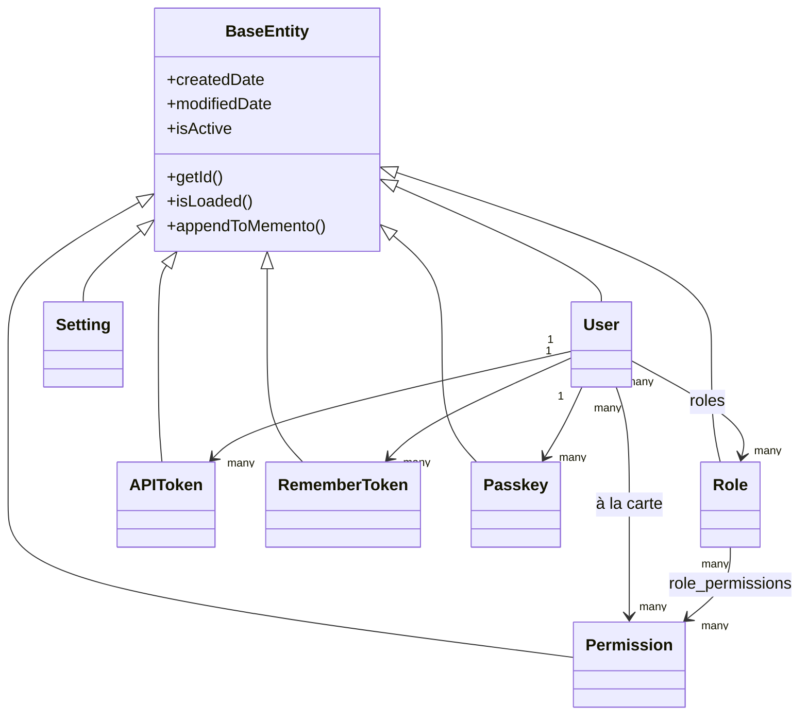

# Base de datos y ORM

## Jerarquía de entidades

Cada entidad extiende `BaseEntity` (`@mappedsuperclass`, que a su vez extiende `cborm.models.ActiveEntity`), la cual agrega automáticamente `createdDate`, `modifiedDate`, y una marca de eliminación suave `isActive` a cada tabla:



`dbcreate: "none"` (establecido en `ormSettings` de `public/Application.bx`) significa que el esquema pertenece exclusivamente a las migraciones — el ORM nunca genera ni altera tablas automáticamente.

## Patrón de la capa de servicio

Cada servicio extiende `BaseService` (`@singleton`, extiende `cborm.models.VirtualEntityService`), el cual inyecta `qb`, `coldbox`, `wirebox`, y `cachebox:template`, y provee `ensureSortOrder()`:

```boxlang title="Example service" linenums="1"
component
    extends="BaseService"
    singleton
    threadSafe
{

    property name="qb"    inject="provider:QueryBuilder@qb";
    property name="cache" inject="cachebox:template";

    function list( struct criteria = {} ){
        return newCriteria()
            .when( criteria.search, function( c, term ){
                c.like( "name", "%#term#%" );
            } )
            .list();
    }

}
```

=== "Entidad"
    ```boxlang title="app/models/security/Role.bx" linenums="1"
    /**
     * A role: a named bundle of permissions.
     */
    class extends="app.models.BaseEntity" table="roles" {

        property name="roleId" fieldtype="id" generator="uuid2" ormtype="string";
        property name="name" type="string";

        property name="permissions"
            fieldtype="many-to-many"
            cfc="Permission"
            linktable="role_permissions";

    }
    ```
=== "Servicio"
    ```boxlang title="app/models/security/RoleService.bx" linenums="1"
    component extends="app.models.BaseService" singleton threadSafe {

        function getAllForLookup(){
            return newCriteria().resultTransformer( "distinct" ).list();
        }

    }
    ```

## Migraciones

Impulsadas por [cfmigrations](https://cfmigrations.ortusbooks.com) a través del módulo CLI `commandbox-migrations`, configurado en `.cbmigrations.json` (`migrationsDirectory: resources/database/migrations/`, `seedsDirectory: resources/database/seeds/`, conexión construida a partir de las mismas variables de entorno `DB_*` que `public/Application.bx`).

```bash frame="terminal" title="Terminal"
box migrate up           # Run pending migrations
box migrate down         # Rollback the last batch
box migrate reset        # Rollback everything, then re-migrate
box migrate seed run     # Run database seeders
```

Las migraciones se ejecutan en orden de nombre de archivo/marca de tiempo:

| Migración | Crea |
|---|---|
| `..._settings.bx` | `settings` (PK GUID, `name` único, `value` longtext) |
| `..._security.bx` | `permissions`, `roles`, `role_permissions` (tabla de unión con PK compuesta, FKs en cascada) |
| `..._users.bx` | `users` (PK GUID, `email` único, `pendingEmail` anulable para solicitudes de autoservicio de cambio de correo electrónico, `password` anulable, `preferences` JSON, `hasAvatar` booleano que rastrea si un usuario tiene un avatar subido en el disco `assets` de cbfs), más `user_roles`, `user_permissions`, `user_remember_tokens`, `user_api_tokens`, `user_action_tokens`, `user_passkeys`, `user_sso_identities` — cada tabla hija con FK a `users.userId` con `ON DELETE CASCADE` (consulta [Seguridad y permisos](security.md#related-security-services) y [Frontend](frontend.md#avatars-branding-logo)) |
| `..._auditlogs.bx` | `audit_logs` registros de actividad de solo inserción con severidad/categoría/acción, metadatos del actor y de la solicitud, e índices de consulta |

## Datos semilla

`resources/database/seeds/AdminData.bx`, ejecutado vía `box migrate seed run`, crea:

- Un rol **Admin**
- **20 permisos** repartidos en cinco recursos (`users`, `roles`, `permissions`, `settings`, `auditlog`), cada uno con `read`/`write`/`delete`/`admin` (`auditlog` usa `read`/`export`/`delete`/`admin`) — todos asignados al rol Admin
- Un usuario administrador, `admin@cbgenesis.com`, con el rol Admin asignado, sembrado como pendiente de restablecimiento para que la contraseña pública de arranque deba ser reemplazada en el primer inicio de sesión

Consulta [Seguridad y permisos](security.md#permission-model) para ver cómo se hacen cumplir esos slugs a nivel de handler.

::: cards
::: card title="Seguridad y permisos" icon="phosphor-duotone:shield-check" href="security.md"
Cómo se mapean las tablas `permissions`/`roles` a las comprobaciones de handlers `@secured`.
:::
::: card title="Extendiendo la aplicación" icon="phosphor-duotone:puzzle-piece" href="extending.md"
Agrega una nueva entidad, servicio y migración para tu propio dominio.
:::
:::
