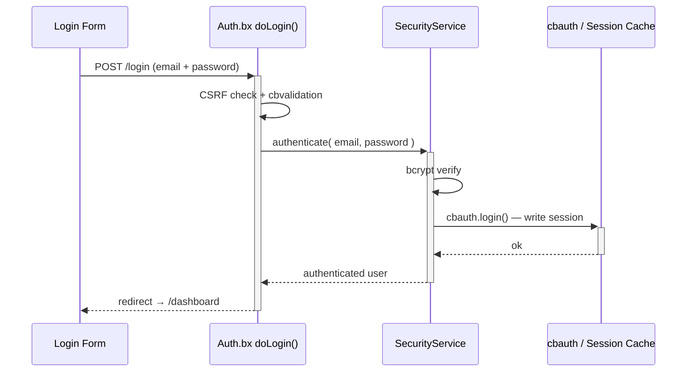
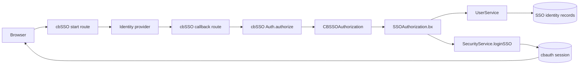
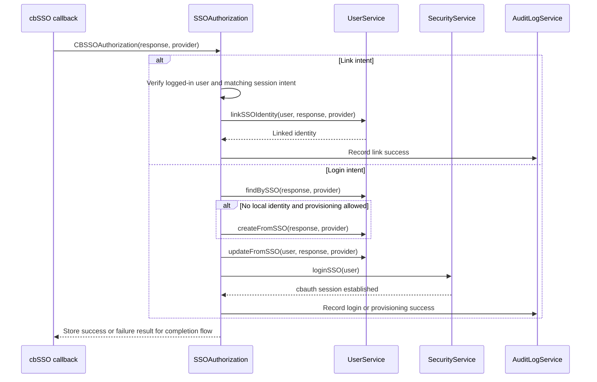

# Seguridad y permisos

## Flujo de inicio de sesión



## Layouts de autenticación

El flujo de autenticación puede usar cualquiera de los dos layouts incluidos a través del ajuste `cbLoginLayout`:

| Valor | Layout | Ideal para |
|---|---|---|
| `AuthSplit` | Panel de características con marca a la izquierda con el formulario a la derecha; se vuelve compacto en móvil. | Aplicaciones que quieren una experiencia de inicio de sesión de dos paneles y con marca. Este es el predeterminado. |
| `AuthCenter` | Tarjeta de autenticación centrada con el logo, el formulario, y el pie de página. | Aplicaciones que prefieren una experiencia de inicio de sesión enfocada y compacta. |

Elige **Auth Center** o **Auth Split** en la página `/settings`. El layout seleccionado se aplica a las páginas de inicio de sesión, registro, activación de invitación, y recuperación de contraseña. Consulta [Ajustes de la aplicación](../reference/settings.md#login-layout-selection) para los archivos de layout e instrucciones de layout personalizado.

<figure>
	
	<figcaption>La pantalla de inicio de sesión usando el diseño <code>AuthSplit</code> predeterminado.</figcaption>
</figure>

## Inicio de sesión único

cbSSO está habilitado a través de `app/config/modules/cbsso.bx`. Usa cbauth como
la autoridad de sesión, de modo que el inicio de sesión local con contraseña, las passkeys,
y SSO comparten la misma sesión y reglas de autorización. La página de inicio de
sesión renderiza un enlace por cada proveedor configurado.

Google es el proveedor de ejemplo incluido. Establece estos valores en `.env` después
de registrar la URL de callback `/cbsso/auth/Google` con Google:

```dotenv linenums="1"
GOOGLE_CLIENT_ID=
GOOGLE_CLIENT_SECRET=
GOOGLE_REDIRECT_URI=https://example.com/cbsso/auth/Google
```

### Habilitar y deshabilitar SSO

No existe un ajuste `SSO_ENABLED` separado. El interruptor de proveedor efectivo está en
[`app/config/modules/cbsso.bx`](../../app/config/modules/cbsso.bx): cbGenesis
registra Google solo cuando `GOOGLE_CLIENT_ID`, `GOOGLE_CLIENT_SECRET`, y
`GOOGLE_REDIRECT_URI` están todos completados. Para deshabilitar el SSO de Google, borra cualquiera de
esos valores y reinicia o reinicializa la aplicación. El proveedor ya no
aparecerá en las páginas de inicio de sesión o perfil.

No confundas esto con `enableCBAuthIntegration: false`. Ese ajuste deshabilita
el listener genérico opcional de cbauth de cbSSO; cbGenesis usa su propio
interceptor `SSOAuthorization` para poder hacer cumplir la vinculación de cuentas local,
el aprovisionamiento, la coincidencia de identidad, y las reglas de auditoría. Consulta la documentación de cbSSO sobre
[configuración](https://cbsso.ortusbooks.com/),
[manejo de la respuesta del proveedor de identidad](https://cbsso.ortusbooks.com/usage/handling-the-identity-provider-response.md),
[puntos de intercepción](https://cbsso.ortusbooks.com/usage/interception-points.md),
y [integración con cbauth](https://cbsso.ortusbooks.com/cbauth-integration/enabling-integration.md).

::: stepper
::: step "Prepara la base de datos"
Desde la raíz del proyecto, ejecuta la migración de identidad SSO:

```bash linenums="1"
box migrate up
```

Esto crea la tabla `user_sso_identities` usada para vincular una cuenta local a un
sujeto de proveedor de identidad. Ejecuta esto antes de intentar el primer inicio de sesión con SSO.
:::

::: step "Crea y configura el cliente OAuth de Google"
En [Google Cloud Console](https://console.cloud.google.com/), crea o selecciona
un proyecto, configura la pantalla de consentimiento OAuth, y crea un **ID de cliente OAuth**
con el tipo de aplicación **Aplicación web**. Añade esta URI de redirección autorizada exacta,
usando la URL HTTPS pública de tu aplicación:

```text linenums="1"
https://your-domain.example/cbsso/auth/Google
```

Copia el ID de cliente y el secreto de cliente en el archivo `.env` local. La URI de redirección
debe ser el mismo valor en Google Cloud y en `GOOGLE_REDIRECT_URI`:

```dotenv linenums="1"
GOOGLE_CLIENT_ID=your-google-client-id
GOOGLE_CLIENT_SECRET=your-google-client-secret
GOOGLE_REDIRECT_URI=https://your-domain.example/cbsso/auth/Google
```

Mantén las credenciales fuera del control de versiones. cbGenesis registra el proveedor de Google
solo cuando los tres ajustes `GOOGLE_*` están completados, así que la aplicación puede
seguir arrancando antes de que SSO esté configurado.

La creación automática de cuentas está deshabilitada por defecto. Para permitir nuevos usuarios de Google,
habilítala explícitamente y restringe los dominios de correo electrónico permitidos:

```dotenv linenums="1"
CBSSO_AUTO_PROVISION=true
CBSSO_ALLOWED_DOMAINS=example.com,example.org
```

Deja `CBSSO_AUTO_PROVISION=false` cuando cada usuario de SSO ya deba tener una cuenta
local. Esos usuarios deben iniciar sesión localmente y usar la acción **Vincular cuenta
de Google** del perfil antes de poder iniciar sesión con Google.
:::

::: step "Inicia la aplicación y verifica el flujo"
Inicia la aplicación con tu comando normal de desarrollo o despliegue, luego
abre `/login` y selecciona **Continuar con Google**. Confirma que Google redirige
de vuelta a `/cbsso/auth/Google` y que la aplicación te envía al panel de control.

Para una cuenta local existente, primero inicia sesión con la contraseña, abre la página de
perfil, y vincula la cuenta de Google. Cierra sesión, vuelve a `/login`, y verifica que
el SSO de Google te vuelve a autenticar en la misma cuenta local. Si el aprovisionamiento está
habilitado, verifica que un dominio permitido crea un usuario local y que un dominio
fuera de `CBSSO_ALLOWED_DOMAINS` es rechazado.
:::
:::

Después de la configuración, las identidades se emparejan por proveedor y sujeto inmutable, nunca por
solo el correo electrónico. Las cuentas locales existentes deben vincularse explícitamente antes de que puedan
usarse a través de SSO.

Para despliegues SAML en clúster, configura `samlRequestCacheName` de cbSSO a una
región de CacheBox distribuida en lugar de usar la caché de repetición en memoria predeterminada.

### Cómo cbSSO se convierte en una sesión local

cbSSO posee el protocolo del proveedor y la validación del callback. cbGenesis posee
la decisión que sigue: a qué cuenta local pertenece la identidad verificada,
si puede ser aprovisionada o vinculada, y cómo se convierte en una sesión de aplicación
autenticada.



La aplicación registra `app/interceptors/SSOAuthorization.bx` para el punto de
intercepción documentado `CBSSOAuthorization` de cbSSO. La carga útil del callback
contiene la respuesta verificada del proveedor y el proveedor que la manejó. El
interceptor entonces sigue uno de dos caminos propiedad de la aplicación:



### Por qué existe este interceptor

cbSSO también provee un listener de integración genérico `cbAuth`. cbGenesis
deliberadamente establece `enableCBAuthIntegration: false` en
`app/config/modules/cbsso.bx`, porque el listener genérico no puede hacer cumplir
las reglas de identidad y seguridad de cuenta de la aplicación. El interceptor personalizado es
responsable de:

- Emparejar identidades por proveedor y sujeto inmutable, nunca por solo el correo electrónico.
- Requerir una sesión autenticada y una intención coincidente para la vinculación de cuentas.
- Aplicar la política de aprovisionamiento y dominios permitidos antes de crear usuarios.
- Mantener las rutas de autenticación de contraseña local, recordarme, passkey, y SSO
  bajo la misma autoridad de sesión de cbauth.
- Registrar las operaciones de SSO exitosas y fallidas en el registro de auditoría.

Esta separación es deliberada: cbSSO verifica *quién dice el proveedor que es el usuario*;
cbGenesis decide *qué se le permite hacer a esa identidad en esta aplicación*.

Para el contrato upstream y la integración genérica alternativa, consulta la documentación de
[puntos de intercepción de cbSSO](https://cbsso.ortusbooks.com/usage/interception-points.md),
[manejo de la respuesta del proveedor de identidad](https://cbsso.ortusbooks.com/usage/handling-the-identity-provider-response.md),
e [integración con cbAuth](https://cbsso.ortusbooks.com/cbauth-integration/enabling-integration.md).

## Capas de seguridad

| Capa | Implementación |
|---|---|
| Autenticación de sesión | cbauth con `CacheStorage@cbStorages` — caché de sesión del lado del servidor |
| Hashing de contraseñas | bcrypt vía `bx-password-encrypt` |
| Política de contraseñas | `SettingService.isValidPassword()` — `cbMinPasswordLength` más una letra mayúscula, una letra minúscula, un dígito, y un carácter especial. Se hace cumplir del lado del servidor en el registro, la activación de invitación, el restablecimiento de contraseña, y el cambio de contraseña de perfil; el helper de Alpine `$passwordMeetsPolicy` la refleja en el navegador |
| Protección CSRF | Token rotativo de cbsecurity (30 min); el auto-verificador está desactivado, y `BaseSecureHandler` verifica con denegación por defecto en cada método HTTP inseguro en su lugar — consulta [Handlers y enrutamiento](handlers-routing.md#csrf-verification) |
| Seguridad de handlers | Anotación `@secured` → el firewall redirige a los visitantes no autenticados a `login`, y a los usuarios autorizados pero sin permiso a `dashboard.notAuthorized` |
| Soporte de JWT | Configurado para acceso a la API (HS512, 60 min, almacenamiento de tokens en caché) |
| Encabezados de seguridad | Protección XSS, `frameOptions: SAMEORIGIN`, `referrerPolicy: same-origin` |
| Tokens de API | Tokens por usuario con hash SHA/BCrypt, con expiración y un programador de purga diaria |
| Limitación de tasa | El interceptor `RateLimiter` limita el inicio de sesión, el registro, y el restablecimiento de contraseña por IP - consulta [Limitación de tasa](#rate-limiting) a continuación |

## Limitación de tasa

`app/interceptors/RateLimiter.bx` se dispara en `preProcess` - antes del enrutamiento, antes de que se ejecute cualquier handler - y limita cinco endpoints no autenticados de `Auth` por IP del cliente:

- `doLogin`, `doRegister`, `doForgotPassword`, `doResetPassword`, `doActivateInvitation`

Un llamante que excede el límite es redirigido de vuelta al formulario con un error flash; la solicitud nunca llega al handler, así que una contraseña correcta enviada mientras está bloqueado aún así no inicia sesión al usuario.

| Ajuste | Propósito |
|---|---|
| `cbRateLimitMaxAttempts` | Intentos permitidos por IP, por endpoint, dentro de la ventana (predeterminado: `5`) |
| `cbRateLimitWindowSeconds` | Longitud de la ventana, en segundos (predeterminado: `300`). `0` desactiva la limitación de tasa por completo |
| `cbTrustProxyHeaders` | Si el "por IP" en "por IP, por endpoint" proviene de `X-Forwarded-For` o de la dirección de socket sin procesar (predeterminado: `true`) - consulta [Desplegando detrás de un proxy inverso](../deployment.md#deploying-behind-a-reverse-proxy) |

Los tres son editables en `/settings` como cualquier otro ajuste de la aplicación - consulta [Ajustes de la aplicación](../reference/settings.md#password--token-policy).

!!! warning "`cbTrustProxyHeaders` es una decisión de despliegue, no una decisión de código"
    `X-Forwarded-For` es un encabezado HTTP simple - cualquier llamante puede establecerlo con cualquier valor a menos que algo delante de la aplicación (un proxy inverso o balanceador de carga) elimine lo que sea que el cliente envió y lo establezca por sí mismo. Si eso es cierto o no es algo que solo la persona que despliega la aplicación sabe.

    - **Activado (predeterminado)**: confía en `X-Forwarded-For`/`X-Cluster-Client-IP`, coincidiendo con un despliegue típico de esta aplicación detrás de un proxy inverso o balanceador de carga. Si tu proxy *no* sobrescribe ese encabezado (o estás directamente expuesto a internet sin nada delante de la aplicación), un llamante puede falsificarlo para obtener un nuevo cupo de límite de tasa en cada solicitud y para falsear la IP registrada en el registro de auditoría - desactiva esto en ese caso.
    - **Desactivado**: `getRealIP()` usa la dirección de socket sin procesar en su lugar. Correcto cuando la aplicación está directamente expuesta a internet, pero si *sí* estás detrás de un proxy, cada llamante aparece como la propia IP del proxy - una "IP" bloqueada bloquea a todos los que están detrás de ella, y cada entrada del registro de auditoría muestra la dirección del proxy en lugar de la del cliente real.

### Cómo funciona el conteo

`RateLimitService.attempt()` es una **ventana deslizante**: cada intento, permitido o bloqueado, reinicia la expiración de la clave a la ventana completa desde ese momento. Una clave solo se enfría una vez que permanece en silencio durante una ventana completa - lo que mantiene el bloqueo mientras dure un ataque, en lugar de reabrirse a mitad de camino. Cada endpoint tiene su propio contador (con clave `event:ip`), así que agotar el límite de inicio de sesión no afecta al registro ni al restablecimiento de contraseña.

!!! note "En memoria por defecto"
    Los contadores viven en la región de CacheBox `rateLimit` (`app/config/CacheBox.bx`), que está en memoria y por lo tanto es **por instancia de aplicación**. Detrás de un balanceador de carga con más de una instancia, cada instancia hace cumplir su propio límite de forma independiente - un llamante podría obtener `cbRateLimitMaxAttempts` intentos gratis por instancia en lugar de en total. Para compartir conteos entre instancias, cambia el `provider`/`properties` de la región `rateLimit` por un proveedor de CacheBox distribuido (Redis, Couchbase, o cualquier proveedor que CacheBox admita) - no se necesita ningún cambio de código en `RateLimitService` ni en `RateLimiter`, ya que ambos pasan por la región inyectada `cachebox:rateLimit`.

## Configuración de `cbsecurity`

`app/config/modules/cbsecurity.bx` es la única fuente de verdad para el firewall:

```boxlang title="app/config/modules/cbsecurity.bx (excerpt)" hl_lines="3 8 9" linenums="1"
{
    authentication : {
        provider          : "authenticationService@cbauth",
        prcUserVariable   : "authUser"
    },
    firewall : {
        autoLoadFirewall         : true,
        validator                 : "CBAuthValidator@cbsecurity",
        handlerAnnotationSecurity : true,
        invalidAuthenticationEvent : "login",
        invalidAuthorizationEvent  : "dashboard.notAuthorized",
        rules                      : [] // authorization is annotation-based, not rule-based
    }
}
```

- **`prcUserVariable: "authUser"`** — el usuario autenticado siempre está disponible como `prc.authUser` en cada handler, vista, y layout.
- **`handlerAnnotationSecurity: true`** — esto es lo que hace que las anotaciones `@secured` en una clase de handler o acción realmente hagan cumplir algo.
- **`rules: []`** — esta aplicación hace toda su autorización a través de anotaciones de handler, no de la lista alternativa de reglas basadas en patrones de URL de cbsecurity.

## Modelo de permisos

Cada permiso es un slug en la forma `resource:action`, sembrado por `resources/database/seeds/AdminData.bx`:

| Recurso | Acciones |
|---|---|
| `users` | `read`, `write`, `delete`, `admin` |
| `roles` | `read`, `write`, `delete`, `admin` |
| `permissions` | `read`, `write`, `delete`, `admin` |
| `settings` | `read`, `write`, `delete`, `admin` |
| `auditlog` | `read`, `export`, `delete`, `admin` |

!!! info "`admin` es un superconjunto"
    `admin` significa "administración completa de ese recurso" y siempre se combina con OR junto a la acción específica que necesita una ruta, de modo que un usuario que tiene `roles:admin` pasa cualquier comprobación `roles:*` sin necesitar también `roles:read`/`roles:write`/`roles:delete` individualmente. El seeder asigna los 20 permisos incorporados a un único rol **Admin**, otorgado al usuario sembrado `admin@cbgenesis.com`.

::: columns
::: column
<figure>
	
	<figcaption>La página de administración de Roles.</figcaption>
</figure>
:::
::: column
<figure>
	
	<figcaption>La página de administración de Permisos, agrupada por recurso.</figcaption>
</figure>
:::
:::

**Hazlo cumplir en el handler** — este es el límite de seguridad real, resuelto por el `CBAuthValidator` de cbsecurity contra los permisos del usuario autenticado:

```boxlang title="app/handlers/Roles.bx" linenums="1"
@secured( "roles:admin,roles:read" )     // class-level: applies to index and any action without its own annotation
class extends="BaseSecureHandler" {

    @secured( "roles:admin,roles:write" )
    function create( event, rc, prc ) { ... }

    @secured( "roles:admin,roles:delete" )
    function delete( event, rc, prc ) { ... }

}
```

Una lista separada por comas es una comprobación de tipo **OR** — cualquiera de los permisos listados es suficiente.

**Refléjalo en la vista** — solo para UX, *nunca* el límite de seguridad por sí solo. `User.bx` expone `hasPermission()` en `prc.authUser`, disponible en cualquier vista o layout renderizado a través de un handler protegido:

```html title="Example view guard" linenums="1"
<bx:if prc.authUser.hasPermission( "roles:write,roles:admin" )>
    <button type="button" class="btn btn-primary" @click="openCreate()">New Role</button>
</bx:if>
```

`hasPermission()` acepta una cadena, una lista separada por comas, o un array, y hace una comprobación OR; `hasAllPermissions()` hace el equivalente AND. Ambos se cachean por solicitud vía `getAllPermissions()`, que une los permisos à-la-carte de un usuario con cada permiso otorgado a través de sus roles. Cada vista de administración existente (navegación de la barra lateral, Usuarios/Roles/Permisos/Configuración) ya sigue este patrón — trátalo como la plantilla para nuevos módulos protegidos.

Un usuario que falla una comprobación `@secured` es redirigido:

- **No autenticado** → `login`
- **Autenticado, sin el permiso** → `dashboard.notAuthorized`

## Servicios de seguridad relacionados

| Modelo | Propósito |
|---|---|
| `SecurityService` | Envuelve el servicio de autenticación de `cbauth`; `login()`/`authenticate()`, gestión de la cookie de recordarme con rotación de tokens, `logout()`, emisión/verificación de tokens de restablecimiento de contraseña (respaldados por caché, no por BD) |
| `UserService` | `requestEmailChange()`/`confirmEmailChange()`/`cancelEmailChange()` - cambio de correo electrónico de autoservicio, controlado por un token de acción `PURPOSE_EMAIL_CHANGE` para que una nueva dirección solo se aplique una vez que el usuario la confirme desde su bandeja de entrada |
| `APIToken` / `APITokenService` | Tokens de acceso personal con hash SHA/BCrypt — `createToken()` devuelve el token en crudo exactamente una vez, `revokeToken()`/`revokeAllForUser()`, `purgeExpiredTokens()` en un programador |
| `RememberToken` / `RememberTokenService` | Tokens de navegador persistentes de "recordarme", rotados en cada uso |
| `UserActionToken` / `UserActionTokenService` | Tokens de un solo uso ligados a un propósito — `issue()`, `resolve()`, `consume()`. Cinco propósitos: `PURPOSE_REGISTRATION`, `PURPOSE_INVITATION`, `PURPOSE_PASSWORD_RESET`, `PURPOSE_FORCED_PASSWORD_CHANGE`, `PURPOSE_EMAIL_CHANGE` |
| `Passkey` / `PasskeyService` | Credenciales WebAuthn para inicio de sesión sin contraseña; `cbRequirePasskey` hace que `BaseSecureHandler` redirija a un usuario sin ninguna a `profile/passkey-required` |
| `AuditLog` / `AuditLogService` | El registro de auditoría. El interceptor `AuditLogger` registra automáticamente los inicios de sesión, cierres de sesión, y fallos de autenticación/autorización — consulta [Arquitectura](../architecture.md#interceptors) |
| `Passkey` / `PasskeyService` | Almacenamiento de credenciales WebAuthn vía el contrato `ICredentialRepository` de `cbsecurity-passkeys` |

<figure>
	
	<figcaption>La página de administración del Registro de Auditoría, mostrando un inicio de sesión registrado.</figcaption>
</figure>

## Problemas conocidos

### "This is an invalid domain" al registrar una passkey

Las passkeys están configuradas para el dominio `localhost` durante el desarrollo local. Si abres la aplicación con una dirección IP como `http://127.0.0.1:8080`, WebAuthn lo trata como un origen distinto y rechaza el registro con **"This is an invalid domain."**

Abre la aplicación en **[http://localhost:8080](http://localhost:8080)** en su lugar. Las passkeys registradas para un origen no son intercambiables con otro, así que elimina y vuelve a registrar la passkey si fue creada mientras usabas un nombre de host distinto.

::: cards
::: card title="Handlers y enrutamiento" icon="phosphor-duotone:signpost" href="handlers-routing.md"
Ve cada anotación `@secured` en contexto, handler por handler.
:::
::: card title="Mapa de rutas" icon="phosphor-duotone:map-trifold" href="../reference/routes.md"
Qué permiso protege qué URL, de un vistazo.
:::
::: card title="Extendiendo la aplicación" icon="phosphor-duotone:puzzle-piece" href="extending.md"
Agrega un permiso completamente nuevo y conéctalo a través del handler, la vista, y el seeder.
:::
:::
