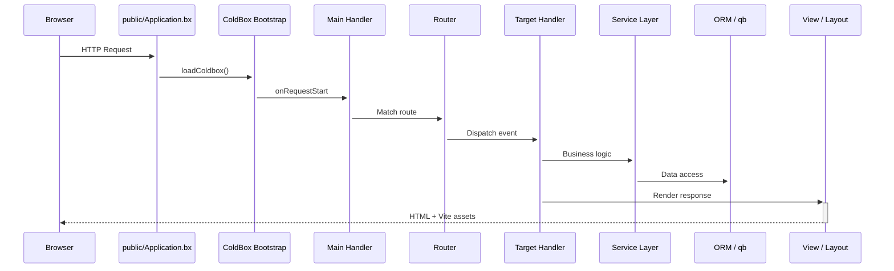

<!--
	This page renders through docs/.theme/home.bxm (the `layout: home` above),
	which hardcodes the whole page and never includes this file's own
	rendered body - everything below is kept, unused, as the starting
	point for reverting to the normal layout.bxm + page.bxm rendering if
	`layout: home` is ever removed.
-->

	
	

		<a class="bxsites-hero__btn bxsites-hero__btn--primary" href="getting-started.md">Comenzar</a>
		<a class="bxsites-hero__btn bxsites-hero__btn--secondary" href="https://github.com/coldbox-templates/cbGenesis">Ver en GitHub</a>
	

Una plantilla inicial de **ColdBox HMVC** lista para producción para [BoxLang](https://boxlang.io) - el lenguaje moderno y dinámico de la JVM. Incluye autenticación, SSO, passkeys, permisos basados en roles, tokens de API, modo oscuro y un panel de administración impulsado por Alpine, para que dediques tu primer día a construir funcionalidades en lugar de montar la autenticación desde cero.

::: cards
::: card title="Comienza en minutos" icon="phosphor-duotone:rocket-launch" href="getting-started.md"
Instala BoxLang, clona la plantilla, ejecuta las migraciones y estarás viendo la pantalla de inicio de sesión en menos de diez minutos.
:::
::: card title="Diseñado para el desarrollo asistido por IA" icon="phosphor-duotone:robot" href="ai-native.md"
AGENTS.md, servidores de documentación MCP y skills personalizadas que reducen, de forma medible, los tokens necesarios para construir sobre este código base con un agente de IA frente a partir de cero.
:::
::: card title="Estructura de plantilla moderna" icon="phosphor-duotone:folders" href="architecture.md"
El código de la aplicación vive en `app/`, completamente separado del webroot público en `public/` - seguridad mejorada por defecto.
:::
::: card title="Autenticación y RBAC, todo incluido" icon="phosphor-duotone:shield-check" href="guides/security.md"
Autenticación de sesión vía cbauth, anotaciones `@secured` en los handlers, rotación de CSRF, soporte para JWT y un modelo de permisos `resource:action`.
:::
::: card title="SSO y Passkeys" icon="phosphor-duotone:key" href="guides/security.md#single-sign-on"
cbSSO con un proveedor de Google OAuth incluido y vinculación de cuentas, además de passkeys WebAuthn para inicio de sesión sin contraseña.
:::
::: card title="ORM Hibernate + qb" icon="phosphor-duotone:database" href="guides/database-orm.md"
Convenciones `BaseEntity`/`BaseService` sobre cborm, migraciones vía cfmigrations, y qb para todo aquello que el SQL en crudo resuelve mejor.
:::
::: card title="UI con Alpine.js + Bootstrap 5" icon="phosphor-duotone:palette" href="guides/frontend.md"
Vistas BXM renderizadas en el servidor, con pequeños componentes Alpine, compiladas por Vite con recarga en caliente de módulos.
:::
::: card title="Una suite de pruebas real" icon="phosphor-duotone:test-tube" href="guides/testing.md"
Specs unitarias de TestBox para cada entidad y servicio, además de specs de integración que ejercitan solicitudes HTTP reales.
:::
::: card title="Configuración sencilla" icon="phosphor-duotone:sliders" href="guides/configuration.md"
Variables de entorno para lo esencial, ajustes de administración respaldados por base de datos para todo lo demás - sin necesidad de volver a desplegar para cambiarlos.
:::
::: card title="Listo para producción" icon="phosphor-duotone:cloud-arrow-up" href="deployment.md"
Una lista de verificación real para salir a producción, soporte para Docker, y la opción de usar CommandBox o el BoxLang MiniServer.
:::
:::

## Capturas de pantalla

El panel de administración, de principio a fin: desde el inicio de sesión hasta el registro de auditoría:

::: columns
::: column
<figure>
	
	<figcaption>Inicio de sesión - el diseño <code>AuthSplit</code> predeterminado.</figcaption>
</figure>
:::
::: column
<figure>
	
	<figcaption>Panel de control - después de iniciar sesión.</figcaption>
</figure>
:::
:::

::: columns
::: column
<figure>
	
	<figcaption>Usuarios - buscar, invitar y administrar cuentas.</figcaption>
</figure>
:::
::: column
<figure>
	
	<figcaption>Roles - agrupar permisos y asignar usuarios.</figcaption>
</figure>
:::
:::

::: columns
::: column
<figure>
	
	<figcaption>Permisos - el modelo <code>resource:action</code>, agrupado por recurso.</figcaption>
</figure>
:::
::: column
<figure>
	
	<figcaption>Configuración - configuración respaldada por base de datos, sin necesidad de volver a desplegar.</figcaption>
</figure>
:::
:::

::: columns
::: column
<figure>
	
	<figcaption>Perfil - avatar, passkeys, tokens de API y ajustes de la cuenta.</figcaption>
</figure>
:::
::: column
<figure>
	
	<figcaption>Registro de auditoría - cada inicio de sesión, cierre de sesión y fallo de acceso.</figcaption>
</figure>
:::
:::

## Míralo, no solo leas sobre ello

El ciclo de vida de una solicitud en CBGenesis, desde el navegador hasta la base de datos y de vuelta:

::: columns
::: column
!!! tip "Segura por convención"
    Cada handler de administración extiende `BaseSecureHandler` y lleva una anotación `@secured( "resource:action,resource:admin" )`. El firewall la hace cumplir - sin comprobaciones `if` hechas a mano dispersas por tus controladores. Consulta [Seguridad y permisos](guides/security.md).
:::
::: column
!!! faq "Hazla crecer a tu manera"
    ¿Un nuevo módulo CRUD? ¿Un nuevo ajuste? ¿Una nueva tarea programada? [Extendiendo CBGenesis](guides/extending.md) recorre los archivos exactos a modificar, en el mismo orden que ya sigue el código existente.
:::
:::

## A dónde ir después

::: cards
::: card title="Primeros pasos" icon="phosphor-duotone:rocket-launch" href="getting-started.md"
Instala, configura, migra y ejecuta la aplicación localmente.
:::
::: card title="Diseñado para el desarrollo asistido por IA" icon="phosphor-duotone:robot" href="ai-native.md"
Por qué empezar aquí supera construir autenticación, RBAC y CSRF desde cero con un agente - con una comparación medida.
:::
::: card title="Arquitectura" icon="phosphor-duotone:tree-structure" href="architecture.md"
La división moderna app/public, el árbol completo del proyecto y el ciclo de vida de una solicitud.
:::
::: card title="Handlers y enrutamiento" icon="phosphor-duotone:signpost" href="guides/handlers-routing.md"
Cada handler, cada ruta y las convenciones que los conectan entre sí.
:::
::: card title="Seguridad y permisos" icon="phosphor-duotone:shield-check" href="guides/security.md"
cbsecurity, cbauth, CSRF, JWT y el modelo de permisos `resource:action`.
:::
::: card title="Base de datos y ORM" icon="phosphor-duotone:database" href="guides/database-orm.md"
Entidades, servicios, migraciones y datos semilla.
:::
::: card title="Frontend" icon="phosphor-duotone:palette" href="guides/frontend.md"
Componentes de Alpine.js, estructura SCSS y el pipeline de Vite.
:::
::: card title="Extendiendo la aplicación" icon="phosphor-duotone:puzzle-piece" href="guides/extending.md"
Agrega un módulo CRUD, un permiso, un ajuste o una tarea programada.
:::
::: card title="Despliegue" icon="phosphor-duotone:cloud-arrow-up" href="deployment.md"
Compilación de producción, Docker, BoxLang MiniServer y una lista de verificación para salir a producción.
:::
:::

## Construido con BX Sites

Este sitio de documentación se genera con [BX Sites](https://ortus-boxlang.github.io/bx-sites/) - el generador oficial de sitios estáticos de BoxLang - directamente a partir del Markdown de la carpeta `docs/` de este repositorio, usando el tema `bootstrap` predeterminado. Consulta [`.github/workflows/docs.yml`](https://github.com/coldbox-templates/cbGenesis/blob/development/.github/workflows/docs.yml) para ver cómo se construye y publica en cada push.
