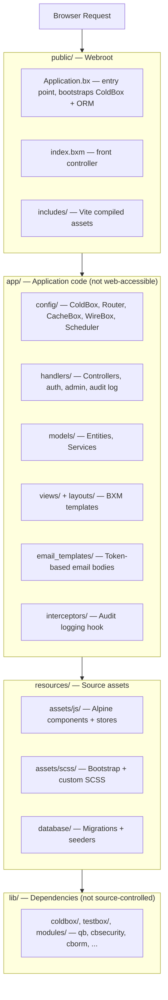
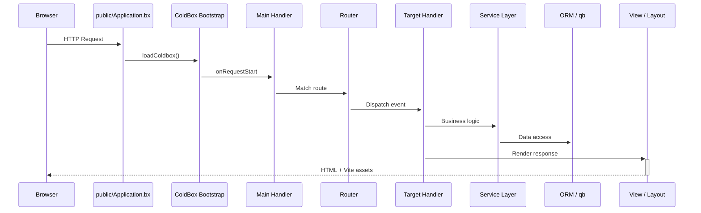

# Architecture

CBGenesis suit la disposition **moderne** de ColdBox : le code applicatif est entièrement séparé de la racine web publique, si bien que rien sous `app/` n'est jamais directement accessible depuis le web.

## Vue d'ensemble en couches



!!! note "Pourquoi cette séparation ?"
    Tout ce qu'un attaquant pourrait autrement parcourir directement - code source des handlers, configuration, templates de vues - ne vit tout simplement pas sous la racine web. `app/Application.bx` est une garde `abort;` d'une seule ligne, conservée uniquement pour que la convention du framework tienne même si un serveur web venait à être mal configuré pour servir `app/` directement.

## Cycle de vie d'une requête

Chaque requête entre par `public/Application.bx`, qui amorce ColdBox avant de passer la main au routeur et, finalement, à votre handler :



`Main.bx` (`app/handlers/Main.bx`) est le handler d'événement implicite câblé dans `app/config/Coldbox.bx` :

- `onAppInit` - exécute `settingService.preFlightCheck()`, qui insère en base tout paramètre d'application manquant
- `onRequestStart` - charge `prc.settings` et `prc.authUser` pour chaque requête
- `onException` - le gestionnaire d'exceptions à l'échelle de l'application

## Intercepteurs

`app/config/Coldbox.bx` enregistre trois intercepteurs applicatifs, dans cet ordre :

**`app/interceptors/AuditLogger.bx`** écrit dans le journal d'audit sur quatre points d'interception :

| Point | Enregistré |
|---|---|
| `postAuthentication` | Une connexion réussie |
| `preLogout` | Une déconnexion |
| `cbSecurity_onInvalidAuthentication` | Une requête qui nécessitait une session et n'en avait aucune |
| `cbSecurity_onInvalidAuthorization` | Un utilisateur authentifié auquel manque la permission requise |

**`app/interceptors/RateLimiter.bx`** se déclenche sur `preProcess` - avant le routage, avant tout handler - et limite le débit de cinq actions `Auth` non authentifiées (connexion, inscription, mot de passe oublié/réinitialisation, activation d'invitation) par IP client. Voir [Limitation de débit](guides/security.md#rate-limiting) pour les paramètres et le fonctionnement.

**`app/interceptors/SSOAuthorization.bx`** gère le point d'interception
`CBSSOAuthorization` de cbSSO. Il relie une identité de fournisseur vérifiée
au modèle utilisateur local, impose la politique connexion-vs-liaison,
provisionne les utilisateurs lorsque cela est autorisé, et crée la session
cbauth. Voir [Authentification unique](guides/security.md#single-sign-on) pour le
déroulement du callback et la raison pour laquelle cbGenesis utilise un
handler personnalisé plutôt que l'intégration cbAuth générique de cbSSO.

Ajoutez les vôtres au tableau `variables.interceptors` de `Coldbox.bx` ; ils se déclenchent dans l'ordre de déclaration.

## Tâches planifiées

`app/config/Scheduler.bx` enregistre trois tâches de fond quotidiennes, chacune `onOneServer()` et `withNoOverlaps()` afin qu'un déploiement multi-instance n'exécute chacune d'elles qu'une seule fois :

| Tâche | S'exécute | Supprime | Régie par |
|---|---|---|---|
| Purge des jetons API expirés | `03:00` | Les lignes de `user_api_tokens` dont l'`expiration` est dépassée | Durée de vie du jeton fixée à l'émission à partir de `cbApiTokenMaxValidityMonths` (par défaut `12` mois) - voir [Paramètres de l'application](reference/settings.md#password--token-policy) |
| Purge des jetons « se souvenir de moi » expirés | `03:15` | Les lignes de `user_remember_tokens` dont l'`expiration` est dépassée | Expiration fixe définie à l'émission du jeton (`SecurityService`/`RememberTokenService`) |
| Purge des anciens journaux d'audit | `03:30` | Les lignes de `audit_logs` plus anciennes que la fenêtre de rétention | `cbAuditLogRetentionDays` (par défaut `90` ; `0` désactive la purge) - voir [Paramètres de l'application](reference/settings.md#password--token-policy) |

Toutes les trois appellent une méthode `purgeExpiredTokens()`/`purgeOlderThan()` sur le service propriétaire plutôt que d'interroger directement la table, si bien que la même logique de purge reste accessible (et testable) en dehors du planificateur. Ajoutez une nouvelle tâche de la même façon - voir [Étendre l'application](guides/extending.md#adding-a-scheduled-task).

## Arborescence complète du projet

```text title="Project structure" linenums="1"
cbgenesis/
├── app/                      Application code
│   ├── Application.bx        Abort-only gate (prevents direct /app access)
│   ├── config/
│   │   ├── Coldbox.bx        Framework settings, environments, logging
│   │   ├── Router.bx         All application routes
│   │   ├── CacheBox.bx       Cache regions (default, template, sessions, rateLimit)
│   │   ├── WireBox.bx        DI container configuration
│   │   ├── Scheduler.bx      Scheduled tasks
│   │   └── modules/          Per-module settings (cbsecurity, cbauth, cborm, ...)
│   ├── handlers/              Controllers (Auth, Dashboard, Users, Roles, ...)
│   ├── layouts/                Admin, AuthCenter, AuthSplit, Main
│   ├── models/
│   │   ├── BaseEntity.bx      ORM base: timestamps, soft delete, memento
│   │   ├── BaseService.bx     Service base: cborm + qb + cache + validation
│   │   ├── security/            Role, Permission, APIToken, RememberToken,
│   │   │                        Passkey, UserActionToken, SecurityService, ...
│   │   └── system/              User, Setting, AuditLog + their services
│   ├── views/                  BXM templates, one folder per handler
│   │   └── _components/        Reusable UI partials (app, auth, ui)
│   ├── email_templates/       Token-based email body templates
│   ├── helpers/               ApplicationHelper.bxm — global view helpers
│   └── interceptors/           AuditLogger, RateLimiter, SSOAuthorization
├── public/
│   ├── Application.bx         Entry point — ColdBox + ORM bootstrap
│   ├── index.bxm               Front controller placeholder
│   └── includes/               Vite production build output
├── resources/
│   ├── assets/js/              Alpine entry, stores, components
│   ├── assets/scss/            Bootstrap + custom SCSS
│   └── database/
│       ├── migrations/         Schema migrations (cfmigrations)
│       └── seeds/              AdminData seeder
├── tests/
│   ├── specs/integration/      Full HTTP-level specs
│   └── specs/unit/             Entity + service specs
├── lib/                        Dependencies (gitignored, installed by `box install`)
├── runtime/                    BoxLang engine config (boxlang.json)
├── server.json                 CommandBox server config (engine, webroot, aliases)
├── box.json                    Package manifest — deps, scripts
├── package.json                 NPM — Alpine, Bootstrap, Vite, ESLint
├── vite.config.mjs              Vite + coldbox-vite-plugin
└── .env.example                  Environment template
```

## La pile technique

| Couche | Technologie |
|---|---|
| Runtime | BoxLang 1.0+ (JVM) |
| Framework | ColdBox HMVC (dernière version) |
| CLI / Serveur | CommandBox + BoxLang MiniServer |
| Injection de dépendances | WireBox |
| Sécurité | cbsecurity + cbauth (basé sur session + JWT) |
| Base de données | MySQL, MariaDB, PostgreSQL, et MSSQL via Hibernate ORM (cborm) ; les quatre cibles de base de données sont prises en charge et couvertes par le flux de test base de données du projet |
| Constructeur de requêtes | qb (SQL fluide) |
| Migrations | cfmigrations |
| Validation | cbvalidation |
| Email | cbmailservices |
| Sérialisation | mementifier |
| Frontend | Bootstrap 5.3 · Alpine.js 3.x · Vite 6 |
| Icônes | Phosphor Duotone |
| Infobulles | Tippy.js |

::: cards
::: card title="Handlers & Routage" icon="phosphor-duotone:signpost" href="guides/handlers-routing.md"
Chaque contrôleur et chaque route, et les conventions qui les relient.
:::
::: card title="Base de données & ORM" icon="phosphor-duotone:database" href="guides/database-orm.md"
La hiérarchie des entités, les migrations, et le patron `BaseService`.
:::
::: card title="Sécurité & Permissions" icon="phosphor-duotone:shield-check" href="guides/security.md"
Comment les handlers `@secured`, le CSRF, et le modèle de permissions s'articulent.
:::
:::
