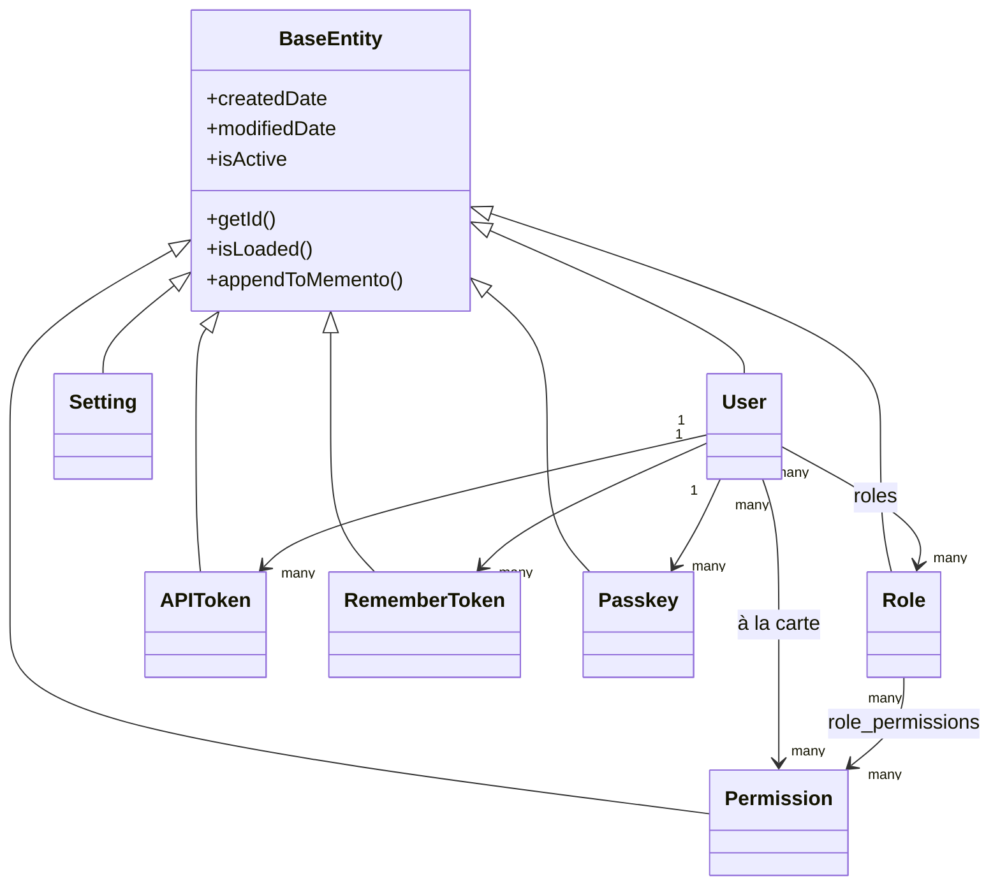

# Base de données & ORM

## Hiérarchie des entités

Chaque entité étend `BaseEntity` (`@mappedsuperclass`, elle-même étendant `cborm.models.ActiveEntity`), qui ajoute automatiquement `createdDate`, `modifiedDate`, et un drapeau de suppression douce `isActive` à chaque table :



`dbcreate: "none"` (défini dans le `ormSettings` de `public/Application.bx`) signifie que le schéma appartient exclusivement aux migrations — l'ORM ne génère ni ne modifie jamais automatiquement les tables.

## Patron de la couche service

Chaque service étend `BaseService` (`@singleton`, étend `cborm.models.VirtualEntityService`), qui injecte `qb`, `coldbox`, `wirebox`, et `cachebox:template`, et fournit `ensureSortOrder()` :

```boxlang title="Example service" linenums="1"
component
    extends="BaseService"
    singleton
    threadSafe
{

    property name="qb"    inject="provider:QueryBuilder@qb";
    property name="cache" inject="cachebox:template";

    function list( struct criteria = {} ){
        return newCriteria()
            .when( criteria.search, function( c, term ){
                c.like( "name", "%#term#%" );
            } )
            .list();
    }

}
```

=== "Entité"
    ```boxlang title="app/models/security/Role.bx" linenums="1"
    /**
     * A role: a named bundle of permissions.
     */
    class extends="app.models.BaseEntity" table="roles" {

        property name="roleId" fieldtype="id" generator="uuid2" ormtype="string";
        property name="name" type="string";

        property name="permissions"
            fieldtype="many-to-many"
            cfc="Permission"
            linktable="role_permissions";

    }
    ```
=== "Service"
    ```boxlang title="app/models/security/RoleService.bx" linenums="1"
    component extends="app.models.BaseService" singleton threadSafe {

        function getAllForLookup(){
            return newCriteria().resultTransformer( "distinct" ).list();
        }

    }
    ```

## Migrations

Propulsées par [cfmigrations](https://cfmigrations.ortusbooks.com) via le module CLI `commandbox-migrations`, configuré dans `.cbmigrations.json` (`migrationsDirectory: resources/database/migrations/`, `seedsDirectory: resources/database/seeds/`, connexion construite à partir des mêmes variables d'environnement `DB_*` que `public/Application.bx`).

```bash frame="terminal" title="Terminal"
box migrate up           # Run pending migrations
box migrate down         # Rollback the last batch
box migrate reset        # Rollback everything, then re-migrate
box migrate seed run     # Run database seeders
```

Les migrations s'exécutent dans l'ordre du nom de fichier/horodatage :

| Migration | Crée |
|---|---|
| `..._settings.bx` | `settings` (PK GUID, `name` unique, `value` en longtext) |
| `..._security.bx` | `permissions`, `roles`, `role_permissions` (table de jonction à clé primaire composite, FK en cascade) |
| `..._users.bx` | `users` (PK GUID, `email` unique, `pendingEmail` nullable pour les demandes de changement d'email en libre-service, `password` nullable, `preferences` en JSON, booléen `hasAvatar` indiquant si un utilisateur a un avatar téléversé sur le disque cbfs `assets`), ainsi que `user_roles`, `user_permissions`, `user_remember_tokens`, `user_api_tokens`, `user_action_tokens`, `user_passkeys`, `user_sso_identities` — chaque table enfant liée par FK à `users.userId` avec `ON DELETE CASCADE` (voir [Sécurité & Permissions](security.md#related-security-services) et [Frontend](frontend.md#avatars-branding-logo)) |
| `..._auditlogs.bx` | `audit_logs`, des enregistrements d'activité en ajout seul avec sévérité/catégorie/action, métadonnées de l'acteur et de la requête, et index de requête |

## Données de départ

`resources/database/seeds/AdminData.bx`, exécuté via `box migrate seed run`, crée :

- Un rôle **Admin**
- **20 permissions** réparties sur cinq ressources (`users`, `roles`, `permissions`, `settings`, `auditlog`), chacune avec `read`/`write`/`delete`/`admin` (`auditlog` utilise `read`/`export`/`delete`/`admin`) — toutes assignées au rôle Admin
- Un utilisateur administrateur, `admin@cbgenesis.com`, assigné au rôle Admin, semé en attente de réinitialisation afin que le mot de passe public de démarrage doive être remplacé dès la première connexion

Voir [Sécurité & Permissions](security.md#permission-model) pour savoir comment ces slugs sont imposés au niveau du handler.

::: cards
::: card title="Sécurité & Permissions" icon="phosphor-duotone:shield-check" href="security.md"
Comment les tables `permissions`/`roles` s'associent aux contrôles de handler `@secured`.
:::
::: card title="Étendre l'application" icon="phosphor-duotone:puzzle-piece" href="extending.md"
Ajouter une nouvelle entité, un service, et une migration pour votre propre domaine.
:::
:::
