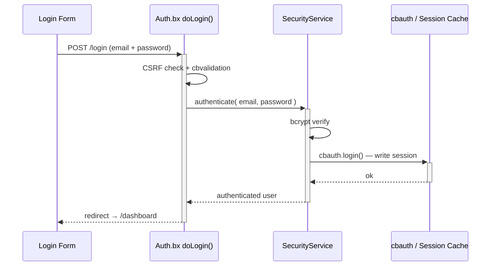
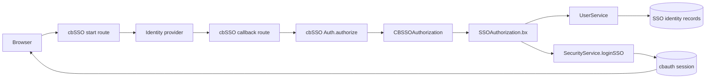
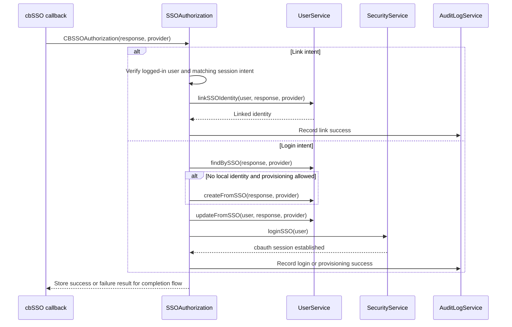

# Sécurité & Permissions

## Flux de connexion



## Mises en page d'authentification

Le flux d'authentification peut utiliser l'une ou l'autre des mises en page livrées via le paramètre `cbLoginLayout` :

| Valeur | Mise en page | Idéal pour |
|---|---|---|
| `AuthSplit` | Panneau de fonctionnalités de marque à gauche avec le formulaire à droite ; devient compact sur mobile. | Les applications qui veulent une expérience de connexion à deux panneaux, de marque. C'est la valeur par défaut. |
| `AuthCenter` | Carte d'authentification centrée avec le logo, le formulaire, et le pied de page. | Les applications qui préfèrent une expérience de connexion centrée et compacte. |

Choisissez **Auth Center** ou **Auth Split** sur la page `/settings`. La mise en page sélectionnée s'applique aux pages de connexion, d'inscription, d'activation d'invitation, et de récupération de mot de passe. Voir [Paramètres de l'application](../reference/settings.md#login-layout-selection) pour les fichiers de mise en page et les instructions de personnalisation.

<figure>
	
	<figcaption>L'écran de connexion utilisant la mise en page <code>AuthSplit</code> par défaut.</figcaption>
</figure>

## Authentification unique

cbSSO est activé via `app/config/modules/cbsso.bx`. Il utilise cbauth comme
autorité de session, si bien que la connexion locale par mot de passe, les passkeys,
et le SSO partagent la même session et les mêmes règles d'autorisation. La page de
connexion affiche un lien pour chaque fournisseur configuré.

Google est le fournisseur d'exemple livré. Définissez ces valeurs dans `.env` après
avoir enregistré l'URL de callback `/cbsso/auth/Google` auprès de Google :

```dotenv linenums="1"
GOOGLE_CLIENT_ID=
GOOGLE_CLIENT_SECRET=
GOOGLE_REDIRECT_URI=https://example.com/cbsso/auth/Google
```

### Activer et désactiver le SSO

Il n'existe pas de paramètre `SSO_ENABLED` séparé. Le commutateur de fournisseur
effectif se trouve dans [`app/config/modules/cbsso.bx`](../../app/config/modules/cbsso.bx) :
cbGenesis n'enregistre Google que lorsque `GOOGLE_CLIENT_ID`, `GOOGLE_CLIENT_SECRET`,
et `GOOGLE_REDIRECT_URI` sont toutes renseignées. Pour désactiver le SSO Google,
videz l'une de ces valeurs et redémarrez ou réinitialisez l'application. Le
fournisseur n'apparaîtra plus sur les pages de connexion ou de profil.

Ne confondez pas ceci avec `enableCBAuthIntegration: false`. Ce paramètre désactive
l'écouteur cbauth générique optionnel de cbSSO ; cbGenesis utilise son propre
intercepteur `SSOAuthorization` afin de pouvoir imposer ses propres règles de
liaison de compte local, de provisionnement, de correspondance d'identité, et
d'audit. Voir la documentation de cbSSO pour
[la configuration](https://cbsso.ortusbooks.com/),
[le traitement de la réponse du fournisseur d'identité](https://cbsso.ortusbooks.com/usage/handling-the-identity-provider-response.md),
[les points d'interception](https://cbsso.ortusbooks.com/usage/interception-points.md),
et [l'intégration cbauth](https://cbsso.ortusbooks.com/cbauth-integration/enabling-integration.md).

::: stepper
::: step "Préparer la base de données"
Depuis la racine du projet, exécutez la migration d'identité SSO :

```bash linenums="1"
box migrate up
```

Cela crée la table `user_sso_identities` utilisée pour lier un compte local à un
sujet de fournisseur d'identité. Exécutez ceci avant de tenter la première
connexion SSO.
:::

::: step "Créer et configurer le client OAuth Google"
Dans la [Google Cloud Console](https://console.cloud.google.com/), créez ou
sélectionnez un projet, configurez l'écran de consentement OAuth, et créez un
**ID client OAuth** avec le type d'application **Application Web**. Ajoutez
cette URI de redirection autorisée exacte, en utilisant l'URL HTTPS publique de
votre application :

```text linenums="1"
https://your-domain.example/cbsso/auth/Google
```

Copiez l'ID client et le secret client dans le fichier `.env` local. L'URI de
redirection doit être la même valeur dans Google Cloud et dans
`GOOGLE_REDIRECT_URI` :

```dotenv linenums="1"
GOOGLE_CLIENT_ID=your-google-client-id
GOOGLE_CLIENT_SECRET=your-google-client-secret
GOOGLE_REDIRECT_URI=https://your-domain.example/cbsso/auth/Google
```

Gardez les identifiants hors du contrôle de version. cbGenesis n'enregistre le
fournisseur Google que lorsque les trois paramètres `GOOGLE_*` sont renseignés,
afin que l'application puisse toujours démarrer avant que le SSO ne soit
configuré.

La création automatique de compte est désactivée par défaut. Pour autoriser de
nouveaux utilisateurs Google, activez-la explicitement et restreignez les
domaines d'email autorisés :

```dotenv linenums="1"
CBSSO_AUTO_PROVISION=true
CBSSO_ALLOWED_DOMAINS=example.com,example.org
```

Laissez `CBSSO_AUTO_PROVISION=false` lorsque chaque utilisateur SSO doit déjà
avoir un compte local. Ces utilisateurs doivent se connecter localement et
utiliser l'action **Lier un compte Google** du profil avant de pouvoir se
connecter avec Google.
:::

::: step "Démarrer l'application et vérifier le flux"
Démarrez l'application avec votre commande de développement ou de déploiement
habituelle, puis ouvrez `/login` et sélectionnez **Continuer avec Google**.
Confirmez que Google redirige bien vers `/cbsso/auth/Google` et que
l'application vous envoie vers le tableau de bord.

Pour un compte local existant, connectez-vous d'abord avec le mot de passe,
ouvrez la page de profil, et liez le compte Google. Déconnectez-vous, revenez
sur `/login`, et vérifiez que le SSO Google vous reconnecte au même compte
local. Si le provisionnement est activé, vérifiez qu'un domaine autorisé crée
un utilisateur local et qu'un domaine hors de `CBSSO_ALLOWED_DOMAINS` est
rejeté.
:::
:::

Après la configuration, les identités sont mises en correspondance par
fournisseur et sujet immuable, jamais par email seul. Les comptes locaux
existants doivent être explicitement liés avant de pouvoir être utilisés via
SSO.

Pour les déploiements SAML en cluster, configurez le `samlRequestCacheName` de
cbSSO vers une région CacheBox distribuée au lieu d'utiliser le cache de rejeu
en mémoire par défaut.

### Comment cbSSO devient une session locale

cbSSO possède le protocole du fournisseur et la validation du callback.
cbGenesis possède la décision qui suit : à quel compte local l'identité vérifiée
appartient, si elle peut être provisionnée ou liée, et comment elle devient une
session applicative authentifiée.



L'application enregistre `app/interceptors/SSOAuthorization.bx` pour le point
d'interception documenté `CBSSOAuthorization` de cbSSO. La charge utile du
callback contient la réponse du fournisseur vérifiée et le fournisseur qui l'a
traitée. L'intercepteur suit ensuite l'un des deux chemins gérés par
l'application :



### Pourquoi cet intercepteur existe

cbSSO fournit aussi un écouteur d'intégration `cbAuth` générique. cbGenesis
définit intentionnellement `enableCBAuthIntegration: false` dans
`app/config/modules/cbsso.bx`, car l'écouteur générique ne peut pas imposer les
règles de sécurité d'identité et de compte de l'application. L'intercepteur
personnalisé est responsable de :

- Faire correspondre les identités par fournisseur et sujet immuable, jamais
  par email seul.
- Exiger une session authentifiée et une intention correspondante pour la
  liaison de compte.
- Appliquer la politique de provisionnement et de domaines autorisés avant de
  créer des utilisateurs.
- Maintenir les chemins d'authentification par mot de passe local, se souvenir
  de moi, passkey, et SSO sous la même autorité de session cbauth.
- Enregistrer les opérations SSO réussies et échouées dans le journal d'audit.

Cette séparation est délibérée : cbSSO vérifie *qui le fournisseur dit que
l'utilisateur est* ; cbGenesis décide *ce que cette identité est autorisée à
faire dans cette application*.

Pour le contrat en amont et l'intégration générique alternative, voir la
documentation [des points d'interception cbSSO](https://cbsso.ortusbooks.com/usage/interception-points.md),
[du traitement de la réponse du fournisseur d'identité](https://cbsso.ortusbooks.com/usage/handling-the-identity-provider-response.md),
et [de l'intégration cbAuth](https://cbsso.ortusbooks.com/cbauth-integration/enabling-integration.md).

## Couches de sécurité

| Couche | Implémentation |
|---|---|
| Authentification de session | cbauth avec `CacheStorage@cbStorages` — cache de session côté serveur |
| Hachage de mot de passe | bcrypt via `bx-password-encrypt` |
| Politique de mot de passe | `SettingService.isValidPassword()` — `cbMinPasswordLength` plus une lettre majuscule, une lettre minuscule, un chiffre, et un caractère spécial. Imposé côté serveur à l'inscription, à l'activation d'invitation, à la réinitialisation de mot de passe, et au changement de mot de passe du profil ; l'assistant Alpine `$passwordMeetsPolicy` le reflète dans le navigateur |
| Protection CSRF | jeton rotatif cbsecurity (30 min) ; le vérificateur automatique est désactivé, et `BaseSecureHandler` vérifie par défaut restrictif sur chaque méthode HTTP non sûre à la place — voir [Handlers & Routage](handlers-routing.md#csrf-verification) |
| Sécurité des handlers | annotation `@secured` → le pare-feu redirige les visiteurs non authentifiés vers `login`, les utilisateurs autorisés mais sans permission vers `dashboard.notAuthorized` |
| Support JWT | Configuré pour l'accès API (HS512, 60 min, stockage de jeton en cache) |
| En-têtes de sécurité | protection XSS, `frameOptions: SAMEORIGIN`, `referrerPolicy: same-origin` |
| Jetons API | jetons par utilisateur hachés SHA/BCrypt avec expiration et purge quotidienne planifiée |
| Limitation de débit | l'intercepteur `RateLimiter` limite le débit de connexion, d'inscription, et de réinitialisation de mot de passe par IP - voir [Limitation de débit](#rate-limiting) ci-dessous |

## Limitation de débit

`app/interceptors/RateLimiter.bx` se déclenche sur `preProcess` - avant le routage, avant l'exécution de tout handler - et limite le débit de cinq points de terminaison `Auth` non authentifiés par IP client :

- `doLogin`, `doRegister`, `doForgotPassword`, `doResetPassword`, `doActivateInvitation`

Un appelant qui dépasse la limite est redirigé vers le formulaire avec une erreur flash ; la requête n'atteint jamais le handler, donc un mot de passe correct soumis pendant le blocage ne connecte quand même pas l'utilisateur.

| Paramètre | Objet |
|---|---|
| `cbRateLimitMaxAttempts` | Tentatives autorisées par IP, par point de terminaison, dans la fenêtre (par défaut : `5`) |
| `cbRateLimitWindowSeconds` | Durée de la fenêtre, en secondes (par défaut : `300`). `0` désactive entièrement la limitation de débit |
| `cbTrustProxyHeaders` | Si le « par IP » de « par IP, par point de terminaison » provient de `X-Forwarded-For` ou de l'adresse brute du socket (par défaut : `true`) - voir [Déployer derrière un proxy inverse](../deployment.md#deploying-behind-a-reverse-proxy) |

Les trois sont modifiables sur `/settings` comme n'importe quel autre paramètre de l'application - voir [Paramètres de l'application](../reference/settings.md#password--token-policy).

!!! warning "`cbTrustProxyHeaders` est une décision de déploiement, pas une décision de code"
    `X-Forwarded-For` est un en-tête HTTP ordinaire - n'importe quel appelant peut le définir à n'importe quelle valeur, à moins que quelque chose devant l'application (un proxy inverse ou un répartiteur de charge) ne supprime ce que le client a envoyé et ne le définisse lui-même. Savoir si c'est le cas est quelque chose que seule la personne qui déploie l'application sait.

    - **Activé (par défaut)** : fait confiance à `X-Forwarded-For`/`X-Cluster-Client-IP`, ce qui correspond à un déploiement typique de cette application derrière un proxy inverse ou un répartiteur de charge. Si votre proxy n'écrase *pas* cet en-tête (ou si vous êtes directement exposé sur Internet sans rien devant l'application), un appelant peut le falsifier pour obtenir un nouveau compteur de limitation de débit à chaque requête et pour truquer l'IP enregistrée dans le journal d'audit - désactivez ceci dans ce cas.
    - **Désactivé** : `getRealIP()` utilise à la place l'adresse brute du socket. Correct lorsque l'application est directement exposée sur Internet, mais si vous *êtes* derrière un proxy, chaque appelant ressemble à l'IP du proxy lui-même - une « IP » bloquée bloque tout le monde derrière elle, et chaque entrée du journal d'audit affiche l'adresse du proxy au lieu de celle du vrai client.

### Comment fonctionne le comptage

`RateLimitService.attempt()` est une **fenêtre glissante** : chaque tentative, autorisée ou bloquée, réinitialise l'expiration de la clé à la fenêtre complète à partir de ce moment. Une clé ne se refroidit qu'une fois qu'elle reste silencieuse pendant une fenêtre entière - ce qui continue de bloquer tant que l'attaque se poursuit, plutôt que de se rouvrir à mi-chemin. Chaque point de terminaison a son propre compteur (indexé par `event:ip`), donc épuiser la limite de connexion n'affecte ni l'inscription ni la réinitialisation de mot de passe.

!!! note "En mémoire par défaut"
    Les compteurs vivent dans la région CacheBox `rateLimit` (`app/config/CacheBox.bx`), qui est en mémoire et donc **par instance d'application**. Derrière un répartiteur de charge avec plus d'une instance, chaque instance impose sa propre limite indépendamment - un appelant pourrait obtenir `cbRateLimitMaxAttempts` tentatives gratuites par instance plutôt qu'au total. Pour partager les compteurs entre instances, remplacez le `provider`/`properties` de la région `rateLimit` par un fournisseur CacheBox distribué (Redis, Couchbase, ou tout fournisseur pris en charge par CacheBox) - aucun changement de code nécessaire dans `RateLimitService` ou `RateLimiter`, puisque les deux passent par la région injectée `cachebox:rateLimit`.

## Configuration de `cbsecurity`

`app/config/modules/cbsecurity.bx` est la source unique de vérité pour le pare-feu :

```boxlang title="app/config/modules/cbsecurity.bx (excerpt)" hl_lines="3 8 9" linenums="1"
{
    authentication : {
        provider          : "authenticationService@cbauth",
        prcUserVariable   : "authUser"
    },
    firewall : {
        autoLoadFirewall         : true,
        validator                 : "CBAuthValidator@cbsecurity",
        handlerAnnotationSecurity : true,
        invalidAuthenticationEvent : "login",
        invalidAuthorizationEvent  : "dashboard.notAuthorized",
        rules                      : [] // authorization is annotation-based, not rule-based
    }
}
```

- **`prcUserVariable: "authUser"`** — l'utilisateur authentifié est toujours disponible sous `prc.authUser` dans chaque handler, vue, et mise en page.
- **`handlerAnnotationSecurity: true`** — c'est ce qui fait que les annotations `@secured` sur une classe de handler ou une action appliquent réellement quelque chose.
- **`rules: []`** — cette application effectue toute son autorisation via des annotations de handler, pas via la liste de règles alternative basée sur des motifs d'URL de cbsecurity.

## Modèle de permissions

Chaque permission est un slug de la forme `resource:action`, seedé par `resources/database/seeds/AdminData.bx` :

| Ressource | Actions |
|---|---|
| `users` | `read`, `write`, `delete`, `admin` |
| `roles` | `read`, `write`, `delete`, `admin` |
| `permissions` | `read`, `write`, `delete`, `admin` |
| `settings` | `read`, `write`, `delete`, `admin` |
| `auditlog` | `read`, `export`, `delete`, `admin` |

!!! info "`admin` est un sur-ensemble"
    `admin` signifie « administration complète de cette ressource » et est toujours combiné par OU avec l'action spécifique dont une route a besoin, si bien qu'un utilisateur détenant `roles:admin` passe n'importe quel contrôle `roles:*` sans avoir besoin individuellement de `roles:read`/`roles:write`/`roles:delete`. Le seeder assigne les 20 permissions intégrées à un seul rôle **Admin**, accordé à l'utilisateur seedé `admin@cbgenesis.com`.

::: columns
::: column
<figure>
	
	<figcaption>La page d'administration des Rôles.</figcaption>
</figure>
:::
::: column
<figure>
	
	<figcaption>La page d'administration des Permissions, regroupées par ressource.</figcaption>
</figure>
:::
:::

**Imposez-le sur le handler** — c'est la véritable limite de sécurité, résolue par le `CBAuthValidator` de cbsecurity contre les permissions de l'utilisateur authentifié :

```boxlang title="app/handlers/Roles.bx" linenums="1"
@secured( "roles:admin,roles:read" )     // class-level: applies to index and any action without its own annotation
class extends="BaseSecureHandler" {

    @secured( "roles:admin,roles:write" )
    function create( event, rc, prc ) { ... }

    @secured( "roles:admin,roles:delete" )
    function delete( event, rc, prc ) { ... }

}
```

Une liste séparée par des virgules est un contrôle **OU** — une seule des permissions listées suffit.

**Reflétez-le dans la vue** — uniquement pour l'expérience utilisateur, *jamais* la limite de sécurité en elle-même. `User.bx` expose `hasPermission()` sur `prc.authUser`, disponible dans n'importe quelle vue ou mise en page rendue via un handler sécurisé :

```html title="Example view guard" linenums="1"
<bx:if prc.authUser.hasPermission( "roles:write,roles:admin" )>
    <button type="button" class="btn btn-primary" @click="openCreate()">New Role</button>
</bx:if>
```

`hasPermission()` accepte une chaîne, une liste séparée par des virgules, ou un tableau, et effectue un contrôle OU ; `hasAllPermissions()` fait l'équivalent en ET. Les deux sont mis en cache par requête via `getAllPermissions()`, qui fait l'union des permissions à la carte d'un utilisateur avec toutes les permissions accordées via ses rôles. Chaque vue d'administration existante (navigation de la barre latérale, Utilisateurs/Rôles/Permissions/Paramètres) suit déjà ce patron — traitez-le comme le modèle pour les nouveaux modules sécurisés.

Un utilisateur qui échoue à un contrôle `@secured` est redirigé :

- **Non authentifié** → `login`
- **Authentifié, permission manquante** → `dashboard.notAuthorized`

## Services de sécurité associés

| Modèle | Objet |
|---|---|
| `SecurityService` | Enveloppe le service d'authentification de `cbauth` ; `login()`/`authenticate()`, gestion du cookie « se souvenir de moi » avec rotation de jeton, `logout()`, émission/vérification du jeton de réinitialisation de mot de passe (en cache, pas en base) |
| `UserService` | `requestEmailChange()`/`confirmEmailChange()`/`cancelEmailChange()` - changement d'email en libre-service, conditionné par un jeton d'action `PURPOSE_EMAIL_CHANGE` afin qu'une nouvelle adresse ne soit appliquée qu'une fois que l'utilisateur l'a confirmée depuis sa boîte de réception |
| `APIToken` / `APITokenService` | Jetons d'accès personnels hachés SHA/BCrypt — `createToken()` retourne le jeton brut une seule fois, `revokeToken()`/`revokeAllForUser()`, `purgeExpiredTokens()` sur un planning |
| `RememberToken` / `RememberTokenService` | Jetons de navigateur persistants « se souvenir de moi », renouvelés à chaque utilisation |
| `UserActionToken` / `UserActionTokenService` | Jetons à usage unique liés à un but précis — `issue()`, `resolve()`, `consume()`. Cinq buts : `PURPOSE_REGISTRATION`, `PURPOSE_INVITATION`, `PURPOSE_PASSWORD_RESET`, `PURPOSE_FORCED_PASSWORD_CHANGE`, `PURPOSE_EMAIL_CHANGE` |
| `Passkey` / `PasskeyService` | Identifiants WebAuthn pour la connexion sans mot de passe ; `cbRequirePasskey` fait que `BaseSecureHandler` redirige un utilisateur qui n'en a aucune vers `profile/passkey-required` |
| `AuditLog` / `AuditLogService` | Le journal d'audit. L'intercepteur `AuditLogger` écrit automatiquement les connexions, déconnexions, et échecs d'authentification/autorisation — voir [Architecture](../architecture.md#interceptors) |
| `Passkey` / `PasskeyService` | Stockage des identifiants WebAuthn via le contrat `ICredentialRepository` de `cbsecurity-passkeys` |

<figure>
	
	<figcaption>La page d'administration du Journal d'audit, montrant une connexion enregistrée.</figcaption>
</figure>

## Problèmes connus

### « This is an invalid domain » lors de l'enregistrement d'une passkey

Les passkeys sont configurées pour le domaine `localhost` pendant le développement local. Si vous ouvrez l'application avec une adresse IP telle que `http://127.0.0.1:8080`, WebAuthn considère cela comme une origine différente et rejette l'enregistrement avec **« This is an invalid domain. »**

Ouvrez plutôt l'application sur **[http://localhost:8080](http://localhost:8080)**. Les passkeys enregistrées pour une origine ne sont pas interchangeables avec une autre, donc supprimez et réenregistrez la passkey si elle a été créée en utilisant un nom d'hôte différent.

::: cards
::: card title="Handlers & Routage" icon="phosphor-duotone:signpost" href="handlers-routing.md"
Voir chaque annotation `@secured` en contexte, handler par handler.
:::
::: card title="Carte des routes" icon="phosphor-duotone:map-trifold" href="../reference/routes.md"
Quelle permission protège quelle URL, en un coup d'œil.
:::
::: card title="Étendre l'application" icon="phosphor-duotone:puzzle-piece" href="extending.md"
Ajouter une toute nouvelle permission et la câbler à travers le handler, la vue, et le seeder.
:::
:::
