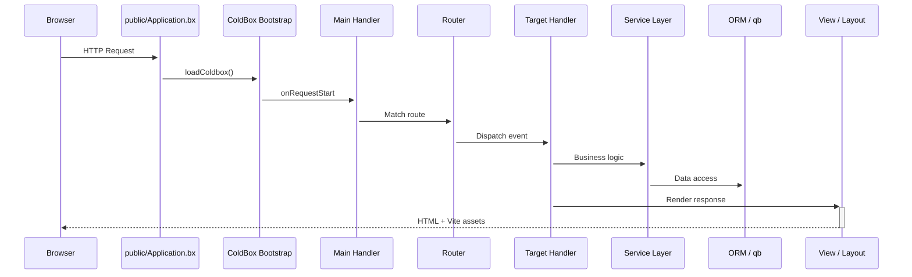

<!--
	This page renders through docs/.theme/home.bxm (the `layout: home` above),
	which hardcodes the whole page and never includes this file's own
	rendered body - everything below is kept, unused, as the starting
	point for reverting to the normal layout.bxm + page.bxm rendering if
	`layout: home` is ever removed.
-->

	
	

		<a class="bxsites-hero__btn bxsites-hero__btn--primary" href="getting-started.md">Démarrer</a>
		<a class="bxsites-hero__btn bxsites-hero__btn--secondary" href="https://github.com/coldbox-templates/cbGenesis">Voir sur GitHub</a>
	

Un template de démarrage **ColdBox HMVC** prêt pour la production pour [BoxLang](https://boxlang.io) - le langage JVM moderne et dynamique. Il embarque authentification, SSO, passkeys, permissions basées sur les rôles, jetons API, mode sombre, et un panneau d'administration propulsé par Alpine, afin que vous passiez votre premier jour à construire des fonctionnalités plutôt qu'à échafauder l'authentification.

::: cards
::: card title="Démarrez en quelques minutes" icon="phosphor-duotone:rocket-launch" href="getting-started.md"
Installez BoxLang, clonez le template, exécutez les migrations, et retrouvez-vous devant l'écran de connexion en moins de dix minutes.
:::
::: card title="Conçu pour le développement assisté par IA" icon="phosphor-duotone:robot" href="ai-native.md"
AGENTS.md, serveurs de documentation MCP, et skills personnalisées qui réduisent réellement, chiffres à l'appui, les tokens nécessaires pour construire sur cette base de code avec un agent IA par rapport à un démarrage depuis zéro.
:::
::: card title="Structure de template moderne" icon="phosphor-duotone:folders" href="architecture.md"
Le code applicatif vit dans `app/`, entièrement séparé de la racine web publique dans `public/` - une sécurité renforcée par défaut.
:::
::: card title="Auth & RBAC, piles incluses" icon="phosphor-duotone:shield-check" href="guides/security.md"
Authentification de session via cbauth, annotations de handler `@secured`, rotation CSRF, support JWT, et un modèle de permissions `resource:action`.
:::
::: card title="SSO & Passkeys" icon="phosphor-duotone:key" href="guides/security.md#single-sign-on"
cbSSO avec un fournisseur Google OAuth livré et la liaison de compte, plus les passkeys WebAuthn pour une connexion sans mot de passe.
:::
::: card title="ORM Hibernate + qb" icon="phosphor-duotone:database" href="guides/database-orm.md"
Conventions `BaseEntity`/`BaseService` au-dessus de cborm, migrations via cfmigrations, et qb pour tout ce que le SQL brut fait mieux.
:::
::: card title="UI Alpine.js + Bootstrap 5" icon="phosphor-duotone:palette" href="guides/frontend.md"
Vues BXM rendues côté serveur, agrémentées de petits composants Alpine, compilées par Vite avec rechargement à chaud des modules.
:::
::: card title="Une véritable suite de tests" icon="phosphor-duotone:test-tube" href="guides/testing.md"
Spécifications unitaires TestBox pour chaque entité et service, plus des spécifications d'intégration qui exécutent de vraies requêtes HTTP.
:::
::: card title="Configuration facile" icon="phosphor-duotone:sliders" href="guides/configuration.md"
Variables d'environnement pour l'essentiel, paramètres d'administration en base de données pour tout le reste - aucun redéploiement nécessaire pour les modifier.
:::
::: card title="Prêt pour la production" icon="phosphor-duotone:cloud-arrow-up" href="deployment.md"
Une véritable checklist de mise en production, un support Docker, et un choix entre CommandBox ou le BoxLang MiniServer.
:::
:::

## Captures d'écran

Le panneau d'administration, de bout en bout - de la connexion au journal d'audit :

::: columns
::: column
<figure>
	
	<figcaption>Connexion - la mise en page <code>AuthSplit</code> par défaut.</figcaption>
</figure>
:::
::: column
<figure>
	
	<figcaption>Tableau de bord - après connexion.</figcaption>
</figure>
:::
:::

::: columns
::: column
<figure>
	
	<figcaption>Utilisateurs - rechercher, inviter, et gérer les comptes.</figcaption>
</figure>
:::
::: column
<figure>
	
	<figcaption>Rôles - regrouper les permissions et assigner les utilisateurs.</figcaption>
</figure>
:::
:::

::: columns
::: column
<figure>
	
	<figcaption>Permissions - le modèle <code>resource:action</code>, regroupé par ressource.</figcaption>
</figure>
:::
::: column
<figure>
	
	<figcaption>Paramètres - configuration en base de données, aucun redéploiement nécessaire.</figcaption>
</figure>
:::
:::

::: columns
::: column
<figure>
	
	<figcaption>Profil - avatar, passkeys, jetons API, et paramètres de compte.</figcaption>
</figure>
:::
::: column
<figure>
	
	<figcaption>Journal d'audit - chaque connexion, déconnexion, et échec d'accès.</figcaption>
</figure>
:::
:::

## Voyez-le, ne vous contentez pas d'en lire

Le cycle de vie des requêtes de CBGenesis, du navigateur à la base de données et retour :

::: columns
::: column
!!! tip "Sécurisé par convention"
    Chaque handler d'administration étend `BaseSecureHandler` et porte une annotation `@secured( "resource:action,resource:admin" )`. Le pare-feu l'impose - pas de vérifications `if` faites main éparpillées dans vos contrôleurs. Voir [Sécurité & Permissions](guides/security.md).
:::
::: column
!!! faq "Faites-le grandir à votre façon"
    Un nouveau module CRUD ? Un nouveau paramètre ? Une nouvelle tâche planifiée ? [Étendre CBGenesis](guides/extending.md) détaille les fichiers exacts à modifier, dans l'ordre déjà suivi par le code existant.
:::
:::

## Où aller ensuite

::: cards
::: card title="Démarrage" icon="phosphor-duotone:rocket-launch" href="getting-started.md"
Installer, configurer, migrer, et exécuter l'application en local.
:::
::: card title="Conçu pour le développement assisté par IA" icon="phosphor-duotone:robot" href="ai-native.md"
Pourquoi démarrer ici bat le fait de construire l'authentification, le RBAC, et le CSRF depuis zéro avec un agent - avec une comparaison chiffrée.
:::
::: card title="Architecture" icon="phosphor-duotone:tree-structure" href="architecture.md"
La séparation moderne app/public, l'arborescence complète du projet, et le cycle de vie des requêtes.
:::
::: card title="Handlers & Routage" icon="phosphor-duotone:signpost" href="guides/handlers-routing.md"
Chaque handler, chaque route, et les conventions qui les relient.
:::
::: card title="Sécurité & Permissions" icon="phosphor-duotone:shield-check" href="guides/security.md"
cbsecurity, cbauth, CSRF, JWT, et le modèle de permissions `resource:action`.
:::
::: card title="Base de données & ORM" icon="phosphor-duotone:database" href="guides/database-orm.md"
Entités, services, migrations, et données de départ.
:::
::: card title="Frontend" icon="phosphor-duotone:palette" href="guides/frontend.md"
Composants Alpine.js, structure SCSS, et le pipeline Vite.
:::
::: card title="Étendre l'application" icon="phosphor-duotone:puzzle-piece" href="guides/extending.md"
Ajouter un module CRUD, une permission, un paramètre, ou une tâche planifiée.
:::
::: card title="Déploiement" icon="phosphor-duotone:cloud-arrow-up" href="deployment.md"
Build de production, Docker, BoxLang MiniServer, et une checklist de mise en production.
:::
:::

## Construit avec BX Sites

Ce site de documentation est généré avec [BX Sites](https://ortus-boxlang.github.io/bx-sites/) - le générateur de site statique officiel de BoxLang - directement à partir du Markdown du dossier `docs/` de ce dépôt, en utilisant le thème `bootstrap` par défaut. Voir [`.github/workflows/docs.yml`](https://github.com/coldbox-templates/cbGenesis/blob/development/.github/workflows/docs.yml) pour savoir comment il est construit et publié à chaque push.
