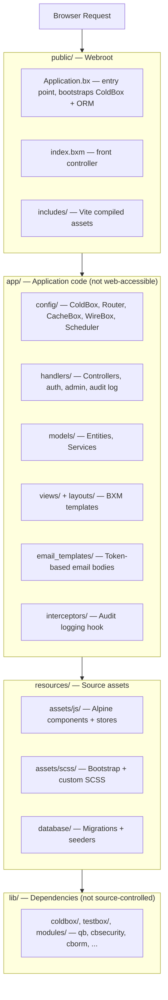
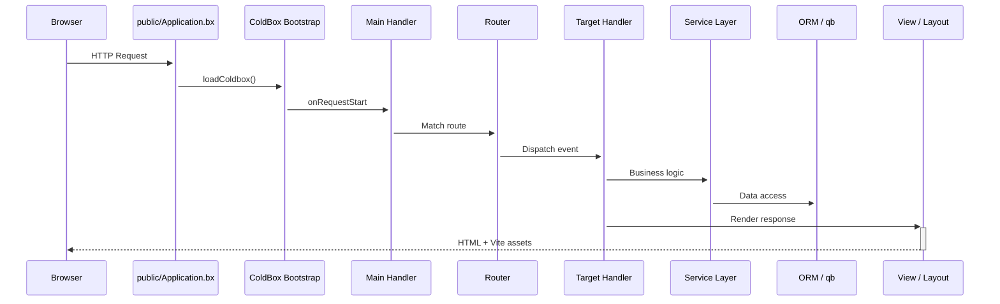

# Architettura

CBGenesis segue il layout **moderno** di ColdBox: il codice dell'applicazione è completamente separato dalla webroot pubblica, quindi nulla sotto `app/` è mai direttamente accessibile dal web.

## Panoramica a livelli



!!! note "Perché questa separazione?"
    Tutto ciò a cui un aggressore potrebbe altrimenti navigare direttamente - codice sorgente degli handler, configurazione, template delle viste - semplicemente non vive sotto la webroot. `app/Application.bx` è una guardia di una riga con `abort;`, mantenuta solo affinché la convenzione del framework regga anche se un server web venisse mai configurato erroneamente per servire `app/` direttamente.

## Ciclo di vita della richiesta

Ogni richiesta entra attraverso `public/Application.bx`, che fa il bootstrap di ColdBox prima di passare il controllo al router e, infine, al tuo handler:



`Main.bx` (`app/handlers/Main.bx`) è l'handler a evento implicito collegato in `app/config/Coldbox.bx`:

- `onAppInit` - esegue `settingService.preFlightCheck()`, seminando nel database ogni impostazione dell'app mancante
- `onRequestStart` - carica `prc.settings` e `prc.authUser` per ogni richiesta
- `onException` - il gestore delle eccezioni a livello di app

## Interceptor

`app/config/Coldbox.bx` registra tre interceptor applicativi, in quest'ordine:

**`app/interceptors/AuditLogger.bx`** scrive nel registro di audit su quattro punti di intercettazione:

| Punto | Registrato |
|---|---|
| `postAuthentication` | Un accesso riuscito |
| `preLogout` | Una disconnessione |
| `cbSecurity_onInvalidAuthentication` | Una richiesta che richiedeva una sessione e non ne aveva nessuna |
| `cbSecurity_onInvalidAuthorization` | Un utente autenticato privo del permesso richiesto |

**`app/interceptors/RateLimiter.bx`** si attiva su `preProcess` - prima del routing, prima di qualsiasi handler - e limita cinque azioni `Auth` non autenticate (login, registrazione, dimentica/reimposta password, attivazione invito) per IP client. Vedi [Rate limiting](guides/security.md#rate-limiting) per le impostazioni e il funzionamento.

**`app/interceptors/SSOAuthorization.bx`** gestisce il punto di intercettazione
`CBSSOAuthorization` di cbSSO. Collega un'identità provider verificata
al modello utente locale, applica la policy login-versus-linking,
approvvigiona gli utenti quando consentito e crea la sessione cbauth. Vedi
[Single sign-on](guides/security.md#single-sign-on) per il flusso di callback e
il motivo per cui cbGenesis usa un handler personalizzato invece dell'integrazione
generica cbAuth di cbSSO.

Aggiungi i tuoi all'array `variables.interceptors` in `Coldbox.bx`; si attivano nell'ordine di dichiarazione.

## Task pianificati

`app/config/Scheduler.bx` registra tre task in background giornalieri, ciascuno con `onOneServer()` e `withNoOverlaps()` in modo che un deployment multi-istanza esegua ciascuno esattamente una volta:

| Task | Esegue alle | Elimina | Governato da |
|---|---|---|---|
| Purga i token API scaduti | `03:00` | Righe di `user_api_tokens` oltre la loro `expiration` | Durata del token impostata al momento dell'emissione da `cbApiTokenMaxValidityMonths` (default `12` mesi) - vedi [Impostazioni dell'app](reference/settings.md#password--token-policy) |
| Purga i remember token scaduti | `03:15` | Righe di `user_remember_tokens` oltre la loro `expiration` | Scadenza fissa impostata quando il token viene emesso (`SecurityService`/`RememberTokenService`) |
| Purga i vecchi registri di audit | `03:30` | Righe di `audit_logs` più vecchie della finestra di conservazione | `cbAuditLogRetentionDays` (default `90`; `0` disabilita la purga) - vedi [Impostazioni dell'app](reference/settings.md#password--token-policy) |

Tutti e tre chiamano un metodo `purgeExpiredTokens()`/`purgeOlderThan()` sul servizio proprietario invece di interrogare direttamente la tabella, così la stessa logica di purga è raggiungibile (e testabile) al di fuori dello scheduler. Aggiungi un nuovo task nello stesso modo - vedi [Estendere l'app](guides/extending.md#adding-a-scheduled-task).

## Albero completo del progetto

```text title="Project structure" linenums="1"
cbgenesis/
├── app/                      Application code
│   ├── Application.bx        Abort-only gate (prevents direct /app access)
│   ├── config/
│   │   ├── Coldbox.bx        Framework settings, environments, logging
│   │   ├── Router.bx         All application routes
│   │   ├── CacheBox.bx       Cache regions (default, template, sessions, rateLimit)
│   │   ├── WireBox.bx        DI container configuration
│   │   ├── Scheduler.bx      Scheduled tasks
│   │   └── modules/          Per-module settings (cbsecurity, cbauth, cborm, ...)
│   ├── handlers/              Controllers (Auth, Dashboard, Users, Roles, ...)
│   ├── layouts/                Admin, AuthCenter, AuthSplit, Main
│   ├── models/
│   │   ├── BaseEntity.bx      ORM base: timestamps, soft delete, memento
│   │   ├── BaseService.bx     Service base: cborm + qb + cache + validation
│   │   ├── security/            Role, Permission, APIToken, RememberToken,
│   │   │                        Passkey, UserActionToken, SecurityService, ...
│   │   └── system/              User, Setting, AuditLog + their services
│   ├── views/                  BXM templates, one folder per handler
│   │   └── _components/        Reusable UI partials (app, auth, ui)
│   ├── email_templates/       Token-based email body templates
│   ├── helpers/               ApplicationHelper.bxm — global view helpers
│   └── interceptors/           AuditLogger, RateLimiter, SSOAuthorization
├── public/
│   ├── Application.bx         Entry point — ColdBox + ORM bootstrap
│   ├── index.bxm               Front controller placeholder
│   └── includes/               Vite production build output
├── resources/
│   ├── assets/js/              Alpine entry, stores, components
│   ├── assets/scss/            Bootstrap + custom SCSS
│   └── database/
│       ├── migrations/         Schema migrations (cfmigrations)
│       └── seeds/              AdminData seeder
├── tests/
│   ├── specs/integration/      Full HTTP-level specs
│   └── specs/unit/             Entity + service specs
├── lib/                        Dependencies (gitignored, installed by `box install`)
├── runtime/                    BoxLang engine config (boxlang.json)
├── server.json                 CommandBox server config (engine, webroot, aliases)
├── box.json                    Package manifest — deps, scripts
├── package.json                 NPM — Alpine, Bootstrap, Vite, ESLint
├── vite.config.mjs              Vite + coldbox-vite-plugin
└── .env.example                  Environment template
```

## Lo stack

| Livello | Tecnologia |
|---|---|
| Runtime | BoxLang 1.0+ (JVM) |
| Framework | ColdBox HMVC (bleeding edge) |
| CLI / Server | CommandBox + BoxLang MiniServer |
| Dependency Injection | WireBox |
| Sicurezza | cbsecurity + cbauth (basata su sessione + JWT) |
| Database | MySQL, MariaDB, PostgreSQL e MSSQL tramite Hibernate ORM (cborm); tutti e quattro i target di database sono supportati e coperti dal workflow di test del database del progetto |
| Query Builder | qb (SQL fluente) |
| Migrazioni | cfmigrations |
| Validazione | cbvalidation |
| Email | cbmailservices |
| Serializzazione | mementifier |
| Frontend | Bootstrap 5.3 · Alpine.js 3.x · Vite 6 |
| Icone | Phosphor Duotone |
| Tooltip | Tippy.js |

::: cards
::: card title="Handler e Routing" icon="phosphor-duotone:signpost" href="guides/handlers-routing.md"
Ogni controller e rotta, e le convenzioni che li collegano.
:::
::: card title="Database e ORM" icon="phosphor-duotone:database" href="guides/database-orm.md"
La gerarchia delle entità, le migrazioni e il pattern `BaseService`.
:::
::: card title="Sicurezza e permessi" icon="phosphor-duotone:shield-check" href="guides/security.md"
Come si combinano gli handler `@secured`, il CSRF e il modello di permessi.
:::
:::
