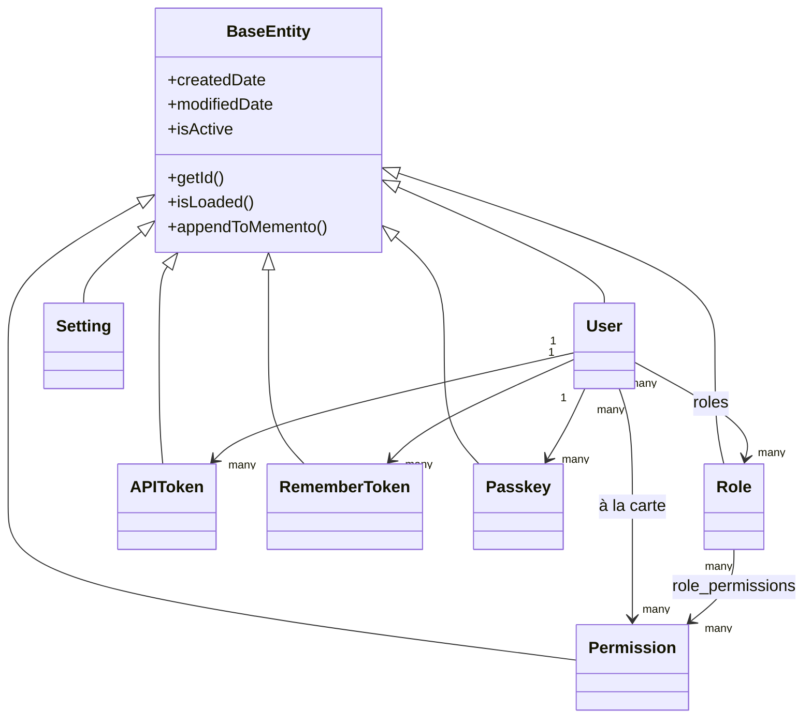

# Database e ORM

## Gerarchia delle entità

Ogni entità estende `BaseEntity` (`@mappedsuperclass`, che a sua volta estende `cborm.models.ActiveEntity`), che aggiunge automaticamente `createdDate`, `modifiedDate` e un flag di soft-delete `isActive` a ogni tabella:



`dbcreate: "none"` (impostato negli `ormSettings` di `public/Application.bx`) significa che lo schema è posseduto esclusivamente dalle migrazioni — l'ORM non genera né modifica mai automaticamente le tabelle.

## Pattern del livello di servizio

Ogni servizio estende `BaseService` (`@singleton`, estende `cborm.models.VirtualEntityService`), che inietta `qb`, `coldbox`, `wirebox` e `cachebox:template`, e fornisce `ensureSortOrder()`:

```boxlang title="Example service" linenums="1"
component
    extends="BaseService"
    singleton
    threadSafe
{

    property name="qb"    inject="provider:QueryBuilder@qb";
    property name="cache" inject="cachebox:template";

    function list( struct criteria = {} ){
        return newCriteria()
            .when( criteria.search, function( c, term ){
                c.like( "name", "%#term#%" );
            } )
            .list();
    }

}
```

=== "Entità"
    ```boxlang title="app/models/security/Role.bx" linenums="1"
    /**
     * A role: a named bundle of permissions.
     */
    class extends="app.models.BaseEntity" table="roles" {

        property name="roleId" fieldtype="id" generator="uuid2" ormtype="string";
        property name="name" type="string";

        property name="permissions"
            fieldtype="many-to-many"
            cfc="Permission"
            linktable="role_permissions";

    }
    ```
=== "Servizio"
    ```boxlang title="app/models/security/RoleService.bx" linenums="1"
    component extends="app.models.BaseService" singleton threadSafe {

        function getAllForLookup(){
            return newCriteria().resultTransformer( "distinct" ).list();
        }

    }
    ```

## Migrazioni

Alimentate da [cfmigrations](https://cfmigrations.ortusbooks.com) tramite il modulo CLI `commandbox-migrations`, configurato in `.cbmigrations.json` (`migrationsDirectory: resources/database/migrations/`, `seedsDirectory: resources/database/seeds/`, connessione costruita dalle stesse variabili d'ambiente `DB_*` di `public/Application.bx`).

```bash frame="terminal" title="Terminal"
box migrate up           # Esegue le migrazioni in sospeso
box migrate down         # Annulla l'ultimo batch
box migrate reset        # Annulla tutto, poi rimigra
box migrate seed run     # Esegue i seeder del database
```

Le migrazioni vengono eseguite in ordine di nome file/timestamp:

| Migrazione | Crea |
|---|---|
| `..._settings.bx` | `settings` (PK GUID, `name` univoco, `value` longtext) |
| `..._security.bx` | `permissions`, `roles`, `role_permissions` (tabella di join a PK composita, FK a cascata) |
| `..._users.bx` | `users` (PK GUID, `email` univoco, `pendingEmail` nullable per le richieste self-service di cambio email, `password` nullable, `preferences` JSON, `hasAvatar` booleano che traccia se un utente ha un avatar caricato sul disco cbfs `assets`), più `user_roles`, `user_permissions`, `user_remember_tokens`, `user_api_tokens`, `user_action_tokens`, `user_passkeys`, `user_sso_identities` — ogni tabella figlia con FK verso `users.userId` con `ON DELETE CASCADE` (vedi [Sicurezza e permessi](security.md#related-security-services) e [Frontend](frontend.md#avatars-branding-logo)) |
| `..._auditlogs.bx` | Record di attività append-only `audit_logs` con severity/categoria/azione, metadati dell'attore e della richiesta, e indici di query |

## Dati seed

`resources/database/seeds/AdminData.bx`, eseguito tramite `box migrate seed run`, crea:

- Un ruolo **Admin**
- **20 permessi** su cinque risorse (`users`, `roles`, `permissions`, `settings`, `auditlog`), ciascuno con `read`/`write`/`delete`/`admin` (`auditlog` usa `read`/`export`/`delete`/`admin`) — tutti assegnati al ruolo Admin
- Un utente admin, `admin@cbgenesis.com`, a cui è assegnato il ruolo Admin, seminato come reset-pending in modo che la password pubblica di bootstrap debba essere sostituita al primo accesso

Vedi [Sicurezza e permessi](security.md#permission-model) per come quegli slug vengono applicati a livello di handler.

::: cards
::: card title="Sicurezza e permessi" icon="phosphor-duotone:shield-check" href="security.md"
Come le tabelle `permissions`/`roles` si mappano sui controlli degli handler `@secured`.
:::
::: card title="Estendere l'app" icon="phosphor-duotone:puzzle-piece" href="extending.md"
Aggiungi una nuova entità, servizio e migrazione per il tuo dominio.
:::
:::
