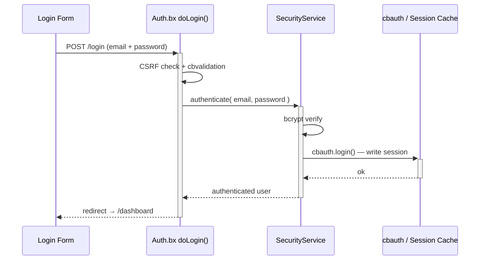
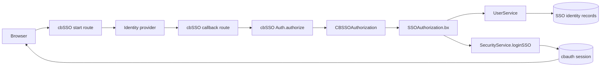
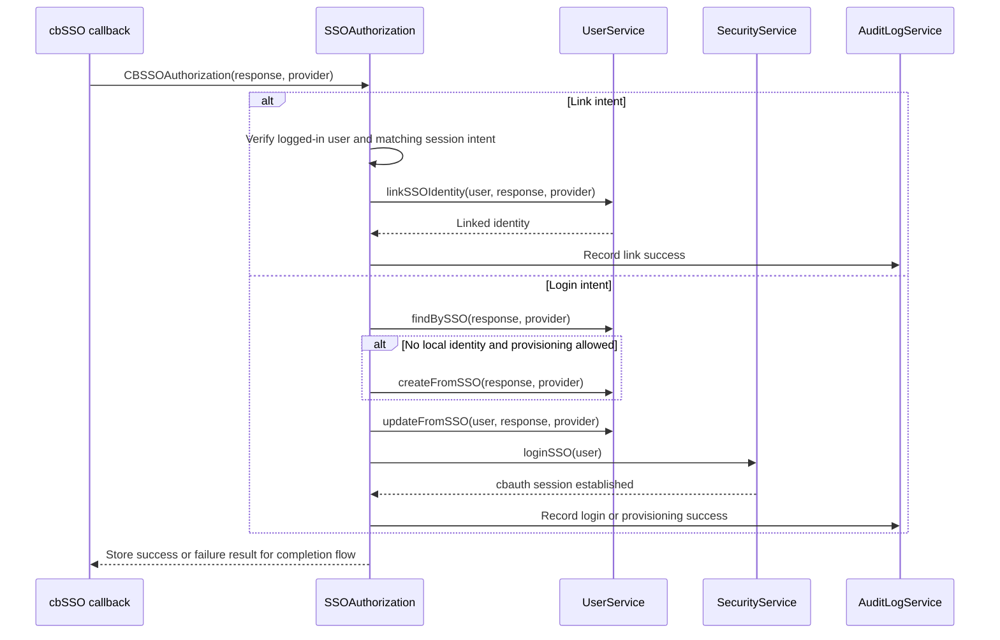

# Sicurezza e permessi

## Flusso di login



## Layout di autenticazione

Il flusso di autenticazione può usare uno dei due layout inclusi tramite l'impostazione `cbLoginLayout`:

| Valore | Layout | Ideale per |
|---|---|---|
| `AuthSplit` | Pannello con branding a sinistra e il form a destra; diventa compatto su mobile. | Applicazioni che vogliono un'esperienza di accesso brandizzata a due pannelli. Questo è il default. |
| `AuthCenter` | Scheda di autenticazione centrata con logo, form e footer. | Applicazioni che preferiscono un'esperienza di accesso focalizzata e compatta. |

Scegli **Auth Center** o **Auth Split** sulla pagina `/settings`. Il layout selezionato si applica alle pagine di login, registrazione, attivazione invito, e recupero password. Vedi [Impostazioni dell'app](../reference/settings.md#login-layout-selection) per i file di layout e le istruzioni per layout personalizzati.

<figure>
	
	<figcaption>La schermata di login usando il layout predefinito <code>AuthSplit</code>.</figcaption>
</figure>

## Single sign-on

cbSSO è abilitato tramite `app/config/modules/cbsso.bx`. Usa cbauth come
autorità di sessione, quindi il login locale con password, le passkey, e l'SSO condividono la stessa
sessione e le stesse regole di autorizzazione. La pagina di login renderizza un link per ogni
provider configurato.

Google è il provider di esempio incluso. Imposta questi valori in `.env` dopo
aver registrato l'URL di callback `/cbsso/auth/Google` presso Google:

```dotenv linenums="1"
GOOGLE_CLIENT_ID=
GOOGLE_CLIENT_SECRET=
GOOGLE_REDIRECT_URI=https://example.com/cbsso/auth/Google
```

### Abilitare e disabilitare l'SSO

Non esiste un'impostazione separata `SSO_ENABLED`. L'interruttore effettivo del provider è in
[`app/config/modules/cbsso.bx`](../../app/config/modules/cbsso.bx): cbGenesis
registra Google solo quando `GOOGLE_CLIENT_ID`, `GOOGLE_CLIENT_SECRET`, e
`GOOGLE_REDIRECT_URI` sono tutti popolati. Per disabilitare l'SSO Google, cancella uno qualsiasi di
quei valori e riavvia o reinizializza l'applicazione. Il provider non
apparirà più sulle pagine di login o profilo.

Non confondere questo con `enableCBAuthIntegration: false`. Quell'impostazione disabilita
il listener generico opzionale cbauth di cbSSO; cbGenesis usa il proprio
interceptor `SSOAuthorization` così può far rispettare il collegamento account locale, il
provisioning, la corrispondenza delle identità, e le regole di audit. Vedi la documentazione di cbSSO per
[configurazione](https://cbsso.ortusbooks.com/),
[gestione della risposta dell'identity provider](https://cbsso.ortusbooks.com/usage/handling-the-identity-provider-response.md),
[punti di intercettazione](https://cbsso.ortusbooks.com/usage/interception-points.md),
e [integrazione cbauth](https://cbsso.ortusbooks.com/cbauth-integration/enabling-integration.md).

::: stepper
::: step "Prepara il database"
Dalla root del progetto, esegui la migrazione dell'identità SSO:

```bash linenums="1"
box migrate up
```

Questo crea la tabella `user_sso_identities` usata per collegare un account locale a un
soggetto dell'identity provider. Esegui questo prima di tentare il primo login SSO.
:::

::: step "Crea e configura il client OAuth Google"
Nella [Google Cloud Console](https://console.cloud.google.com/), crea o seleziona
un progetto, configura la schermata di consenso OAuth, e crea un **ID client OAuth**
con tipo di applicazione **Applicazione web**. Aggiungi questo esatto URI di redirect
autorizzato, usando l'URL HTTPS pubblico della tua app:

```text linenums="1"
https://your-domain.example/cbsso/auth/Google
```

Copia l'ID client e il client secret nel file `.env` locale. L'URI di redirect
deve essere lo stesso valore in Google Cloud e in `GOOGLE_REDIRECT_URI`:

```dotenv linenums="1"
GOOGLE_CLIENT_ID=your-google-client-id
GOOGLE_CLIENT_SECRET=your-google-client-secret
GOOGLE_REDIRECT_URI=https://your-domain.example/cbsso/auth/Google
```

Tieni le credenziali fuori dal controllo di versione. cbGenesis registra il provider Google
solo quando tutte e tre le impostazioni `GOOGLE_*` sono popolate, così l'applicazione può
comunque avviarsi prima che l'SSO sia configurato.

La creazione automatica degli account è disabilitata per default. Per consentire nuovi utenti Google,
abilitala esplicitamente e limita i domini email consentiti:

```dotenv linenums="1"
CBSSO_AUTO_PROVISION=true
CBSSO_ALLOWED_DOMAINS=example.com,example.org
```

Lascia `CBSSO_AUTO_PROVISION=false` quando ogni utente SSO deve già avere un account
locale. Quegli utenti devono accedere localmente e usare l'azione **Collega account
Google** dal profilo prima di poter accedere con Google.
:::

::: step "Avvia l'app e verifica il flusso"
Avvia l'applicazione con il tuo normale comando di sviluppo o deployment, poi
apri `/login` e seleziona **Continua con Google**. Conferma che Google reindirizza
di nuovo a `/cbsso/auth/Google` e che l'applicazione ti invia alla dashboard.

Per un account locale esistente, accedi prima con la password, apri la pagina
profilo, e collega l'account Google. Disconnettiti, torna a `/login`, e verifica che
l'SSO Google ti riporti nello stesso account locale. Se il provisioning è
abilitato, verifica che un dominio consentito crei un utente locale e che un dominio
al di fuori di `CBSSO_ALLOWED_DOMAINS` venga rifiutato.
:::
:::

Dopo la configurazione, le identità vengono abbinate per provider e soggetto immutabile, mai per
sola email. Gli account locali esistenti devono essere esplicitamente collegati prima di poter
essere usati tramite l'SSO.

Per deployment SAML in cluster, configura `samlRequestCacheName` di cbSSO su una
regione CacheBox distribuita invece di usare la cache di replay in-memory predefinita.

### Come cbSSO diventa una sessione locale

cbSSO possiede il protocollo del provider e la validazione del callback. cbGenesis possiede
la decisione che segue: a quale account locale appartiene l'identità verificata,
se può essere approvvigionata o collegata, e come diventa una sessione applicativa
autenticata.



L'applicazione registra `app/interceptors/SSOAuthorization.bx` per il punto di intercettazione
documentato `CBSSOAuthorization` di cbSSO. Il payload del callback
contiene la risposta del provider verificata e il provider che l'ha gestita. L'
interceptor segue quindi uno dei due percorsi di proprietà dell'applicazione:



### Perché esiste questo interceptor

cbSSO fornisce anche un listener di integrazione `cbAuth` generico. cbGenesis
imposta intenzionalmente `enableCBAuthIntegration: false` in
`app/config/modules/cbsso.bx`, perché il listener generico non può far rispettare
le regole di identità e sicurezza degli account dell'applicazione. L'interceptor personalizzato è
responsabile di:

- Abbinare le identità per provider e soggetto immutabile, mai per sola email.
- Richiedere una sessione autenticata e un intento corrispondente per il collegamento dell'account.
- Applicare la policy di provisioning e di dominio consentito prima di creare utenti.
- Mantenere i percorsi di autenticazione con password locale, remember-me, passkey, e SSO
  sotto la stessa autorità di sessione cbauth.
- Registrare le operazioni SSO riuscite e fallite nel registro di audit.

Questa separazione è deliberata: cbSSO verifica *chi il provider dice che sia l'utente*;
cbGenesis decide *cosa quell'identità è autorizzata a fare in questa applicazione*.

Per il contratto upstream e l'integrazione generica alternativa, vedi la documentazione
[punti di intercettazione di cbSSO](https://cbsso.ortusbooks.com/usage/interception-points.md),
[gestione della risposta dell'identity provider](https://cbsso.ortusbooks.com/usage/handling-the-identity-provider-response.md),
e [integrazione cbAuth](https://cbsso.ortusbooks.com/cbauth-integration/enabling-integration.md).

## Livelli di sicurezza

| Livello | Implementazione |
|---|---|
| Autenticazione di sessione | cbauth con `CacheStorage@cbStorages` — cache di sessione lato server |
| Hashing della password | bcrypt tramite `bx-password-encrypt` |
| Policy password | `SettingService.isValidPassword()` — `cbMinPasswordLength` più una lettera maiuscola, una minuscola, una cifra, e un carattere speciale. Applicata lato server su registrazione, attivazione invito, reset password, e cambio password dal profilo; l'helper Alpine `$passwordMeetsPolicy` la rispecchia nel browser |
| Protezione CSRF | Token rotante di cbsecurity (30 min); l'auto-verifier è disattivato, e `BaseSecureHandler` verifica deny-by-default su ogni metodo HTTP non sicuro - vedi [Handler e Routing](handlers-routing.md#csrf-verification) |
| Sicurezza degli handler | Annotazione `@secured` → il firewall reindirizza i visitatori non autenticati a `login`, gli utenti autorizzati ma privi di permesso a `dashboard.notAuthorized` |
| Supporto JWT | Configurato per l'accesso API (HS512, 60 min, storage token in cache) |
| Header di sicurezza | Protezione XSS, `frameOptions: SAMEORIGIN`, `referrerPolicy: same-origin` |
| Token API | Token per utente con hash SHA/BCrypt, con scadenza e uno scheduler di purga giornaliero |
| Rate limiting | L'interceptor `RateLimiter` limita login, registrazione, e reset password per IP - vedi [Rate limiting](#rate-limiting) sotto |

## Rate limiting

`app/interceptors/RateLimiter.bx` si attiva su `preProcess` - prima del routing, prima che qualsiasi handler venga eseguito - e limita cinque endpoint `Auth` non autenticati per IP client:

- `doLogin`, `doRegister`, `doForgotPassword`, `doResetPassword`, `doActivateInvitation`

Un chiamante che supera il limite viene reindirizzato al form con un errore flash; la richiesta non raggiunge mai l'handler, quindi una password corretta inviata mentre si è bloccati non fa comunque accedere l'utente.

| Impostazione | Scopo |
|---|---|
| `cbRateLimitMaxAttempts` | Tentativi consentiti per IP, per endpoint, entro la finestra (default: `5`) |
| `cbRateLimitWindowSeconds` | Durata della finestra, in secondi (default: `300`). `0` disabilita completamente il rate limiting |
| `cbTrustProxyHeaders` | Se il "per IP" in "per IP, per endpoint" proviene da `X-Forwarded-For` o dall'indirizzo socket grezzo (default: `true`) - vedi [Distribuire dietro un reverse proxy](../deployment.md#deploying-behind-a-reverse-proxy) |

Tutte e tre sono modificabili in `/settings` come qualsiasi altra impostazione dell'app - vedi [Impostazioni dell'app](../reference/settings.md#password--token-policy).

!!! warning "`cbTrustProxyHeaders` è una decisione di deployment, non di codice"
    `X-Forwarded-For` è un semplice header HTTP - qualsiasi chiamante può impostarlo a piacere a meno che qualcosa davanti all'app (un reverse proxy o load balancer) non rimuova qualunque valore inviato dal client e lo imposti esso stesso. Se ciò sia vero è qualcosa che solo la persona che distribuisce l'app sa.

    - **Attivo (default)**: si fida di `X-Forwarded-For`/`X-Cluster-Client-IP`, corrispondendo a un tipico deployment di questa app dietro un reverse proxy o load balancer. Se il tuo proxy *non* sovrascrive quell'header (o sei direttamente esposto a internet senza nulla davanti all'app), un chiamante può falsificarlo per ottenere un bucket fresco di rate-limit a ogni richiesta e falsificare l'IP registrato nel registro di audit - disattiva questo in tal caso.
    - **Disattivo**: `getRealIP()` usa invece l'indirizzo socket grezzo. Corretto quando l'app è direttamente esposta a internet, ma se *sei* dietro un proxy, ogni chiamante appare come l'IP del proxy stesso - un "IP" bloccato blocca tutti quelli dietro di esso, e ogni voce del registro di audit mostra l'indirizzo del proxy invece di quello del client reale.

### Come funziona il conteggio

`RateLimitService.attempt()` è una **finestra scorrevole**: ogni tentativo, consentito o bloccato, reimposta la scadenza della chiave alla finestra completa da quel momento. Una chiave si raffredda solo una volta che resta silenziosa per un'intera finestra - il che continua a bloccare finché un attacco continua, piuttosto che riaprirsi a metà strada. Ogni endpoint ha il proprio contatore (con chiave `event:ip`), quindi esaurire il limite di login non influisce sulla registrazione o sul reset password.

!!! note "In-memory per default"
    I contatori vivono nella regione CacheBox `rateLimit` (`app/config/CacheBox.bx`), che è in-memory e quindi **per istanza dell'applicazione**. Dietro un load balancer con più di un'istanza, ogni istanza applica il proprio limite indipendentemente - un chiamante potrebbe ottenere `cbRateLimitMaxAttempts` tentativi gratuiti per istanza invece che in totale. Per condividere i conteggi tra le istanze, sostituisci `provider`/`properties` della regione `rateLimit` con un provider CacheBox distribuito (Redis, Couchbase, o qualsiasi provider supportato da CacheBox) - nessuna modifica al codice necessaria in `RateLimitService` o `RateLimiter`, poiché entrambi passano attraverso la regione iniettata `cachebox:rateLimit`.

## Configurazione di `cbsecurity`

`app/config/modules/cbsecurity.bx` è l'unica fonte di verità per il firewall:

```boxlang title="app/config/modules/cbsecurity.bx (excerpt)" hl_lines="3 8 9" linenums="1"
{
    authentication : {
        provider          : "authenticationService@cbauth",
        prcUserVariable   : "authUser"
    },
    firewall : {
        autoLoadFirewall         : true,
        validator                 : "CBAuthValidator@cbsecurity",
        handlerAnnotationSecurity : true,
        invalidAuthenticationEvent : "login",
        invalidAuthorizationEvent  : "dashboard.notAuthorized",
        rules                      : [] // authorization is annotation-based, not rule-based
    }
}
```

- **`prcUserVariable: "authUser"`** — l'utente autenticato è sempre disponibile come `prc.authUser` in ogni handler, vista, e layout.
- **`handlerAnnotationSecurity: true`** — questo è ciò che fa sì che le annotazioni `@secured` su una classe handler o un'azione applichino effettivamente qualcosa.
- **`rules: []`** — questa app fa tutta la sua autorizzazione tramite annotazioni sugli handler, non tramite l'elenco alternativo di regole basate su pattern URL di cbsecurity.

## Modello di permessi

Ogni permesso è uno slug nella forma `resource:action`, seminato da `resources/database/seeds/AdminData.bx`:

| Risorsa | Azioni |
|---|---|
| `users` | `read`, `write`, `delete`, `admin` |
| `roles` | `read`, `write`, `delete`, `admin` |
| `permissions` | `read`, `write`, `delete`, `admin` |
| `settings` | `read`, `write`, `delete`, `admin` |
| `auditlog` | `read`, `export`, `delete`, `admin` |

!!! info "`admin` è un superset"
    `admin` significa "amministrazione completa di quella risorsa" ed è sempre messo in OR insieme all'azione specifica richiesta da una rotta, quindi un utente che ha `roles:admin` supera qualsiasi controllo `roles:*` senza aver bisogno anche di `roles:read`/`roles:write`/`roles:delete` individualmente. Il seeder assegna tutti i 20 permessi integrati a un singolo ruolo **Admin**, concesso all'utente seminato `admin@cbgenesis.com`.

::: columns
::: column
<figure>
	
	<figcaption>La pagina admin Ruoli.</figcaption>
</figure>
:::
::: column
<figure>
	
	<figcaption>La pagina admin Permessi, raggruppata per risorsa.</figcaption>
</figure>
:::
:::

**Applicalo sull'handler** — questo è il vero confine di sicurezza, risolto dal `CBAuthValidator` di cbsecurity contro i permessi dell'utente autenticato:

```boxlang title="app/handlers/Roles.bx" linenums="1"
@secured( "roles:admin,roles:read" )     // class-level: applies to index and any action without its own annotation
class extends="BaseSecureHandler" {

    @secured( "roles:admin,roles:write" )
    function create( event, rc, prc ) { ... }

    @secured( "roles:admin,roles:delete" )
    function delete( event, rc, prc ) { ... }

}
```

Un elenco separato da virgole è un controllo **OR** — basta uno qualsiasi dei permessi elencati.

**Rispecchialo nella vista** — solo per UX, *mai* il confine di sicurezza da solo. `User.bx` espone `hasPermission()` su `prc.authUser`, disponibile in qualsiasi vista o layout renderizzato tramite un handler protetto:

```html title="Example view guard" linenums="1"
<bx:if prc.authUser.hasPermission( "roles:write,roles:admin" )>
    <button type="button" class="btn btn-primary" @click="openCreate()">New Role</button>
</bx:if>
```

`hasPermission()` accetta una stringa, un elenco separato da virgole, o un array e fa un controllo OR; `hasAllPermissions()` fa l'equivalente AND. Entrambi sono messi in cache per richiesta tramite `getAllPermissions()`, che unisce i permessi à-la-carte di un utente con ogni permesso concesso tramite i suoi ruoli. Ogni vista admin esistente (navigazione sidebar, Users/Roles/Permissions/Settings) segue già questo pattern — trattalo come il template per nuovi moduli protetti.

Un utente che fallisce un controllo `@secured` viene reindirizzato:

- **Non autenticato** → `login`
- **Autenticato, permesso mancante** → `dashboard.notAuthorized`

## Servizi di sicurezza correlati

| Modello | Scopo |
|---|---|
| `SecurityService` | Avvolge il servizio di autenticazione di `cbauth`; `login()`/`authenticate()`, gestione del cookie remember-me con rotazione del token, `logout()`, emissione/verifica del token di reset password (basata su cache, non su DB) |
| `UserService` | `requestEmailChange()`/`confirmEmailChange()`/`cancelEmailChange()` - cambio email self-service, protetto da un token azione `PURPOSE_EMAIL_CHANGE` così un nuovo indirizzo viene applicato solo una volta che l'utente lo conferma dalla propria casella di posta |
| `APIToken` / `APITokenService` | Token di accesso personali con hash SHA/BCrypt — `createToken()` restituisce il token grezzo esattamente una volta, `revokeToken()`/`revokeAllForUser()`, `purgeExpiredTokens()` su pianificazione |
| `RememberToken` / `RememberTokenService` | Token browser persistenti "ricordami", ruotati a ogni utilizzo |
| `UserActionToken` / `UserActionTokenService` | Token a uso singolo legati a uno scopo — `issue()`, `resolve()`, `consume()`. Cinque scopi: `PURPOSE_REGISTRATION`, `PURPOSE_INVITATION`, `PURPOSE_PASSWORD_RESET`, `PURPOSE_FORCED_PASSWORD_CHANGE`, `PURPOSE_EMAIL_CHANGE` |
| `Passkey` / `PasskeyService` | Credenziali WebAuthn per l'accesso senza password; `cbRequirePasskey` fa sì che `BaseSecureHandler` reindirizzi un utente senza nessuna a `profile/passkey-required` |
| `AuditLog` / `AuditLogService` | Il registro di audit. L'interceptor `AuditLogger` registra automaticamente accessi, disconnessioni, e fallimenti di autenticazione/autorizzazione — vedi [Architettura](../architecture.md#interceptors) |
| `Passkey` / `PasskeyService` | Archiviazione delle credenziali WebAuthn tramite il contratto `ICredentialRepository` di `cbsecurity-passkeys` |

<figure>
	
	<figcaption>La pagina admin Registro di audit, che mostra un accesso registrato.</figcaption>
</figure>

## Problemi noti

### "Questo è un dominio non valido" quando si registra una passkey

Le passkey sono configurate per il dominio `localhost` durante lo sviluppo locale. Se apri l'applicazione con un indirizzo IP come `http://127.0.0.1:8080`, WebAuthn tratta quello come un'origine diversa e rifiuta la registrazione con **"Questo è un dominio non valido."**

Apri invece l'applicazione su **[http://localhost:8080](http://localhost:8080)**. Le passkey registrate per un'origine non sono intercambiabili con un'altra, quindi elimina e registra di nuovo la passkey se è stata creata mentre si usava un nome host diverso.

::: cards
::: card title="Handler e Routing" icon="phosphor-duotone:signpost" href="handlers-routing.md"
Vedi ogni annotazione `@secured` nel contesto, handler per handler.
:::
::: card title="Mappa delle rotte" icon="phosphor-duotone:map-trifold" href="../reference/routes.md"
Quale permesso protegge quale URL, a colpo d'occhio.
:::
::: card title="Estendere l'app" icon="phosphor-duotone:puzzle-piece" href="extending.md"
Aggiungi un nuovo permesso e collegalo attraverso handler, vista, e seeder.
:::
:::
