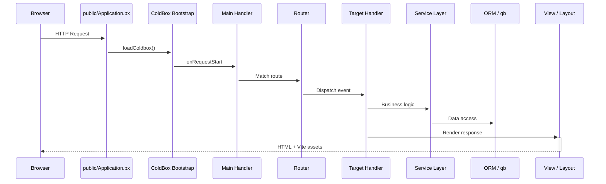

<!--
	This page renders through docs/.theme/home.bxm (the `layout: home` above),
	which hardcodes the whole page and never includes this file's own
	rendered body - everything below is kept, unused, as the starting
	point for reverting to the normal layout.bxm + page.bxm rendering if
	`layout: home` is ever removed.
-->

	
	

		<a class="bxsites-hero__btn bxsites-hero__btn--primary" href="getting-started.md">Inizia</a>
		<a class="bxsites-hero__btn bxsites-hero__btn--secondary" href="https://github.com/coldbox-templates/cbGenesis">Vedi su GitHub</a>
	

Un template starter **ColdBox HMVC** pronto per la produzione per [BoxLang](https://boxlang.io) - il linguaggio JVM moderno e dinamico. Include autenticazione, SSO, passkey, permessi basati su ruoli, token API, dark mode e un pannello admin basato su Alpine, così passi il primo giorno a costruire funzionalità invece che a scaffoldare l'autenticazione.

::: cards
::: card title="Inizia in pochi minuti" icon="phosphor-duotone:rocket-launch" href="getting-started.md"
Installa BoxLang, clona il template, esegui le migrazioni e in meno di dieci minuti sarai davanti alla schermata di login.
:::
::: card title="Progettato per lo sviluppo assistito dall'AI" icon="phosphor-duotone:robot" href="ai-native.md"
AGENTS.md, server di documentazione MCP e skill personalizzate che riducono in modo misurabile i token necessari per costruire su questo codebase con un agente AI rispetto a partire da zero.
:::
::: card title="Struttura del template moderna" icon="phosphor-duotone:folders" href="architecture.md"
Il codice dell'applicazione vive in `app/`, completamente separato dalla webroot pubblica in `public/` - sicurezza migliorata di default.
:::
::: card title="Auth e RBAC, tutto incluso" icon="phosphor-duotone:shield-check" href="guides/security.md"
Autenticazione basata su sessione via cbauth, annotazioni `@secured` sugli handler, rotazione CSRF, supporto JWT e un modello di permessi `resource:action`.
:::
::: card title="SSO e Passkey" icon="phosphor-duotone:key" href="guides/security.md#single-sign-on"
cbSSO con un provider OAuth Google incluso e collegamento degli account, più passkey WebAuthn per l'accesso senza password.
:::
::: card title="Hibernate ORM + qb" icon="phosphor-duotone:database" href="guides/database-orm.md"
Convenzioni `BaseEntity`/`BaseService` sopra cborm, migrazioni tramite cfmigrations e qb per tutto ciò per cui l'SQL grezzo è più adatto.
:::
::: card title="UI Alpine.js + Bootstrap 5" icon="phosphor-duotone:palette" href="guides/frontend.md"
Viste BXM renderizzate lato server, arricchite con piccoli componenti Alpine, compilate da Vite con hot module reload.
:::
::: card title="Una vera suite di test" icon="phosphor-duotone:test-tube" href="guides/testing.md"
Spec unitarie TestBox per ogni entità e servizio, più spec di integrazione che eseguono vere richieste HTTP.
:::
::: card title="Configurazione semplice" icon="phosphor-duotone:sliders" href="guides/configuration.md"
Variabili d'ambiente per gli elementi essenziali, impostazioni admin basate su DB per tutto il resto - nessun redeploy necessario per modificarle.
:::
::: card title="Pronto per la produzione" icon="phosphor-duotone:cloud-arrow-up" href="deployment.md"
Una vera checklist di go-live, supporto Docker e la scelta tra CommandBox o il BoxLang MiniServer.
:::
:::

## Screenshot

Il pannello admin, dall'inizio alla fine: dal login al registro di audit:

::: columns
::: column
<figure>
	
	<figcaption>Login - il layout predefinito <code>AuthSplit</code>.</figcaption>
</figure>
:::
::: column
<figure>
	
	<figcaption>Dashboard - dopo l'accesso.</figcaption>
</figure>
:::
:::

::: columns
::: column
<figure>
	
	<figcaption>Utenti - cerca, invita e gestisci gli account.</figcaption>
</figure>
:::
::: column
<figure>
	
	<figcaption>Ruoli - raggruppa i permessi e assegna gli utenti.</figcaption>
</figure>
:::
:::

::: columns
::: column
<figure>
	
	<figcaption>Permessi - il modello <code>resource:action</code>, raggruppato per risorsa.</figcaption>
</figure>
:::
::: column
<figure>
	
	<figcaption>Impostazioni - configurazione basata su DB, nessun redeploy necessario.</figcaption>
</figure>
:::
:::

::: columns
::: column
<figure>
	
	<figcaption>Profilo - avatar, passkey, token API e impostazioni account.</figcaption>
</figure>
:::
::: column
<figure>
	
	<figcaption>Registro di audit - ogni accesso, disconnessione e fallimento di accesso.</figcaption>
</figure>
:::
:::

## Vedilo, non limitarti a leggerlo

Il ciclo di vita delle richieste di CBGenesis, dal browser al database e ritorno:

::: columns
::: column
!!! tip "Protetto per convenzione"
    Ogni handler admin estende `BaseSecureHandler` e porta un'annotazione `@secured( "resource:action,resource:admin" )`. Il firewall la applica - niente controlli `if` scritti a mano sparsi nei tuoi controller. Vedi [Sicurezza e permessi](guides/security.md).
:::
::: column
!!! faq "Fallo crescere a modo tuo"
    Un nuovo modulo CRUD? Una nuova impostazione? Un nuovo task pianificato? [Estendere CBGenesis](guides/extending.md) illustra i file esatti da toccare, nell'ordine già seguito dal codice esistente.
:::
:::

## Dove andare adesso

::: cards
::: card title="Per iniziare" icon="phosphor-duotone:rocket-launch" href="getting-started.md"
Installa, configura, esegui le migrazioni e avvia l'app in locale.
:::
::: card title="Progettato per lo sviluppo assistito dall'AI" icon="phosphor-duotone:robot" href="ai-native.md"
Perché partire da qui batte il costruire auth, RBAC e CSRF da zero con un agente - con un confronto misurato.
:::
::: card title="Architettura" icon="phosphor-duotone:tree-structure" href="architecture.md"
La divisione moderna app/public, l'albero completo del progetto e il ciclo di vita delle richieste.
:::
::: card title="Handler e Routing" icon="phosphor-duotone:signpost" href="guides/handlers-routing.md"
Ogni handler, ogni rotta e le convenzioni che li collegano.
:::
::: card title="Sicurezza e permessi" icon="phosphor-duotone:shield-check" href="guides/security.md"
cbsecurity, cbauth, CSRF, JWT e il modello di permessi `resource:action`.
:::
::: card title="Database e ORM" icon="phosphor-duotone:database" href="guides/database-orm.md"
Entità, servizi, migrazioni e dati seed.
:::
::: card title="Frontend" icon="phosphor-duotone:palette" href="guides/frontend.md"
Componenti Alpine.js, struttura SCSS e la pipeline Vite.
:::
::: card title="Estendere l'app" icon="phosphor-duotone:puzzle-piece" href="guides/extending.md"
Aggiungi un modulo CRUD, un permesso, un'impostazione o un task pianificato.
:::
::: card title="Deployment" icon="phosphor-duotone:cloud-arrow-up" href="deployment.md"
Build di produzione, Docker, BoxLang MiniServer e una checklist di go-live.
:::
:::

## Realizzato con BX Sites

Questo sito di documentazione è generato con [BX Sites](https://ortus-boxlang.github.io/bx-sites/) - il generatore ufficiale di siti statici per BoxLang - direttamente dal Markdown nella cartella `docs/` di questo repository, usando il tema predefinito `bootstrap`. Vedi [`.github/workflows/docs.yml`](https://github.com/coldbox-templates/cbGenesis/blob/development/.github/workflows/docs.yml) per come viene costruito e pubblicato a ogni push.
