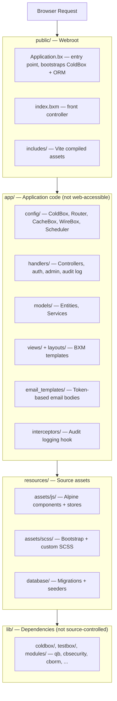
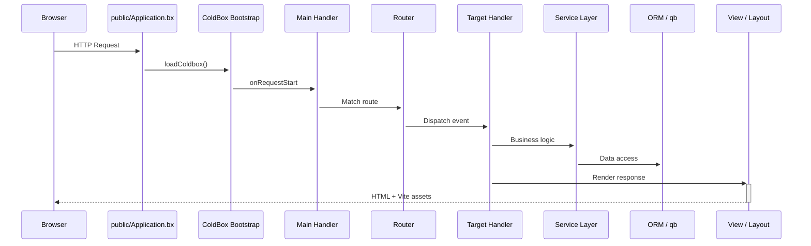

# アーキテクチャ

CBGenesis は ColdBox の**モダンテンプレート**レイアウトに従っています。アプリケーションコードは公開 Web ルートから完全に分離されているため、`app/` 配下のものが直接 Web からアクセスされることは決してありません。

## レイヤー構成の概要



!!! note "なぜ分割するのか?"
    攻撃者が直接ブラウズできてしまうもの - ハンドラーのソース、設定、ビューテンプレート - は、そもそも Web ルート配下には存在しません。`app/Application.bx` は 1 行の `abort;` ガードであり、Web サーバーが誤って `app/` を直接配信するよう設定されてしまった場合でも、フレームワークの規約が保たれるようにするためだけに保持されています。

## リクエストライフサイクル

すべてのリクエストは `public/Application.bx` を通じて入り、ColdBox をブートストラップしてから、ルーターへ、そして最終的にはあなたのハンドラーへと引き渡します。



`Main.bx`(`app/handlers/Main.bx`)は `app/config/Coldbox.bx` で設定される暗黙イベントハンドラーです。

- `onAppInit` - `settingService.preFlightCheck()` を実行し、不足しているアプリ設定をデータベースにシードします
- `onRequestStart` - すべてのリクエストで `prc.settings` と `prc.authUser` を読み込みます
- `onException` - アプリ全体の例外ハンドラーです

## インターセプター

`app/config/Coldbox.bx` は次の順序で 3 つのアプリケーションインターセプターを登録します。

**`app/interceptors/AuditLogger.bx`** は 4 つのインターセプションポイントで監査トレイルに書き込みます。

| ポイント | 記録される内容 |
|---|---|
| `postAuthentication` | サインインの成功 |
| `preLogout` | サインアウト |
| `cbSecurity_onInvalidAuthentication` | セッションが必要だったが存在しなかったリクエスト |
| `cbSecurity_onInvalidAuthorization` | 認証済みだが必要な権限を持たないユーザー |

**`app/interceptors/RateLimiter.bx`** は `preProcess`(ルーティングの前、どのハンドラーよりも前)で発火し、5 つの未認証 `Auth` アクション(ログイン、登録、パスワード忘れ/リセット、招待の有効化)をクライアント IP ごとに制限します。設定と仕組みについては [レート制限](guides/security.md#rate-limiting) を参照してください。

**`app/interceptors/SSOAuthorization.bx`** は cbSSO の
`CBSSOAuthorization` インターセプションポイントを処理します。検証済みのプロバイダー
アイデンティティをローカルのユーザーモデルに結びつけ、ログインかリンクかのポリシーを強制し、
許可されていればユーザーをプロビジョニングし、cbauth セッションを作成します。コールバックフローと、
cbGenesis が cbSSO の汎用 cbAuth 連携ではなくカスタムハンドラーを使う理由については
[シングルサインオン](guides/security.md#single-sign-on) を参照してください。

独自のインターセプターは `Coldbox.bx` の `variables.interceptors` 配列に追加してください。宣言順に発火します。

## スケジュールタスク

`app/config/Scheduler.bx` は 3 つの日次バックグラウンドタスクを登録しており、それぞれ `onOneServer()` と `withNoOverlaps()` が設定されているため、複数インスタンスでのデプロイでも各タスクが確実に一度だけ実行されます。

| タスク | 実行時刻 | 削除対象 | 制御する設定 |
|---|---|---|---|
| 期限切れ API トークンのパージ | `03:00` | `expiration` を過ぎた `user_api_tokens` の行 | 発行時に `cbApiTokenMaxValidityMonths`(デフォルト `12` か月)から設定されるトークン寿命 - 詳細は [アプリ設定](reference/settings.md#password--token-policy) を参照 |
| 期限切れ Remember トークンのパージ | `03:15` | `expiration` を過ぎた `user_remember_tokens` の行 | トークン発行時に設定される固定の有効期限(`SecurityService`/`RememberTokenService`) |
| 古い監査ログのパージ | `03:30` | 保持期間を過ぎた `audit_logs` の行 | `cbAuditLogRetentionDays`(デフォルト `90`、`0` でパージを無効化) - 詳細は [アプリ設定](reference/settings.md#password--token-policy) を参照 |

3 つのタスクはすべて、テーブルを直接クエリするのではなく、所有元のサービスの `purgeExpiredTokens()`/`purgeOlderThan()` メソッドを呼び出すため、同じパージロジックはスケジューラーの外からも到達可能(かつテスト可能)です。新しいタスクを追加する際も同じ方法で行ってください - [アプリの拡張](guides/extending.md#adding-a-scheduled-task) を参照してください。

## プロジェクトツリー全体

```text title="Project structure" linenums="1"
cbgenesis/
├── app/                      Application code
│   ├── Application.bx        Abort-only gate (prevents direct /app access)
│   ├── config/
│   │   ├── Coldbox.bx        Framework settings, environments, logging
│   │   ├── Router.bx         All application routes
│   │   ├── CacheBox.bx       Cache regions (default, template, sessions, rateLimit)
│   │   ├── WireBox.bx        DI container configuration
│   │   ├── Scheduler.bx      Scheduled tasks
│   │   └── modules/          Per-module settings (cbsecurity, cbauth, cborm, ...)
│   ├── handlers/              Controllers (Auth, Dashboard, Users, Roles, ...)
│   ├── layouts/                Admin, AuthCenter, AuthSplit, Main
│   ├── models/
│   │   ├── BaseEntity.bx      ORM base: timestamps, soft delete, memento
│   │   ├── BaseService.bx     Service base: cborm + qb + cache + validation
│   │   ├── security/            Role, Permission, APIToken, RememberToken,
│   │   │                        Passkey, UserActionToken, SecurityService, ...
│   │   └── system/              User, Setting, AuditLog + their services
│   ├── views/                  BXM templates, one folder per handler
│   │   └── _components/        Reusable UI partials (app, auth, ui)
│   ├── email_templates/       Token-based email body templates
│   ├── helpers/               ApplicationHelper.bxm — global view helpers
│   └── interceptors/           AuditLogger, RateLimiter, SSOAuthorization
├── public/
│   ├── Application.bx         Entry point — ColdBox + ORM bootstrap
│   ├── index.bxm               Front controller placeholder
│   └── includes/               Vite production build output
├── resources/
│   ├── assets/js/              Alpine entry, stores, components
│   ├── assets/scss/            Bootstrap + custom SCSS
│   └── database/
│       ├── migrations/         Schema migrations (cfmigrations)
│       └── seeds/              AdminData seeder
├── tests/
│   ├── specs/integration/      Full HTTP-level specs
│   └── specs/unit/             Entity + service specs
├── lib/                        Dependencies (gitignored, installed by `box install`)
├── runtime/                    BoxLang engine config (boxlang.json)
├── server.json                 CommandBox server config (engine, webroot, aliases)
├── box.json                    Package manifest — deps, scripts
├── package.json                 NPM — Alpine, Bootstrap, Vite, ESLint
├── vite.config.mjs              Vite + coldbox-vite-plugin
└── .env.example                  Environment template
```

## 技術スタック

| レイヤー | 技術 |
|---|---|
| ランタイム | BoxLang 1.0+ (JVM) |
| フレームワーク | ColdBox HMVC (bleeding edge) |
| CLI / サーバー | CommandBox + BoxLang MiniServer |
| 依存性注入 | WireBox |
| セキュリティ | cbsecurity + cbauth (session-based + JWT) |
| データベース | Hibernate ORM (cborm) 経由の MySQL、MariaDB、PostgreSQL、MSSQL。4 種類のデータベースすべてがサポートされ、プロジェクトのデータベーステストワークフローでカバーされています |
| クエリビルダー | qb (fluent SQL) |
| マイグレーション | cfmigrations |
| バリデーション | cbvalidation |
| メール | cbmailservices |
| シリアライゼーション | mementifier |
| フロントエンド | Bootstrap 5.3 · Alpine.js 3.x · Vite 6 |
| アイコン | Phosphor Duotone |
| ツールチップ | Tippy.js |

::: cards
::: card title="ハンドラーとルーティング" icon="phosphor-duotone:signpost" href="guides/handlers-routing.md"
すべてのコントローラーとルート、そしてそれらを結びつける規約。
:::
::: card title="データベースと ORM" icon="phosphor-duotone:database" href="guides/database-orm.md"
エンティティの階層、マイグレーション、そして `BaseService` パターン。
:::
::: card title="セキュリティと権限" icon="phosphor-duotone:shield-check" href="guides/security.md"
`@secured` ハンドラー、CSRF、権限モデルがどのように連携するか。
:::
:::
