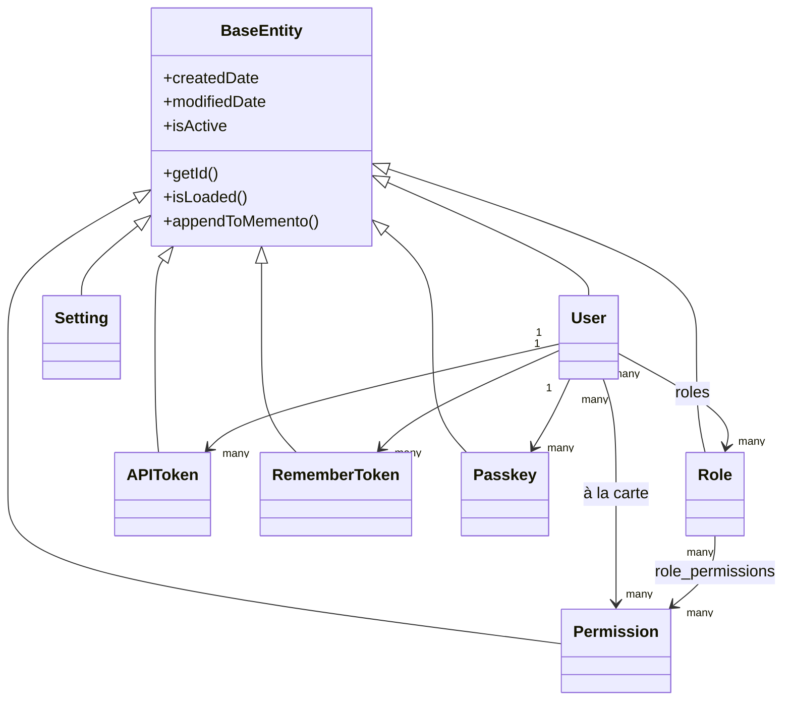

# データベースと ORM

## エンティティの階層

すべてのエンティティは `BaseEntity`(`@mappedsuperclass`、それ自体は `cborm.models.ActiveEntity` を継承しています)を継承しており、これによってすべてのテーブルに `createdDate`、`modifiedDate`、そしてソフトデリート用の `isActive` フラグが自動的に追加されます。



`dbcreate: "none"`(`public/Application.bx` の `ormSettings` で設定されています)は、スキーマがマイグレーションのみによって管理されることを意味します — ORM が自動的にテーブルを生成したり変更したりすることは決してありません。

## サービス層のパターン

すべてのサービスは `BaseService`(`@singleton`、`cborm.models.VirtualEntityService` を継承しています)を継承しており、`qb`、`coldbox`、`wirebox`、`cachebox:template` を注入し、`ensureSortOrder()` を提供します。

```boxlang title="Example service" linenums="1"
component
    extends="BaseService"
    singleton
    threadSafe
{

    property name="qb"    inject="provider:QueryBuilder@qb";
    property name="cache" inject="cachebox:template";

    function list( struct criteria = {} ){
        return newCriteria()
            .when( criteria.search, function( c, term ){
                c.like( "name", "%#term#%" );
            } )
            .list();
    }

}
```

=== "エンティティ"
    ```boxlang title="app/models/security/Role.bx" linenums="1"
    /**
     * A role: a named bundle of permissions.
     */
    class extends="app.models.BaseEntity" table="roles" {

        property name="roleId" fieldtype="id" generator="uuid2" ormtype="string";
        property name="name" type="string";

        property name="permissions"
            fieldtype="many-to-many"
            cfc="Permission"
            linktable="role_permissions";

    }
    ```
=== "サービス"
    ```boxlang title="app/models/security/RoleService.bx" linenums="1"
    component extends="app.models.BaseService" singleton threadSafe {

        function getAllForLookup(){
            return newCriteria().resultTransformer( "distinct" ).list();
        }

    }
    ```

## マイグレーション

`commandbox-migrations` CLI モジュール経由の [cfmigrations](https://cfmigrations.ortusbooks.com) によって実現されており、`.cbmigrations.json`(`migrationsDirectory: resources/database/migrations/`、`seedsDirectory: resources/database/seeds/`、接続は `public/Application.bx` と同じ `DB_*` 環境変数から構築されます)で設定されています。

```bash frame="terminal" title="Terminal"
box migrate up           # Run pending migrations
box migrate down         # Rollback the last batch
box migrate reset        # Rollback everything, then re-migrate
box migrate seed run     # Run database seeders
```

マイグレーションはファイル名/タイムスタンプの順に実行されます。

| マイグレーション | 作成するもの |
|---|---|
| `..._settings.bx` | `settings`(GUID 主キー、一意な `name`、longtext の `value`) |
| `..._security.bx` | `permissions`、`roles`、`role_permissions`(複合主キーの結合テーブル、カスケード外部キー) |
| `..._users.bx` | `users`(GUID 主キー、一意な `email`、セルフサービスのメールアドレス変更リクエスト用の null 許容 `pendingEmail`、null 許容 `password`、JSON 型の `preferences`、cbfs の `assets` ディスクにアップロードされたアバターを持っているかどうかを追跡する真偽値 `hasAvatar`)、および `user_roles`、`user_permissions`、`user_remember_tokens`、`user_api_tokens`、`user_action_tokens`、`user_passkeys`、`user_sso_identities` — すべての子テーブルが `ON DELETE CASCADE` で `users.userId` に外部キー結合されています([セキュリティと権限](security.md#related-security-services) と [フロントエンド](frontend.md#avatars-branding-logo) を参照) |
| `..._auditlogs.bx` | 重大度/カテゴリ/アクション、アクターとリクエストのメタデータ、そしてクエリ用インデックスを持つ、追記専用のアクティビティ記録である `audit_logs` |

## シードデータ

`box migrate seed run` によって実行される `resources/database/seeds/AdminData.bx` は次を作成します。

- **Admin** ロール
- 5 つのリソース(`users`、`roles`、`permissions`、`settings`、`auditlog`)にわたる **20 個の権限**で、それぞれ `read`/`write`/`delete`/`admin`(`auditlog` は `read`/`export`/`delete`/`admin`)を持ち — すべて Admin ロールに割り当てられます
- 1 人の管理者ユーザー `admin@cbgenesis.com` で、Admin ロールが割り当てられ、リセット保留としてシードされているため、公開されているブートストラップパスワードは初回サインイン時に置き換えられなければなりません

これらのスラッグがハンドラーレベルでどのように強制されるかについては、[セキュリティと権限](security.md#permission-model) を参照してください。

::: cards
::: card title="セキュリティと権限" icon="phosphor-duotone:shield-check" href="security.md"
`permissions`/`roles` テーブルが `@secured` ハンドラーチェックにどのようにマッピングされるか。
:::
::: card title="アプリの拡張" icon="phosphor-duotone:puzzle-piece" href="extending.md"
自分のドメイン向けに、新しいエンティティ、サービス、マイグレーションを追加します。
:::
:::
