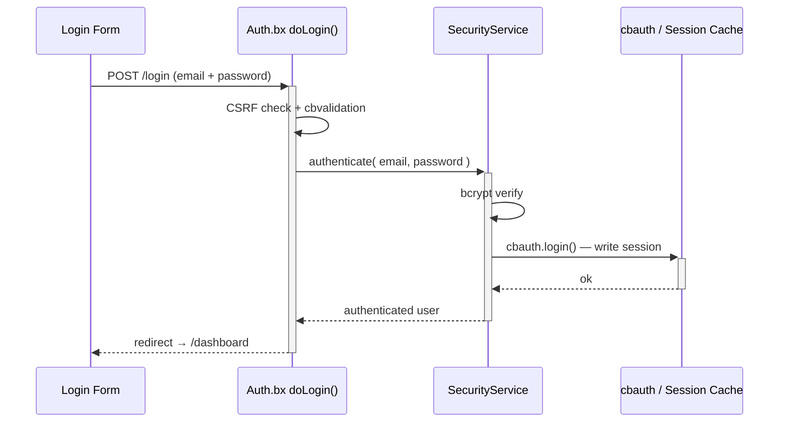
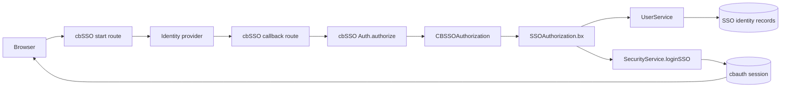
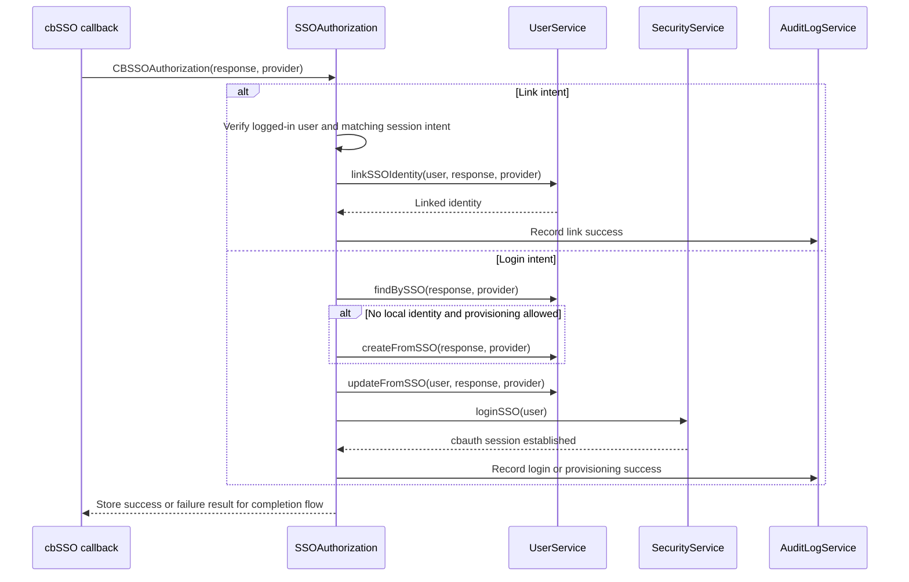

# セキュリティと権限

## ログインフロー



## 認証レイアウト

認証フローは、`cbLoginLayout` 設定を通じて、同梱されているどちらのレイアウトも使用できます。

| 値 | レイアウト | 最適な用途 |
|---|---|---|
| `AuthSplit` | 左側にブランド化された機能パネル、右側にフォームを配置。モバイルではコンパクトになります。 | ブランド化された 2 パネル構成のサインイン体験を求めるアプリケーション。これがデフォルトです。 |
| `AuthCenter` | ロゴ、フォーム、フッターを中央に配置した認証カード。 | 集中的でコンパクトなサインイン体験を好むアプリケーション。 |

`/settings` ページで **Auth Center** または **Auth Split** を選択してください。選択したレイアウトは、ログイン、登録、招待の有効化、パスワード復旧の各ページに適用されます。レイアウトファイルとカスタムレイアウトの手順については、[アプリ設定](../reference/settings.md#login-layout-selection) を参照してください。

<figure>
	
	<figcaption>デフォルトの <code>AuthSplit</code> レイアウトを使用したログイン画面。</figcaption>
</figure>

## シングルサインオン

cbSSO は `app/config/modules/cbsso.bx` を通じて有効化されます。cbauth をセッションの
権威として使用しているため、ローカルのパスワードログイン、パスキー、SSO は同じ
セッションと認可ルールを共有します。ログインページには、設定済みのプロバイダーごとに
リンクがレンダリングされます。

Google が同梱されている例のプロバイダーです。Google にコールバック URL
`/cbsso/auth/Google` を登録した後、`.env` に以下の値を設定してください。

```dotenv linenums="1"
GOOGLE_CLIENT_ID=
GOOGLE_CLIENT_SECRET=
GOOGLE_REDIRECT_URI=https://example.com/cbsso/auth/Google
```

### SSO の有効化と無効化

独立した `SSO_ENABLED` 設定はありません。実質的なプロバイダーの切り替えは
[`app/config/modules/cbsso.bx`](../../app/config/modules/cbsso.bx) にあります。cbGenesis は
`GOOGLE_CLIENT_ID`、`GOOGLE_CLIENT_SECRET`、`GOOGLE_REDIRECT_URI` がすべて設定されている
ときにのみ Google を登録します。Google SSO を無効にするには、これらの値のいずれか 1 つを
クリアして、アプリケーションを再起動または再初期化してください。プロバイダーは、ログインや
プロフィールのページに表示されなくなります。

これを `enableCBAuthIntegration: false` と混同しないでください。その設定は cbSSO の
オプションの汎用 cbauth リスナーを無効にするものです。cbGenesis はローカルのアカウント
連携、プロビジョニング、アイデンティティの照合、監査ルールを強制できるよう、独自の
`SSOAuthorization` インターセプターを使用しています。上流の契約や代替の汎用連携については、
cbSSO のドキュメントの[設定](https://cbsso.ortusbooks.com/)、
[アイデンティティプロバイダーのレスポンス処理](https://cbsso.ortusbooks.com/usage/handling-the-identity-provider-response.md)、
[インターセプションポイント](https://cbsso.ortusbooks.com/usage/interception-points.md)、
[cbauth 連携](https://cbsso.ortusbooks.com/cbauth-integration/enabling-integration.md) を参照してください。

::: stepper
::: step "データベースを準備する"
プロジェクトのルートから、SSO アイデンティティのマイグレーションを実行します。

```bash linenums="1"
box migrate up
```

これにより、ローカルアカウントとアイデンティティプロバイダーのサブジェクトを紐づけるために
使用される `user_sso_identities` テーブルが作成されます。最初の SSO ログインを試みる前に
これを実行してください。
:::

::: step "Google OAuth クライアントを作成・設定する"
[Google Cloud Console](https://console.cloud.google.com/) で、プロジェクトを作成または選択し、
OAuth 同意画面を設定し、アプリケーションの種類が **ウェブ アプリケーション** の
**OAuth クライアント ID** を作成します。アプリの公開 HTTPS URL を使用して、この正確な
承認済みリダイレクト URI を追加してください。

```text linenums="1"
https://your-domain.example/cbsso/auth/Google
```

クライアント ID とクライアントシークレットをローカルの `.env` ファイルにコピーします。
リダイレクト URI は、Google Cloud と `GOOGLE_REDIRECT_URI` で同じ値でなければなりません。

```dotenv linenums="1"
GOOGLE_CLIENT_ID=your-google-client-id
GOOGLE_CLIENT_SECRET=your-google-client-secret
GOOGLE_REDIRECT_URI=https://your-domain.example/cbsso/auth/Google
```

認証情報をソース管理から除外してください。cbGenesis は 3 つの `GOOGLE_*` 設定すべてが
入力されている場合にのみ Google プロバイダーを登録するため、SSO が設定される前でも
アプリケーションは起動できます。

自動アカウント作成はデフォルトで無効になっています。新しい Google ユーザーを許可するには、
明示的に有効にし、許可するメールドメインを制限してください。

```dotenv linenums="1"
CBSSO_AUTO_PROVISION=true
CBSSO_ALLOWED_DOMAINS=example.com,example.org
```

すべての SSO ユーザーが既にローカルアカウントを持っている必要がある場合は、
`CBSSO_AUTO_PROVISION=false` のままにしてください。それらのユーザーはローカルでサインインし、
プロフィールの **Google アカウントをリンク** アクションを使用してから、Google でサインイン
できるようになります。
:::

::: step "アプリを起動してフローを確認する"
通常の開発またはデプロイのコマンドでアプリケーションを起動し、`/login` を開いて
**Google で続ける** を選択します。Google が `/cbsso/auth/Google` にリダイレクトして
戻ってきて、アプリケーションがダッシュボードに送ることを確認してください。

既存のローカルアカウントについては、まずパスワードでサインインし、プロフィールページを開いて
Google アカウントをリンクしてください。サインアウトし、`/login` に戻り、Google SSO で
同じローカルアカウントにサインインできることを確認してください。プロビジョニングが有効な
場合は、許可されたドメインでローカルユーザーが作成されること、そして
`CBSSO_ALLOWED_DOMAINS` の対象外のドメインが拒否されることを確認してください。
:::
:::

セットアップ後、アイデンティティはプロバイダーと不変のサブジェクトによって照合され、
メールアドレスだけで照合されることは決してありません。既存のローカルアカウントは、
SSO 経由で使用される前に明示的にリンクされている必要があります。

クラスター化された SAML デプロイでは、デフォルトのインメモリなリプレイキャッシュを
使う代わりに、cbSSO の `samlRequestCacheName` を分散型の CacheBox リージョンに
設定してください。

### cbSSO がどのようにローカルセッションになるか

cbSSO はプロバイダーのプロトコルとコールバックの検証を所有します。cbGenesis はその後に
続く判断を所有します。検証済みのアイデンティティがどのローカルアカウントに属するか、
それがプロビジョニングまたはリンク可能かどうか、そしてそれがどのように認証済みの
アプリケーションセッションになるか、です。



アプリケーションは、cbSSO のドキュメント化された `CBSSOAuthorization` インターセプション
ポイントに対して `app/interceptors/SSOAuthorization.bx` を登録しています。コールバックの
ペイロードには、検証済みのプロバイダーレスポンスと、それを処理したプロバイダーが含まれます。
インターセプターは、次の 2 つのアプリケーション所有のパスのいずれかをたどります。



### このインターセプターが存在する理由

cbSSO は汎用の `cbAuth` 連携リスナーも提供します。cbGenesis は
`app/config/modules/cbsso.bx` で意図的に `enableCBAuthIntegration: false` を
設定しています。なぜなら、汎用リスナーではアプリケーションのアイデンティティと
アカウントセキュリティのルールを強制できないからです。このカスタムインターセプターは
次のことに責任を持ちます。

- アイデンティティをプロバイダーと不変のサブジェクトで照合し、メールアドレスだけで
  照合しないこと。
- アカウントリンクに対して、認証済みセッションと一致する意図を要求すること。
- ユーザーを作成する前に、プロビジョニングと許可ドメインのポリシーを適用すること。
- ローカルパスワード、リメンバーミー、パスキー、SSO の各認証パスを、同じ cbauth
  セッション権威の下に保つこと。
- 成功・失敗した SSO 操作を監査トレイルに記録すること。

この分離は意図的なものです。cbSSO は*プロバイダーが誰であると言っているか*を
検証し、cbGenesis は*そのアイデンティティがこのアプリケーションで何を行うことを
許可されているか*を決定します。

上流の契約と代替の汎用連携については、
[cbSSO のインターセプションポイント](https://cbsso.ortusbooks.com/usage/interception-points.md)、
[アイデンティティプロバイダーのレスポンス処理](https://cbsso.ortusbooks.com/usage/handling-the-identity-provider-response.md)、
[cbauth 連携](https://cbsso.ortusbooks.com/cbauth-integration/enabling-integration.md)
のドキュメントを参照してください。

## セキュリティレイヤー

| レイヤー | 実装 |
|---|---|
| セッション認証 | `CacheStorage@cbStorages` を使う cbauth — サーバーサイドのセッションキャッシュ |
| パスワードハッシュ化 | `bx-password-encrypt` 経由の bcrypt |
| パスワードポリシー | `SettingService.isValidPassword()` — `cbMinPasswordLength` に加え、大文字、小文字、数字、特殊文字を 1 文字ずつ要求します。登録、招待の有効化、パスワードリセット、プロフィールのパスワード変更でサーバーサイドで強制され、Alpine の `$passwordMeetsPolicy` ヘルパーがブラウザ側でそれをミラーします |
| CSRF 保護 | cbsecurity のローテーション式トークン(30 分)。自動検証機能はオフで、代わりに `BaseSecureHandler` がすべての安全でない HTTP メソッドに対してデフォルト拒否で検証します — [ハンドラーとルーティング](handlers-routing.md#csrf-verification) を参照 |
| ハンドラーのセキュリティ | `@secured` アノテーション → ファイアウォールが未認証の訪問者を `login` に、認証済みだが権限のないユーザーを `dashboard.notAuthorized` にリダイレクトします |
| JWT サポート | API アクセス向けに設定済み(HS512、60 分、キャッシュによるトークンストレージ) |
| セキュリティヘッダー | XSS 保護、`frameOptions: SAMEORIGIN`、`referrerPolicy: same-origin` |
| API トークン | 有効期限付きで SHA/BCrypt ハッシュ化された、ユーザーごとのトークンと、日次のパージスケジューラー |
| レート制限 | `RateLimiter` インターセプターが、ログイン、登録、パスワードリセットを IP ごとに制限します - 詳細は以下の [レート制限](#rate-limiting) を参照 |

## レート制限

`app/interceptors/RateLimiter.bx` は `preProcess`(ルーティングの前、どのハンドラーが
実行されるよりも前)で発火し、5 つの未認証の `Auth` エンドポイントをクライアント IP ごとに
制限します。

- `doLogin`、`doRegister`、`doForgotPassword`、`doResetPassword`、`doActivateInvitation`

上限を超えた呼び出し元は、フラッシュエラーとともにフォームへリダイレクトされます。リクエストは
ハンドラーに到達しないため、ブロックされている間に正しいパスワードを送信してもユーザーは
ログインできません。

| 設定 | 目的 |
|---|---|
| `cbRateLimitMaxAttempts` | 期間内に IP ごと、エンドポイントごとに許可される試行回数(デフォルト: `5`) |
| `cbRateLimitWindowSeconds` | 期間の長さ(秒単位、デフォルト: `300`)。`0` でレート制限を完全に無効化します |
| `cbTrustProxyHeaders` | 「IP ごと、エンドポイントごと」の「IP ごと」が `X-Forwarded-For` から来るか、生のソケットアドレスから来るか(デフォルト: `true`) - 詳細は [リバースプロキシの背後でのデプロイ](../deployment.md#deploying-behind-a-reverse-proxy) を参照 |

3 つとも、他のアプリ設定と同様に `/settings` で編集できます - 詳細は [アプリ設定](../reference/settings.md#password--token-policy) を参照してください。

!!! warning "`cbTrustProxyHeaders` はコードの判断ではなくデプロイの判断です"
    `X-Forwarded-For` は単なる HTTP ヘッダーです - アプリの前段にある何か(リバースプロキシやロードバランサー)がクライアントから送られた値を取り除き、自ら設定していない限り、どの呼び出し元でも任意の値に設定できます。それが真かどうかは、アプリをデプロイする本人だけが知っています。

    - **オン(デフォルト)**: `X-Forwarded-For`/`X-Cluster-Client-IP` を信頼し、このアプリがリバースプロキシやロードバランサーの背後にデプロイされる典型的な形に合わせています。あなたのプロキシがそのヘッダーを*上書きしない*場合(または、アプリの前段に何もなく直接インターネットに公開されている場合)、呼び出し元はリクエストごとに新しいレート制限バケットを得るために偽装したり、監査トレイルに記録される IP を偽ったりできます - その場合はこれをオフにしてください。
    - **オフ**: `getRealIP()` は代わりに生のソケットアドレスを使用します。アプリが直接インターネットに公開されている場合は正しいですが、もしプロキシの背後にいる場合、すべての呼び出し元がプロキシ自身の IP のように見えます - 1 つのブロックされた「IP」がその背後にいる全員をブロックし、すべての監査ログエントリには実際のクライアントではなくプロキシのアドレスが表示されます。

### カウントの仕組み

`RateLimitService.attempt()` は**スライディングウィンドウ**です。許可されたものであれ
ブロックされたものであれ、すべての試行がそのキーの有効期限をその時点から完全な期間まで
リセットします。キーは、期間全体にわたって静かになったときにのみクールダウンします - これに
より、攻撃が続く限りブロックし続けることになり、途中で再び開くことはありません。各
エンドポイントは独自のカウンター(`event:ip` をキーとします)を持つため、ログインの上限に
達しても登録やパスワードリセットには影響しません。

!!! note "デフォルトではインメモリ"
    カウンターは `rateLimit` CacheBox リージョン(`app/config/CacheBox.bx`)に存在しており、インメモリであるため**アプリケーションインスタンスごと**になります。複数インスタンスのあるロードバランサーの背後では、各インスタンスが独立して自身の上限を強制します - 呼び出し元は、合計ではなくインスタンスごとに `cbRateLimitMaxAttempts` 回の無料の試行を得られてしまう可能性があります。インスタンス間でカウントを共有するには、`rateLimit` リージョンの `provider`/`properties` を分散型の CacheBox プロバイダー(Redis、Couchbase、または CacheBox がサポートする任意のプロバイダー)に交換してください - `RateLimitService` や `RateLimiter` のどちらも注入された `cachebox:rateLimit` リージョンを通じて動作するため、コードの変更は不要です。

## `cbsecurity` の設定

`app/config/modules/cbsecurity.bx` は、ファイアウォールの単一の信頼できる情報源です。

```boxlang title="app/config/modules/cbsecurity.bx (excerpt)" hl_lines="3 8 9" linenums="1"
{
    authentication : {
        provider          : "authenticationService@cbauth",
        prcUserVariable   : "authUser"
    },
    firewall : {
        autoLoadFirewall         : true,
        validator                 : "CBAuthValidator@cbsecurity",
        handlerAnnotationSecurity : true,
        invalidAuthenticationEvent : "login",
        invalidAuthorizationEvent  : "dashboard.notAuthorized",
        rules                      : [] // authorization is annotation-based, not rule-based
    }
}
```

- **`prcUserVariable: "authUser"`** — 認証済みユーザーは常に、すべてのハンドラー、ビュー、レイアウトで `prc.authUser` として利用できます。
- **`handlerAnnotationSecurity: true`** — これが、ハンドラークラスやアクション上の `@secured` アノテーションに実際に効力を持たせるものです。
- **`rules: []`** — このアプリはすべての認可をハンドラーのアノテーションで行っており、cbsecurity の代替となる URL パターンのルールリストは使用しません。

## 権限モデル

すべての権限は `resource:action` という形式のスラッグであり、`resources/database/seeds/AdminData.bx` によってシードされます。

| リソース | アクション |
|---|---|
| `users` | `read`、`write`、`delete`、`admin` |
| `roles` | `read`、`write`、`delete`、`admin` |
| `permissions` | `read`、`write`、`delete`、`admin` |
| `settings` | `read`、`write`、`delete`、`admin` |
| `auditlog` | `read`、`export`、`delete`、`admin` |

!!! info "`admin` は上位集合です"
    `admin` は「そのリソースの完全な管理」を意味し、ルートが必要とする特定のアクションと常に OR で結ばれます。そのため、`roles:admin` を持つユーザーは、`roles:read`/`roles:write`/`roles:delete` を個別に持たなくても、あらゆる `roles:*` チェックを通過します。シーダーは、組み込みの 20 個の権限すべてを単一の **Admin** ロールに割り当て、シードされた `admin@cbgenesis.com` ユーザーに付与します。

::: columns
::: column
<figure>
	
	<figcaption>ロール管理ページ。</figcaption>
</figure>
:::
::: column
<figure>
	
	<figcaption>リソースごとにグループ化された権限管理ページ。</figcaption>
</figure>
:::
:::

**ハンドラーで強制する** — これが実際のセキュリティ境界であり、認証済みユーザーの権限に対して cbsecurity の `CBAuthValidator` によって解決されます。

```boxlang title="app/handlers/Roles.bx" linenums="1"
@secured( "roles:admin,roles:read" )     // class-level: applies to index and any action without its own annotation
class extends="BaseSecureHandler" {

    @secured( "roles:admin,roles:write" )
    function create( event, rc, prc ) { ... }

    @secured( "roles:admin,roles:delete" )
    function delete( event, rc, prc ) { ... }

}
```

カンマ区切りのリストは **OR** チェックです — 挙げられた権限のいずれか 1 つがあれば十分です。

**ビューでミラーする** — これは UX のためだけのものであり、単体では*決して*セキュリティ境界にはなりません。`User.bx` は `prc.authUser` 上に `hasPermission()` を公開しており、保護されたハンドラーを通じてレンダリングされる任意のビューやレイアウトで利用できます。

```html title="Example view guard" linenums="1"
<bx:if prc.authUser.hasPermission( "roles:write,roles:admin" )>
    <button type="button" class="btn btn-primary" @click="openCreate()">New Role</button>
</bx:if>
```

`hasPermission()` は文字列、カンマ区切りリスト、配列を受け付け、OR チェックを行います。`hasAllPermissions()` は AND の等価版です。どちらも `getAllPermissions()` を通じてリクエストごとにキャッシュされ、これはユーザー個別に割り当てられた権限と、ロールを通じて付与されたすべての権限を統合します。既存のすべての管理ビュー(サイドバーナビゲーション、Users/Roles/Permissions/Settings)はすでにこのパターンに従っています — 新しい保護されたモジュールのテンプレートとして扱ってください。

`@secured` チェックに失敗したユーザーはリダイレクトされます。

- **未認証** → `login`
- **認証済みだが権限がない** → `dashboard.notAuthorized`

## 関連するセキュリティサービス

| モデル | 目的 |
|---|---|
| `SecurityService` | `cbauth` の認証サービスをラップします。`login()`/`authenticate()`、トークンローテーション付きのリメンバーミークッキー管理、`logout()`、パスワードリセットトークンの発行/検証(DB ではなくキャッシュベース) |
| `UserService` | `requestEmailChange()`/`confirmEmailChange()`/`cancelEmailChange()` - セルフサービスのメールアドレス変更で、`PURPOSE_EMAIL_CHANGE` アクショントークンによってゲートされているため、新しいアドレスはユーザーが受信トレイルから確認して初めて適用されます |
| `APIToken` / `APITokenService` | SHA/BCrypt でハッシュ化された個人アクセストークン — `createToken()` は生のトークンを一度だけ返し、`revokeToken()`/`revokeAllForUser()`、スケジュールされた `purgeExpiredTokens()` |
| `RememberToken` / `RememberTokenService` | 使用のたびにローテーションされる、永続的な「リメンバーミー」ブラウザトークン |
| `UserActionToken` / `UserActionTokenService` | 用途に紐づいた 1 回限りのトークン — `issue()`、`resolve()`、`consume()`。5 つの用途があります: `PURPOSE_REGISTRATION`、`PURPOSE_INVITATION`、`PURPOSE_PASSWORD_RESET`、`PURPOSE_FORCED_PASSWORD_CHANGE`、`PURPOSE_EMAIL_CHANGE` |
| `Passkey` / `PasskeyService` | パスワードレスサインインのための WebAuthn 資格情報。`cbRequirePasskey` により、`BaseSecureHandler` はパスキーを持たないユーザーを `profile/passkey-required` にリダイレクトします |
| `AuditLog` / `AuditLogService` | 監査トレイル。`AuditLogger` インターセプターは、サインイン、サインアウト、認証/認可の失敗を自動的に書き込みます — [アーキテクチャ](../architecture.md#interceptors) を参照 |
| `Passkey` / `PasskeyService` | `cbsecurity-passkeys` の `ICredentialRepository` 契約経由の WebAuthn 資格情報ストレージ |

<figure>
	
	<figcaption>記録されたサインインを表示する監査ログ管理ページ。</figcaption>
</figure>

## 既知の問題

### パスキー登録時の「This is an invalid domain」

パスキーは、ローカル開発時には `localhost` ドメイン向けに設定されています。`http://127.0.0.1:8080` のような IP アドレスでアプリケーションを開くと、WebAuthn はそれを別のオリジンとして扱い、**「This is an invalid domain.」** というエラーで登録を拒否します。

代わりに **[http://localhost:8080](http://localhost:8080)** でアプリケーションを開いてください。あるオリジン向けに登録されたパスキーは別のオリジンとは互換性がないため、別のホスト名を使用していたときに作成されたパスキーは、削除して再登録してください。

::: cards
::: card title="ハンドラーとルーティング" icon="phosphor-duotone:signpost" href="handlers-routing.md"
すべての `@secured` アノテーションを、ハンドラーごとに文脈の中で確認しましょう。
:::
::: card title="ルートマップ" icon="phosphor-duotone:map-trifold" href="../reference/routes.md"
どの権限がどの URL を保護しているかを一目で確認できます。
:::
::: card title="アプリの拡張" icon="phosphor-duotone:puzzle-piece" href="extending.md"
新しい権限を追加し、ハンドラー、ビュー、シーダーを通じて配線します。
:::
:::
