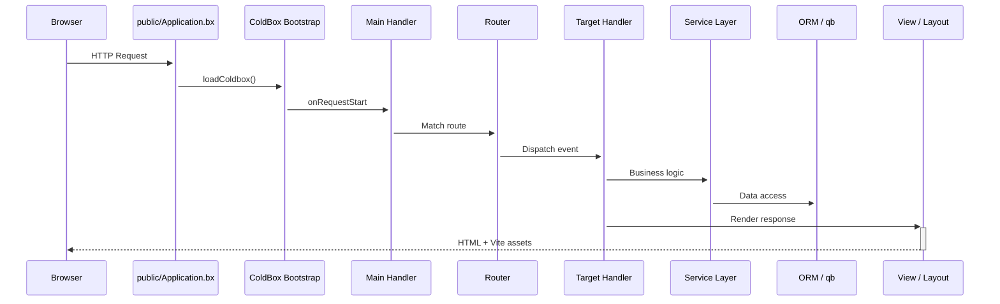

<!--
	This page renders through docs/.theme/home.bxm (the `layout: home` above),
	which hardcodes the whole page and never includes this file's own
	rendered body - everything below is kept, unused, as the starting
	point for reverting to the normal layout.bxm + page.bxm rendering if
	`layout: home` is ever removed.
-->

	
	

		<a class="bxsites-hero__btn bxsites-hero__btn--primary" href="getting-started.md">はじめる</a>
		<a class="bxsites-hero__btn bxsites-hero__btn--secondary" href="https://github.com/coldbox-templates/cbGenesis">GitHub で見る</a>
	

[BoxLang](https://boxlang.io) - モダンでダイナミックな JVM 言語 - 向けの、本番運用可能な **ColdBox HMVC** スターターテンプレートです。認証、SSO、パスキー、ロールベースの権限、API トークン、ダークモード、Alpine を活用した管理パネルが標準搭載されているため、初日から認証のスキャフォールディングではなく機能開発に集中できます。

::: cards
::: card title="数分で始める" icon="phosphor-duotone:rocket-launch" href="getting-started.md"
BoxLang をインストールし、テンプレートをクローンしてマイグレーションを実行すれば、10 分足らずでログイン画面を確認できます。
:::
::: card title="AI 支援開発のために構築" icon="phosphor-duotone:robot" href="ai-native.md"
AGENTS.md、MCP ドキュメントサーバー、そしてカスタムスキルにより、ゼロから始める場合と比較して、AI エージェントでこのコードベース上に構築する際のトークン数を実測ベースで削減します。
:::
::: card title="モダンなテンプレート構造" icon="phosphor-duotone:folders" href="architecture.md"
アプリケーションコードは `app/` に置かれ、公開 Web ルートである `public/` から完全に分離されています - デフォルトでセキュリティが強化されています。
:::
::: card title="認証と RBAC を標準装備" icon="phosphor-duotone:shield-check" href="guides/security.md"
cbauth によるセッション認証、`@secured` ハンドラーアノテーション、CSRF ローテーション、JWT サポート、そして `resource:action` 権限モデル。
:::
::: card title="SSO とパスキー" icon="phosphor-duotone:key" href="guides/security.md#single-sign-on"
Google OAuth プロバイダーとアカウント連携を標準搭載した cbSSO に加え、パスワードレスサインインのための WebAuthn パスキー。
:::
::: card title="Hibernate ORM + qb" icon="phosphor-duotone:database" href="guides/database-orm.md"
cborm 上に構築された `BaseEntity`/`BaseService` の規約、cfmigrations によるマイグレーション、そして生の SQL の方が適している場面のための qb。
:::
::: card title="Alpine.js + Bootstrap 5 UI" icon="phosphor-duotone:palette" href="guides/frontend.md"
サーバーサイドでレンダリングされる BXM ビューに、小さな Alpine コンポーネントを散りばめ、ホットモジュールリロード対応の Vite でコンパイルされます。
:::
::: card title="本格的なテストスイート" icon="phosphor-duotone:test-tube" href="guides/testing.md"
すべてのエンティティとサービスに対する TestBox ユニットスペックに加え、実際の HTTP リクエストを実行する統合スペック。
:::
::: card title="簡単な設定" icon="phosphor-duotone:sliders" href="guides/configuration.md"
基本項目は環境変数で、それ以外は DB に保存された管理設定で管理します - 変更に再デプロイは不要です。
:::
::: card title="本番運用対応" icon="phosphor-duotone:cloud-arrow-up" href="deployment.md"
実践的な本番稼働チェックリスト、Docker サポート、そして CommandBox か BoxLang MiniServer を選択可能です。
:::
:::

## スクリーンショット

管理パネルを最初から最後まで - ログインから監査ログまで:

::: columns
::: column
<figure>
	
	<figcaption>ログイン - デフォルトの <code>AuthSplit</code> レイアウト。</figcaption>
</figure>
:::
::: column
<figure>
	
	<figcaption>ダッシュボード - サインイン後。</figcaption>
</figure>
:::
:::

::: columns
::: column
<figure>
	
	<figcaption>ユーザー - アカウントの検索、招待、管理。</figcaption>
</figure>
:::
::: column
<figure>
	
	<figcaption>ロール - 権限をグループ化し、ユーザーを割り当てます。</figcaption>
</figure>
:::
:::

::: columns
::: column
<figure>
	
	<figcaption>権限 - リソースごとにグループ化された <code>resource:action</code> モデル。</figcaption>
</figure>
:::
::: column
<figure>
	
	<figcaption>設定 - DB に保存された設定、再デプロイ不要。</figcaption>
</figure>
:::
:::

::: columns
::: column
<figure>
	
	<figcaption>プロフィール - アバター、パスキー、API トークン、アカウント設定。</figcaption>
</figure>
:::
::: column
<figure>
	
	<figcaption>監査ログ - すべてのサインイン、サインアウト、アクセス失敗。</figcaption>
</figure>
:::
:::

## 読むだけでなく、実際に見てみる

CBGenesis のリクエストライフサイクル - ブラウザからデータベースへ、そして戻ってくるまで:

::: columns
::: column
!!! tip "規約によるセキュリティ保護"
    すべての管理ハンドラーは `BaseSecureHandler` を継承し、`@secured( "resource:action,resource:admin" )` アノテーションを持ちます。ファイアウォールがこれを強制するため、コントローラー内に手書きの `if` チェックを散らばらせる必要はありません。詳細は [セキュリティと権限](guides/security.md) を参照してください。
:::
::: column
!!! faq "自分のやり方で拡張する"
    新しい CRUD モジュール、新しい設定、新しいスケジュールタスクなど、[CBGenesis の拡張](guides/extending.md) では、既存コードがすでに従っている順序で、実際に変更すべきファイルを一つずつ解説しています。
:::
:::

## 次に読むべきもの

::: cards
::: card title="はじめに" icon="phosphor-duotone:rocket-launch" href="getting-started.md"
インストール、設定、マイグレーション、そしてローカルでのアプリ実行。
:::
::: card title="AI 支援開発のために構築" icon="phosphor-duotone:robot" href="ai-native.md"
エージェントでゼロから認証、RBAC、CSRF を構築するより、ここから始める方が優れている理由 - 実測による比較付き。
:::
::: card title="アーキテクチャ" icon="phosphor-duotone:tree-structure" href="architecture.md"
モダンな app/public 分割、プロジェクトツリー全体、そしてリクエストライフサイクル。
:::
::: card title="ハンドラーとルーティング" icon="phosphor-duotone:signpost" href="guides/handlers-routing.md"
すべてのハンドラー、すべてのルート、そしてそれらを結びつける規約。
:::
::: card title="セキュリティと権限" icon="phosphor-duotone:shield-check" href="guides/security.md"
cbsecurity、cbauth、CSRF、JWT、そして `resource:action` 権限モデル。
:::
::: card title="データベースと ORM" icon="phosphor-duotone:database" href="guides/database-orm.md"
エンティティ、サービス、マイグレーション、シードデータ。
:::
::: card title="フロントエンド" icon="phosphor-duotone:palette" href="guides/frontend.md"
Alpine.js コンポーネント、SCSS 構造、そして Vite パイプライン。
:::
::: card title="アプリの拡張" icon="phosphor-duotone:puzzle-piece" href="guides/extending.md"
CRUD モジュール、権限、設定、またはスケジュールタスクを追加します。
:::
::: card title="デプロイ" icon="phosphor-duotone:cloud-arrow-up" href="deployment.md"
本番ビルド、Docker、BoxLang MiniServer、そして本番稼働チェックリスト。
:::
:::

## BX Sites で構築

このドキュメントサイトは、公式の BoxLang 静的サイトジェネレーターである [BX Sites](https://ortus-boxlang.github.io/bx-sites/) を使用し、デフォルトの `bootstrap` テーマで、このリポジトリの `docs/` フォルダー内の Markdown から直接生成されています。プッシュのたびにどのようにビルド・公開されるかについては、[`.github/workflows/docs.yml`](https://github.com/coldbox-templates/cbGenesis/blob/development/.github/workflows/docs.yml) を参照してください。
