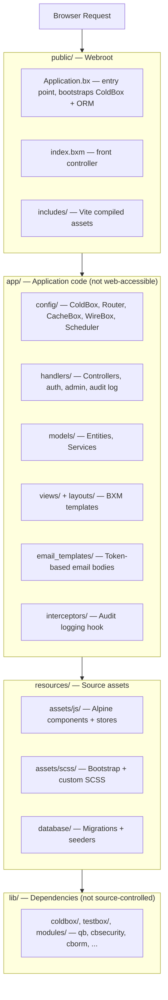
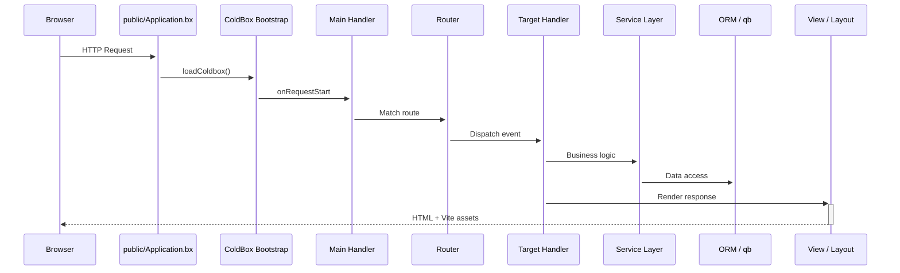

# Arquitetura

O CBGenesis segue a estrutura de **template moderno** do ColdBox: o código da aplicação está totalmente separado da raiz pública, pelo que nada em `app/` é jamais acessível diretamente pela web.

## Visão geral em camadas



!!! note "Porquê esta divisão?"
    Tudo o que um atacante poderia de outra forma navegar diretamente - código-fonte dos handlers, configuração, templates de vistas - simplesmente não reside na raiz pública. `app/Application.bx` é apenas uma proteção `abort;` de uma linha, mantida apenas para que a convenção da framework se mantenha mesmo que um servidor web seja alguma vez mal configurado para servir `app/` diretamente.

## Ciclo de vida do pedido

Todos os pedidos entram através de `public/Application.bx`, que inicializa o ColdBox antes de o entregar ao router e, eventualmente, ao seu handler:



`Main.bx` (`app/handlers/Main.bx`) é o handler de eventos implícitos, ligado em `app/config/Coldbox.bx`:

- `onAppInit` - executa `settingService.preFlightCheck()`, semeando na base de dados quaisquer definições da aplicação em falta
- `onRequestStart` - carrega `prc.settings` e `prc.authUser` em cada pedido
- `onException` - o handler de exceções para toda a aplicação

## Interceptors

`app/config/Coldbox.bx` regista três interceptors da aplicação, por esta ordem:

**`app/interceptors/AuditLogger.bx`** escreve no registo de auditoria em quatro pontos de interceção:

| Ponto | Registado |
|---|---|
| `postAuthentication` | Um início de sessão bem-sucedido |
| `preLogout` | Uma terminação de sessão |
| `cbSecurity_onInvalidAuthentication` | Um pedido que exigia uma sessão e não tinha nenhuma |
| `cbSecurity_onInvalidAuthorization` | Um utilizador autenticado sem a permissão necessária |

**`app/interceptors/RateLimiter.bx`** dispara em `preProcess` - antes do routing, antes de qualquer handler - e limita cinco ações não autenticadas de `Auth` (início de sessão, registo, esquecimento/reposição de palavra-passe, ativação de convite) por IP do cliente. Veja [Limitação de taxa](guides/security.md#rate-limiting) para as definições e como funciona.

**`app/interceptors/SSOAuthorization.bx`** trata o ponto de interceção
`CBSSOAuthorization` do cbSSO. Liga uma identidade de fornecedor verificada
ao modelo de utilizador local, aplica a política de início de sessão versus
ligação de conta, cria utilizadores quando permitido, e cria a sessão cbauth.
Veja [Single sign-on](guides/security.md#single-sign-on) para o fluxo de
callback e a razão pela qual o cbGenesis utiliza um handler personalizado em
vez da integração genérica do cbSSO com cbAuth.

Adicione os seus próprios ao array `variables.interceptors` em `Coldbox.bx`; disparam pela ordem em que são declarados.

## Tarefas agendadas

`app/config/Scheduler.bx` regista três tarefas diárias em segundo plano, cada uma com `onOneServer()` e `withNoOverlaps()`, para que uma implantação com várias instâncias execute cada uma exatamente uma vez:

| Tarefa | Executa às | Elimina | Governada por |
|---|---|---|---|
| Purgar Tokens de API Expirados | `03:00` | Linhas de `user_api_tokens` cujo `expiration` já passou | Duração do token definida no momento da emissão a partir de `cbApiTokenMaxValidityMonths` (predefinição de `12` meses) - veja [Definições da Aplicação](reference/settings.md#password--token-policy) |
| Purgar Tokens de "Lembrar-me" Expirados | `03:15` | Linhas de `user_remember_tokens` cujo `expiration` já passou | Expiração fixa definida no momento em que o token é emitido (`SecurityService`/`RememberTokenService`) |
| Purgar Registos de Auditoria Antigos | `03:30` | Linhas de `audit_logs` mais antigas do que a janela de retenção | `cbAuditLogRetentionDays` (predefinição `90`; `0` desativa a purga) - veja [Definições da Aplicação](reference/settings.md#password--token-policy) |

As três chamam um método `purgeExpiredTokens()`/`purgeOlderThan()` no serviço proprietário, em vez de consultar a tabela diretamente, para que a mesma lógica de purga seja acessível (e testável) fora do scheduler. Adicione uma nova tarefa da mesma forma - veja [Estender a Aplicação](guides/extending.md#adding-a-scheduled-task).

## Árvore completa do projeto

```text title="Project structure" linenums="1"
cbgenesis/
├── app/                      Application code
│   ├── Application.bx        Abort-only gate (prevents direct /app access)
│   ├── config/
│   │   ├── Coldbox.bx        Framework settings, environments, logging
│   │   ├── Router.bx         All application routes
│   │   ├── CacheBox.bx       Cache regions (default, template, sessions, rateLimit)
│   │   ├── WireBox.bx        DI container configuration
│   │   ├── Scheduler.bx      Scheduled tasks
│   │   └── modules/          Per-module settings (cbsecurity, cbauth, cborm, ...)
│   ├── handlers/              Controllers (Auth, Dashboard, Users, Roles, ...)
│   ├── layouts/                Admin, AuthCenter, AuthSplit, Main
│   ├── models/
│   │   ├── BaseEntity.bx      ORM base: timestamps, soft delete, memento
│   │   ├── BaseService.bx     Service base: cborm + qb + cache + validation
│   │   ├── security/            Role, Permission, APIToken, RememberToken,
│   │   │                        Passkey, UserActionToken, SecurityService, ...
│   │   └── system/              User, Setting, AuditLog + their services
│   ├── views/                  BXM templates, one folder per handler
│   │   └── _components/        Reusable UI partials (app, auth, ui)
│   ├── email_templates/       Token-based email body templates
│   ├── helpers/               ApplicationHelper.bxm — global view helpers
│   └── interceptors/           AuditLogger, RateLimiter, SSOAuthorization
├── public/
│   ├── Application.bx         Entry point — ColdBox + ORM bootstrap
│   ├── index.bxm               Front controller placeholder
│   └── includes/               Vite production build output
├── resources/
│   ├── assets/js/              Alpine entry, stores, components
│   ├── assets/scss/            Bootstrap + custom SCSS
│   └── database/
│       ├── migrations/         Schema migrations (cfmigrations)
│       └── seeds/              AdminData seeder
├── tests/
│   ├── specs/integration/      Full HTTP-level specs
│   └── specs/unit/             Entity + service specs
├── lib/                        Dependencies (gitignored, installed by `box install`)
├── runtime/                    BoxLang engine config (boxlang.json)
├── server.json                 CommandBox server config (engine, webroot, aliases)
├── box.json                    Package manifest — deps, scripts
├── package.json                 NPM — Alpine, Bootstrap, Vite, ESLint
├── vite.config.mjs              Vite + coldbox-vite-plugin
└── .env.example                  Environment template
```

## O stack

| Camada | Tecnologia |
|---|---|
| Runtime | BoxLang 1.0+ (JVM) |
| Framework | ColdBox HMVC (bleeding edge) |
| CLI / Servidor | CommandBox + BoxLang MiniServer |
| Injeção de Dependências | WireBox |
| Segurança | cbsecurity + cbauth (baseado em sessão + JWT) |
| Base de Dados | MySQL, MariaDB, PostgreSQL, e MSSQL via Hibernate ORM (cborm); os quatro destinos de base de dados são suportados e cobertos pelo fluxo de trabalho de testes de base de dados do projeto |
| Query Builder | qb (SQL fluente) |
| Migrações | cfmigrations |
| Validação | cbvalidation |
| E-mail | cbmailservices |
| Serialização | mementifier |
| Frontend | Bootstrap 5.3 · Alpine.js 3.x · Vite 6 |
| Ícones | Phosphor Duotone |
| Tooltips | Tippy.js |

::: cards
::: card title="Handlers e Rotas" icon="phosphor-duotone:signpost" href="guides/handlers-routing.md"
Todos os controladores e rotas, e as convenções que os ligam entre si.
:::
::: card title="Base de Dados e ORM" icon="phosphor-duotone:database" href="guides/database-orm.md"
A hierarquia de entidades, as migrações, e o padrão `BaseService`.
:::
::: card title="Segurança e Permissões" icon="phosphor-duotone:shield-check" href="guides/security.md"
Como os handlers `@secured`, o CSRF, e o modelo de permissões se encaixam.
:::
:::
