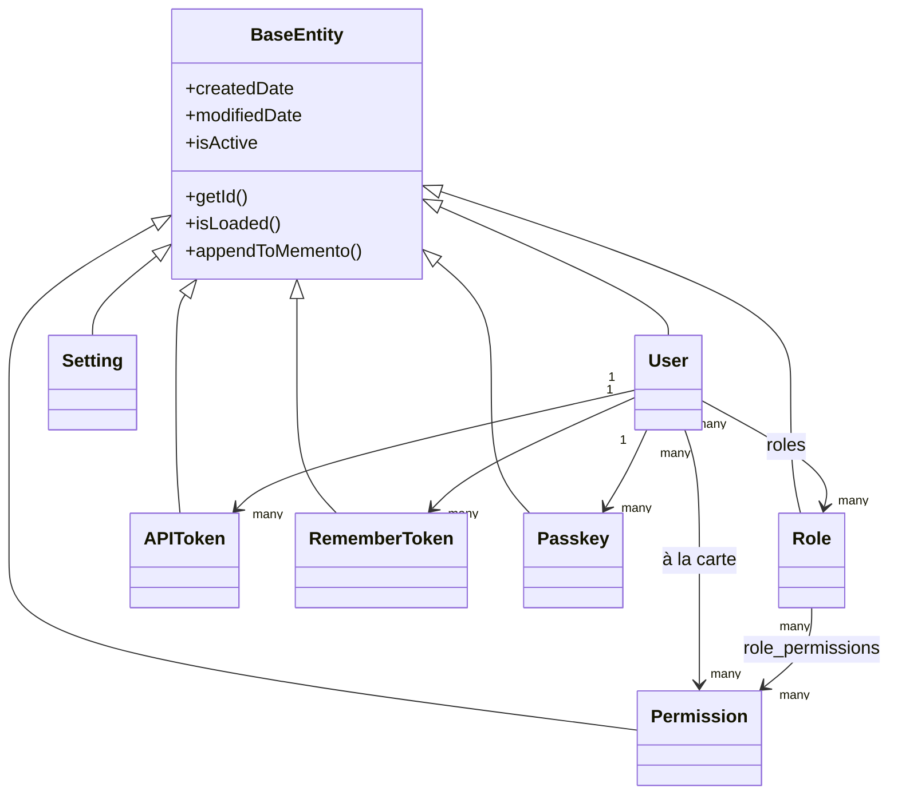

# Base de Dados e ORM

## Hierarquia de entidades

Todas as entidades estendem `BaseEntity` (`@mappedsuperclass`, que por sua vez estende `cborm.models.ActiveEntity`), o que adiciona automaticamente `createdDate`, `modifiedDate`, e um indicador de eliminação suave (`isActive`) a todas as tabelas:



`dbcreate: "none"` (definido em `ormSettings` no `public/Application.bx`) significa que o esquema pertence exclusivamente às migrações — o ORM nunca gera ou altera tabelas automaticamente.

## Padrão da camada de serviços

Todos os serviços estendem `BaseService` (`@singleton`, que estende `cborm.models.VirtualEntityService`), que injeta `qb`, `coldbox`, `wirebox`, e `cachebox:template`, e fornece `ensureSortOrder()`:

```boxlang title="Example service" linenums="1"
component
    extends="BaseService"
    singleton
    threadSafe
{

    property name="qb"    inject="provider:QueryBuilder@qb";
    property name="cache" inject="cachebox:template";

    function list( struct criteria = {} ){
        return newCriteria()
            .when( criteria.search, function( c, term ){
                c.like( "name", "%#term#%" );
            } )
            .list();
    }

}
```

=== "Entidade"
    ```boxlang title="app/models/security/Role.bx" linenums="1"
    /**
     * A role: a named bundle of permissions.
     */
    class extends="app.models.BaseEntity" table="roles" {

        property name="roleId" fieldtype="id" generator="uuid2" ormtype="string";
        property name="name" type="string";

        property name="permissions"
            fieldtype="many-to-many"
            cfc="Permission"
            linktable="role_permissions";

    }
    ```
=== "Serviço"
    ```boxlang title="app/models/security/RoleService.bx" linenums="1"
    component extends="app.models.BaseService" singleton threadSafe {

        function getAllForLookup(){
            return newCriteria().resultTransformer( "distinct" ).list();
        }

    }
    ```

## Migrações

Potenciadas pelo [cfmigrations](https://cfmigrations.ortusbooks.com) através do módulo CLI `commandbox-migrations`, configurado em `.cbmigrations.json` (`migrationsDirectory: resources/database/migrations/`, `seedsDirectory: resources/database/seeds/`, ligação construída a partir das mesmas variáveis de ambiente `DB_*` que o `public/Application.bx`).

```bash frame="terminal" title="Terminal"
box migrate up           # Executa as migrações pendentes
box migrate down         # Reverte o último lote
box migrate reset        # Reverte tudo e depois volta a migrar
box migrate seed run     # Executa os seeders da base de dados
```

As migrações executam-se pela ordem do nome do ficheiro/timestamp:

| Migração | Cria |
|---|---|
| `..._settings.bx` | `settings` (PK GUID, `name` único, `value` longtext) |
| `..._security.bx` | `permissions`, `roles`, `role_permissions` (tabela de junção com PK composta, FKs em cascata) |
| `..._users.bx` | `users` (PK GUID, `email` único, `pendingEmail` opcional para pedidos de alteração de e-mail feitos pelo próprio utilizador, `password` opcional, `preferences` em JSON, booleano `hasAvatar` que indica se o utilizador tem um avatar carregado no disco `assets` do cbfs), mais `user_roles`, `user_permissions`, `user_remember_tokens`, `user_api_tokens`, `user_action_tokens`, `user_passkeys`, `user_sso_identities` — todas as tabelas filhas com FK para `users.userId` com `ON DELETE CASCADE` (veja [Segurança e Permissões](security.md#related-security-services) e [Frontend](frontend.md#avatars-branding-logo)) |
| `..._auditlogs.bx` | `audit_logs`, registos de atividade apenas de acrescento, com severidade/categoria/ação, metadados do ator e do pedido, e índices de consulta |

## Dados de seed

`resources/database/seeds/AdminData.bx`, executado via `box migrate seed run`, cria:

- Uma função **Admin**
- **20 permissões** em cinco recursos (`users`, `roles`, `permissions`, `settings`, `auditlog`), cada uma com `read`/`write`/`delete`/`admin` (`auditlog` utiliza `read`/`export`/`delete`/`admin`) — todas atribuídas à função Admin
- Um utilizador administrador, `admin@cbgenesis.com`, com a função Admin atribuída, semeado como pendente de reposição, para que a palavra-passe de arranque pública tenha de ser substituída no primeiro início de sessão

Veja [Segurança e Permissões](security.md#permission-model) para saber como esses slugs são aplicados ao nível do handler.

::: cards
::: card title="Segurança e Permissões" icon="phosphor-duotone:shield-check" href="security.md"
Como as tabelas `permissions`/`roles` correspondem às verificações `@secured` dos handlers.
:::
::: card title="Estender a Aplicação" icon="phosphor-duotone:puzzle-piece" href="extending.md"
Adicione uma nova entidade, serviço, e migração para o seu próprio domínio.
:::
:::
