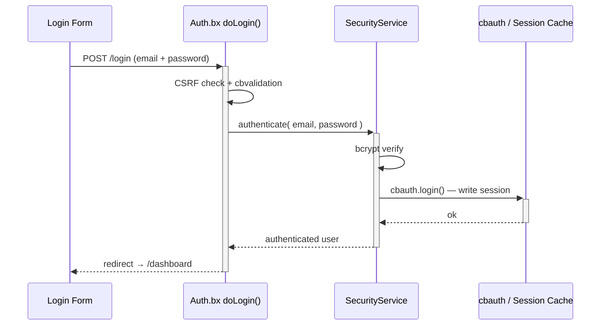
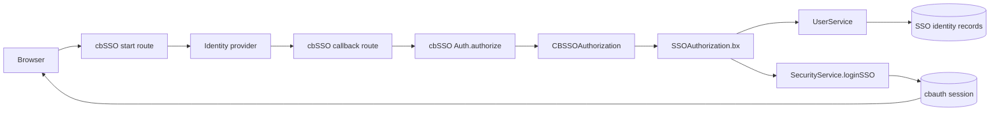
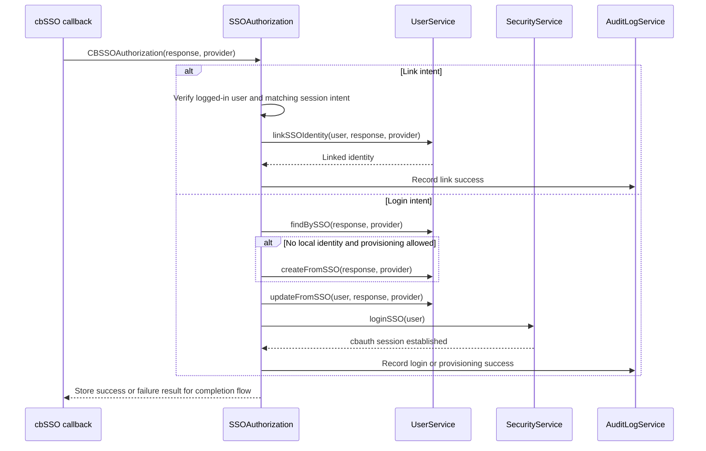

# Segurança e Permissões

## Fluxo de início de sessão



## Layouts de autenticação

O fluxo de autenticação pode utilizar qualquer um dos dois layouts incluídos, através da definição `cbLoginLayout`:

| Valor | Layout | Melhor para |
|---|---|---|
| `AuthSplit` | Painel de destaque com marca à esquerda e o formulário à direita; torna-se compacto em dispositivos móveis. | Aplicações que querem uma experiência de início de sessão de dois painéis, com marca. Esta é a predefinição. |
| `AuthCenter` | Cartão de autenticação centrado, com o logótipo, o formulário, e o rodapé. | Aplicações que preferem uma experiência de início de sessão focada e compacta. |

Escolha **Auth Center** ou **Auth Split** na página `/settings`. O layout selecionado aplica-se ao início de sessão, ao registo, à ativação de convites, e às páginas de recuperação de palavra-passe. Veja [Definições da Aplicação](../reference/settings.md#login-layout-selection) para os ficheiros de layout e as instruções de personalização.

<figure>
	
	<figcaption>O ecrã de início de sessão a utilizar o layout <code>AuthSplit</code> predefinido.</figcaption>
</figure>

## Single sign-on

O cbSSO é ativado através de `app/config/modules/cbsso.bx`. Utiliza o cbauth
como autoridade de sessão, pelo que o início de sessão local por palavra-passe,
as passkeys, e o SSO partilham a mesma sessão e as mesmas regras de
autorização. A página de início de sessão renderiza uma ligação para cada
fornecedor configurado.

O Google é o fornecedor de exemplo incluído. Defina estes valores no `.env`
depois de registar o URL de callback `/cbsso/auth/Google` junto do Google:

```dotenv linenums="1"
GOOGLE_CLIENT_ID=
GOOGLE_CLIENT_SECRET=
GOOGLE_REDIRECT_URI=https://example.com/cbsso/auth/Google
```

### Ativar e desativar o SSO

Não existe uma definição separada `SSO_ENABLED`. O interruptor efetivo do
fornecedor está em [`app/config/modules/cbsso.bx`](../../app/config/modules/cbsso.bx):
o cbGenesis regista o Google apenas quando `GOOGLE_CLIENT_ID`,
`GOOGLE_CLIENT_SECRET`, e `GOOGLE_REDIRECT_URI` estão todos preenchidos. Para
desativar o SSO com o Google, limpe qualquer um desses valores e reinicie ou
reinicialize a aplicação. O fornecedor deixará de aparecer nas páginas de
início de sessão ou de perfil.

Não confunda isto com `enableCBAuthIntegration: false`. Essa definição
desativa o listener genérico e opcional do cbauth do cbSSO; o cbGenesis
utiliza o seu próprio interceptor `SSOAuthorization`, para poder aplicar as
regras locais de ligação de contas, criação de utilizadores,
correspondência de identidade, e auditoria. Veja a documentação do cbSSO
sobre [configuração](https://cbsso.ortusbooks.com/),
[tratamento da resposta do fornecedor de identidade](https://cbsso.ortusbooks.com/usage/handling-the-identity-provider-response.md),
[pontos de interceção](https://cbsso.ortusbooks.com/usage/interception-points.md),
e [integração com o cbauth](https://cbsso.ortusbooks.com/cbauth-integration/enabling-integration.md).

::: stepper
::: step "Preparar a base de dados"
A partir da raiz do projeto, execute a migração de identidades SSO:

```bash linenums="1"
box migrate up
```

Isto cria a tabela `user_sso_identities`, utilizada para ligar uma conta
local ao sujeito de um fornecedor de identidade. Execute isto antes de
tentar o primeiro início de sessão via SSO.
:::

::: step "Criar e configurar o cliente OAuth do Google"
Na [Google Cloud Console](https://console.cloud.google.com/), crie ou
selecione um projeto, configure o ecrã de consentimento OAuth, e crie um
**ID de cliente OAuth** com o tipo de aplicação **Aplicação Web**. Adicione
exatamente este URI de redirecionamento autorizado, utilizando o URL HTTPS
público da sua aplicação:

```text linenums="1"
https://your-domain.example/cbsso/auth/Google
```

Copie o ID de cliente e o segredo de cliente para o ficheiro `.env` local.
O URI de redirecionamento tem de ser o mesmo valor na Google Cloud e em
`GOOGLE_REDIRECT_URI`:

```dotenv linenums="1"
GOOGLE_CLIENT_ID=your-google-client-id
GOOGLE_CLIENT_SECRET=your-google-client-secret
GOOGLE_REDIRECT_URI=https://your-domain.example/cbsso/auth/Google
```

Mantenha as credenciais fora do controlo de versões. O cbGenesis regista o
fornecedor Google apenas quando as três definições `GOOGLE_*` estão
preenchidas, para que a aplicação ainda consiga arrancar antes de o SSO
estar configurado.

A criação automática de contas está desativada por predefinição. Para
permitir novos utilizadores do Google, ative-a explicitamente e restrinja
os domínios de e-mail permitidos:

```dotenv linenums="1"
CBSSO_AUTO_PROVISION=true
CBSSO_ALLOWED_DOMAINS=example.com,example.org
```

Deixe `CBSSO_AUTO_PROVISION=false` quando todos os utilizadores de SSO já
tiverem de ter uma conta local. Esses utilizadores têm de iniciar sessão
localmente e utilizar a ação **Ligar conta Google** do perfil, antes de
poderem iniciar sessão com o Google.
:::

::: step "Iniciar a aplicação e verificar o fluxo"
Inicie a aplicação com o seu comando normal de desenvolvimento ou
implantação, e depois abra `/login` e selecione **Continuar com o Google**.
Confirme que o Google redireciona de volta para `/cbsso/auth/Google` e que a
aplicação o envia para o dashboard.

Para uma conta local já existente, inicie primeiro sessão com a
palavra-passe, abra a página de perfil, e ligue a conta Google. Termine
sessão, volte a `/login`, e verifique que o SSO do Google volta a iniciar
sessão na mesma conta local. Se a criação automática estiver ativada,
verifique que um domínio permitido cria um utilizador local, e que um
domínio fora de `CBSSO_ALLOWED_DOMAINS` é rejeitado.
:::
:::

Após a configuração, as identidades são correspondidas pelo fornecedor e por
um sujeito imutável, nunca apenas pelo e-mail. As contas locais existentes
têm de ser explicitamente ligadas antes de poderem ser utilizadas através de
SSO.

Para implantações SAML em cluster, configure o `samlRequestCacheName` do
cbSSO para uma região distribuída do CacheBox, em vez de utilizar a cache de
repetição em memória predefinida.

### Como o cbSSO se torna numa sessão local

O cbSSO é dono do protocolo do fornecedor e da validação do callback. O
cbGenesis é dono da decisão que se segue: a que conta local pertence a
identidade verificada, se pode ser criada ou ligada, e como se torna numa
sessão autenticada da aplicação.



A aplicação regista `app/interceptors/SSOAuthorization.bx` para o ponto de
interceção documentado do cbSSO, `CBSSOAuthorization`. O payload do callback
contém a resposta verificada do fornecedor e o fornecedor que a tratou. O
interceptor segue então um de dois caminhos pertencentes à aplicação:



### Porque existe este interceptor

O cbSSO também fornece um listener genérico de integração com o `cbAuth`. O
cbGenesis define intencionalmente `enableCBAuthIntegration: false` em
`app/config/modules/cbsso.bx`, porque o listener genérico não consegue
aplicar as regras de identidade e segurança de conta da aplicação. O
interceptor personalizado é responsável por:

- Corresponder identidades pelo fornecedor e por um sujeito imutável, nunca apenas pelo e-mail.
- Exigir uma sessão autenticada e uma intenção correspondente para a ligação de contas.
- Aplicar a política de criação de utilizadores e de domínios permitidos antes de criar utilizadores.
- Manter os percursos de autenticação local por palavra-passe, "lembrar-me", passkey, e SSO sob a mesma autoridade de sessão do cbauth.
- Registar as operações de SSO bem-sucedidas e falhadas no registo de auditoria.

Esta separação é deliberada: o cbSSO verifica *quem o fornecedor diz que o
utilizador é*; o cbGenesis decide *o que essa identidade pode fazer nesta
aplicação*.

Para o contrato a montante e a integração genérica alternativa, veja a
documentação do cbSSO sobre
[pontos de interceção](https://cbsso.ortusbooks.com/usage/interception-points.md),
[tratamento da resposta do fornecedor de identidade](https://cbsso.ortusbooks.com/usage/handling-the-identity-provider-response.md),
e [integração com o cbAuth](https://cbsso.ortusbooks.com/cbauth-integration/enabling-integration.md).

## Camadas de segurança

| Camada | Implementação |
|---|---|
| Autenticação por sessão | cbauth com `CacheStorage@cbStorages` — cache de sessão do lado do servidor |
| Hashing de palavra-passe | bcrypt via `bx-password-encrypt` |
| Política de palavra-passe | `SettingService.isValidPassword()` — `cbMinPasswordLength` mais uma letra maiúscula, uma letra minúscula, um dígito, e um carácter especial. Aplicada no servidor no registo, na ativação de convite, na reposição de palavra-passe, e na alteração de palavra-passe no perfil; o auxiliar Alpine `$passwordMeetsPolicy` espelha-a no browser |
| Proteção CSRF | token rotativo do cbsecurity (30 min); o verificador automático está desativado, e `BaseSecureHandler` verifica em regime de negação por predefinição em todos os métodos HTTP inseguros - veja [Handlers e Rotas](handlers-routing.md#csrf-verification) |
| Segurança dos handlers | anotação `@secured` → a firewall redireciona visitantes não autenticados para `login`, e utilizadores autorizados mas sem permissão para `dashboard.notAuthorized` |
| Suporte a JWT | configurado para acesso via API (HS512, 60 min, armazenamento de tokens em cache) |
| Cabeçalhos de segurança | proteção contra XSS, `frameOptions: SAMEORIGIN`, `referrerPolicy: same-origin` |
| Tokens de API | tokens por utilizador com hash SHA/BCrypt, com expiração e um agendador de purga diário |
| Limitação de taxa | o interceptor `RateLimiter` limita o início de sessão, o registo, e a reposição de palavra-passe por IP - veja [Limitação de taxa](#rate-limiting) abaixo |

## Limitação de taxa

`app/interceptors/RateLimiter.bx` dispara em `preProcess` - antes do routing, antes de qualquer handler ser executado - e limita cinco endpoints não autenticados de `Auth` por IP do cliente:

- `doLogin`, `doRegister`, `doForgotPassword`, `doResetPassword`, `doActivateInvitation`

Quem chama e excede o limite é redirecionado de volta ao formulário com um erro flash; o pedido nunca chega ao handler, pelo que uma palavra-passe correta submetida enquanto bloqueado continua a não iniciar sessão do utilizador.

| Definição | Propósito |
|---|---|
| `cbRateLimitMaxAttempts` | Tentativas permitidas por IP, por endpoint, dentro da janela (predefinição: `5`) |
| `cbRateLimitWindowSeconds` | Duração da janela, em segundos (predefinição: `300`). `0` desativa completamente a limitação de taxa |
| `cbTrustProxyHeaders` | Se o "por IP" em "por IP, por endpoint" vem de `X-Forwarded-For` ou do endereço de socket em bruto (predefinição: `true`) - veja [Implantar atrás de um proxy reverso](../deployment.md#deploying-behind-a-reverse-proxy) |

As três são editáveis em `/settings`, como qualquer outra definição da aplicação - veja [Definições da Aplicação](../reference/settings.md#password--token-policy).

!!! warning "`cbTrustProxyHeaders` é uma decisão de implantação, não uma decisão de código"
    `X-Forwarded-For` é um cabeçalho HTTP simples - qualquer chamador pode defini-lo com o que quiser, a menos que algo à frente da aplicação (um proxy reverso ou load balancer) remova o que o cliente enviou e o defina ele próprio. Se isso é verdade é algo que só a pessoa que implanta a aplicação sabe.

    - **Ativo (predefinição)**: confia em `X-Forwarded-For`/`X-Cluster-Client-IP`, correspondendo a uma implantação típica desta aplicação atrás de um proxy reverso ou load balancer. Se o seu proxy *não* sobrescrever esse cabeçalho (ou se estiver diretamente exposto à internet, sem nada à frente da aplicação), um chamador pode falsificá-lo para obter um novo intervalo de limitação de taxa a cada pedido, e para falsificar o IP registado no registo de auditoria - desative isto nesse caso.
    - **Desativado**: `getRealIP()` utiliza antes o endereço de socket em bruto. Correto quando a aplicação está diretamente exposta à internet, mas se *estiver* atrás de um proxy, todos os chamadores parecem ter o IP do próprio proxy - um "IP" bloqueado bloqueia todos os que estão atrás dele, e cada entrada do registo de auditoria mostra o endereço do proxy em vez do cliente real.

### Como funciona a contagem

`RateLimitService.attempt()` é uma **janela deslizante**: a cada tentativa, permitida ou bloqueada, a expiração da chave é reposta para a janela completa a partir desse momento. Uma chave só arrefece depois de ficar em silêncio durante uma janela inteira - o que mantém o bloqueio enquanto um ataque continuar, em vez de reabrir a meio. Cada endpoint tem o seu próprio contador (indexado por `event:ip`), pelo que esgotar o limite de início de sessão não afeta o registo nem a reposição de palavra-passe.

!!! note "Em memória por predefinição"
    Os contadores residem na região CacheBox `rateLimit` (`app/config/CacheBox.bx`), que é em memória e, por isso, **por instância da aplicação**. Atrás de um load balancer com mais de uma instância, cada instância aplica o seu próprio limite de forma independente - um chamador poderia obter `cbRateLimitMaxAttempts` tentativas grátis por instância, em vez de no total. Para partilhar as contagens entre instâncias, troque o `provider`/`properties` da região `rateLimit` por um fornecedor distribuído do CacheBox (Redis, Couchbase, ou qualquer fornecedor suportado pelo CacheBox) - sem necessidade de alterar código em `RateLimitService` ou `RateLimiter`, já que ambos passam pela região injetada `cachebox:rateLimit`.

## Configuração do `cbsecurity`

`app/config/modules/cbsecurity.bx` é a única fonte de verdade para a firewall:

```boxlang title="app/config/modules/cbsecurity.bx (excerpt)" hl_lines="3 8 9" linenums="1"
{
    authentication : {
        provider          : "authenticationService@cbauth",
        prcUserVariable   : "authUser"
    },
    firewall : {
        autoLoadFirewall         : true,
        validator                 : "CBAuthValidator@cbsecurity",
        handlerAnnotationSecurity : true,
        invalidAuthenticationEvent : "login",
        invalidAuthorizationEvent  : "dashboard.notAuthorized",
        rules                      : [] // authorization is annotation-based, not rule-based
    }
}
```

- **`prcUserVariable: "authUser"`** — o utilizador autenticado está sempre disponível como `prc.authUser` em todos os handlers, vistas, e layouts.
- **`handlerAnnotationSecurity: true`** — é isto que faz com que as anotações `@secured` numa classe ou ação de handler tenham, de facto, algum efeito.
- **`rules: []`** — esta aplicação faz toda a sua autorização através de anotações nos handlers, e não através da lista alternativa de regras por padrão de URL do cbsecurity.

## Modelo de permissões

Cada permissão é um slug na forma `resource:action`, semeado por `resources/database/seeds/AdminData.bx`:

| Recurso | Ações |
|---|---|
| `users` | `read`, `write`, `delete`, `admin` |
| `roles` | `read`, `write`, `delete`, `admin` |
| `permissions` | `read`, `write`, `delete`, `admin` |
| `settings` | `read`, `write`, `delete`, `admin` |
| `auditlog` | `read`, `export`, `delete`, `admin` |

!!! info "`admin` é um superconjunto"
    `admin` significa "administração completa desse recurso" e é sempre combinado com OU juntamente com a ação específica que uma rota exige, pelo que um utilizador com `roles:admin` passa em qualquer verificação `roles:*`, sem precisar também de `roles:read`/`roles:write`/`roles:delete` individualmente. O seeder atribui as 20 permissões incorporadas a uma única função **Admin**, concedida ao utilizador semeado `admin@cbgenesis.com`.

::: columns
::: column
<figure>
	
	<figcaption>A página de administração de Funções.</figcaption>
</figure>
:::
::: column
<figure>
	
	<figcaption>A página de administração de Permissões, agrupada por recurso.</figcaption>
</figure>
:::
:::

**Aplique-a no handler** — esta é a verdadeira fronteira de segurança, resolvida pelo `CBAuthValidator` do cbsecurity contra as permissões do utilizador autenticado:

```boxlang title="app/handlers/Roles.bx" linenums="1"
@secured( "roles:admin,roles:read" )     // class-level: applies to index and any action without its own annotation
class extends="BaseSecureHandler" {

    @secured( "roles:admin,roles:write" )
    function create( event, rc, prc ) { ... }

    @secured( "roles:admin,roles:delete" )
    function delete( event, rc, prc ) { ... }

}
```

Uma lista separada por vírgulas é uma verificação **OU** — basta qualquer uma das permissões listadas.

**Espelhe-a na vista** — apenas para efeitos de UX, *nunca* como a fronteira de segurança por si só. `User.bx` expõe `hasPermission()` em `prc.authUser`, disponível em qualquer vista ou layout renderizado através de um handler protegido:

```html title="Example view guard" linenums="1"
<bx:if prc.authUser.hasPermission( "roles:write,roles:admin" )>
    <button type="button" class="btn btn-primary" @click="openCreate()">New Role</button>
</bx:if>
```

`hasPermission()` aceita uma string, uma lista separada por vírgulas, ou um array, e faz uma verificação OU; `hasAllPermissions()` faz o equivalente com E. Ambas são colocadas em cache por pedido via `getAllPermissions()`, que une as permissões à-la-carte de um utilizador com todas as permissões concedidas através das suas funções. Todas as vistas de administração existentes (navegação da barra lateral, Users/Roles/Permissions/Settings) já seguem este padrão — trate-o como o template para novos módulos protegidos.

Um utilizador que falhe numa verificação `@secured` é redirecionado:

- **Não autenticado** → `login`
- **Autenticado, sem a permissão** → `dashboard.notAuthorized`

## Serviços de segurança relacionados

| Modelo | Propósito |
|---|---|
| `SecurityService` | Envolve o serviço de autenticação do `cbauth`; `login()`/`authenticate()`, gestão do cookie "lembrar-me" com rotação de token, `logout()`, emissão/verificação do token de reposição de palavra-passe (guardado em cache, não na base de dados) |
| `UserService` | `requestEmailChange()`/`confirmEmailChange()`/`cancelEmailChange()` - alteração de e-mail por autoatendimento, controlada por um token de ação `PURPOSE_EMAIL_CHANGE`, para que um novo endereço só seja aplicado depois de o utilizador o confirmar a partir da sua caixa de entrada |
| `APIToken` / `APITokenService` | Tokens de acesso pessoal com hash SHA/BCrypt — `createToken()` devolve o token em bruto exatamente uma vez, `revokeToken()`/`revokeAllForUser()`, `purgeExpiredTokens()` de forma agendada |
| `RememberToken` / `RememberTokenService` | Tokens persistentes de "lembrar-me" no browser, rodados a cada utilização |
| `UserActionToken` / `UserActionTokenService` | Tokens de utilização única e limitados a um propósito — `issue()`, `resolve()`, `consume()`. Cinco propósitos: `PURPOSE_REGISTRATION`, `PURPOSE_INVITATION`, `PURPOSE_PASSWORD_RESET`, `PURPOSE_FORCED_PASSWORD_CHANGE`, `PURPOSE_EMAIL_CHANGE` |
| `Passkey` / `PasskeyService` | Credenciais WebAuthn para início de sessão sem palavra-passe; `cbRequirePasskey` faz com que `BaseSecureHandler` redirecione um utilizador sem nenhuma para `profile/passkey-required` |
| `AuditLog` / `AuditLogService` | O registo de auditoria. O interceptor `AuditLogger` regista automaticamente inícios de sessão, terminações de sessão, e falhas de autenticação/autorização — veja [Arquitetura](../architecture.md#interceptors) |
| `Passkey` / `PasskeyService` | Armazenamento de credenciais WebAuthn através do contrato `ICredentialRepository` do `cbsecurity-passkeys` |

<figure>
	
	<figcaption>A página de administração do Registo de Auditoria, mostrando um início de sessão registado.</figcaption>
</figure>

## Problemas conhecidos

### "This is an invalid domain" ao registar uma passkey

As passkeys estão configuradas para o domínio `localhost` durante o desenvolvimento local. Se abrir a aplicação com um endereço IP como `http://127.0.0.1:8080`, o WebAuthn trata-o como uma origem diferente e rejeita o registo com **"This is an invalid domain."**

Abra antes a aplicação em **[http://localhost:8080](http://localhost:8080)**. As passkeys registadas para uma origem não são intercambiáveis com outra, pelo que deve eliminar e registar novamente a passkey se ela foi criada enquanto utilizava um nome de anfitrião diferente.

::: cards
::: card title="Handlers e Rotas" icon="phosphor-duotone:signpost" href="handlers-routing.md"
Veja cada anotação `@secured` em contexto, handler a handler.
:::
::: card title="Mapa de Rotas" icon="phosphor-duotone:map-trifold" href="../reference/routes.md"
Qual permissão protege qual URL, de relance.
:::
::: card title="Estender a Aplicação" icon="phosphor-duotone:puzzle-piece" href="extending.md"
Adicione uma permissão totalmente nova, e ligue-a através do handler, da vista, e do seeder.
:::
:::
