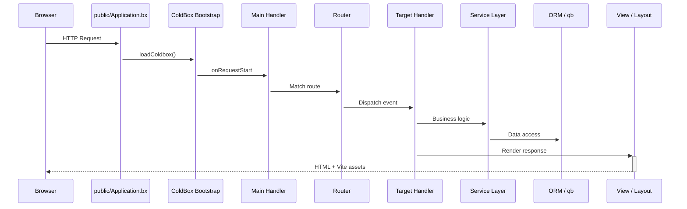

<!--
	This page renders through docs/.theme/home.bxm (the `layout: home` above),
	which hardcodes the whole page and never includes this file's own
	rendered body - everything below is kept, unused, as the starting
	point for reverting to the normal layout.bxm + page.bxm rendering if
	`layout: home` is ever removed.
-->

	
	

		<a class="bxsites-hero__btn bxsites-hero__btn--primary" href="getting-started.md">Começar</a>
		<a class="bxsites-hero__btn bxsites-hero__btn--secondary" href="https://github.com/coldbox-templates/cbGenesis">Ver no GitHub</a>
	

Um template inicial **ColdBox HMVC** pronto para produção para [BoxLang](https://boxlang.io) - a linguagem JVM moderna e dinâmica. Vem equipado com autenticação, SSO, passkeys, permissões baseadas em funções, tokens de API, modo escuro, e um painel de administração potenciado por Alpine, para que passe o primeiro dia a construir funcionalidades em vez de montar a autenticação.

::: cards
::: card title="Comece em Minutos" icon="phosphor-duotone:rocket-launch" href="getting-started.md"
Instale o BoxLang, clone o template, execute as migrações, e esteja a ver o ecrã de início de sessão em menos de dez minutos.
:::
::: card title="Construído para o Desenvolvimento Assistido por IA" icon="phosphor-duotone:robot" href="ai-native.md"
AGENTS.md, servidores de documentação MCP, e skills personalizadas que reduzem, de forma real e mensurável, os tokens gastos ao construir sobre esta base de código com um agente de IA, em comparação com começar do zero.
:::
::: card title="Estrutura de Template Moderna" icon="phosphor-duotone:folders" href="architecture.md"
O código da aplicação reside em `app/`, totalmente separado da raiz pública em `public/` - segurança reforçada por predefinição.
:::
::: card title="Autenticação e RBAC, Tudo Incluído" icon="phosphor-duotone:shield-check" href="guides/security.md"
Autenticação por sessão via cbauth, anotações `@secured` nos handlers, rotação de CSRF, suporte a JWT, e um modelo de permissões `resource:action`.
:::
::: card title="SSO e Passkeys" icon="phosphor-duotone:key" href="guides/security.md#single-sign-on"
cbSSO com um fornecedor OAuth do Google já incluído e ligação de contas, além de passkeys WebAuthn para início de sessão sem palavra-passe.
:::
::: card title="Hibernate ORM + qb" icon="phosphor-duotone:database" href="guides/database-orm.md"
Convenções `BaseEntity`/`BaseService` sobre o cborm, migrações via cfmigrations, e qb para tudo aquilo que o SQL em bruto faz melhor.
:::
::: card title="UI com Alpine.js + Bootstrap 5" icon="phosphor-duotone:palette" href="guides/frontend.md"
Vistas BXM renderizadas no servidor, complementadas com pequenos componentes Alpine, compiladas pelo Vite com recarregamento por hot module reload.
:::
::: card title="Um Conjunto de Testes a Sério" icon="phosphor-duotone:test-tube" href="guides/testing.md"
Specs unitárias em TestBox para cada entidade e serviço, além de specs de integração que exercitam pedidos HTTP reais.
:::
::: card title="Configuração Simples" icon="phosphor-duotone:sliders" href="guides/configuration.md"
Variáveis de ambiente para o essencial, definições de administração guardadas na base de dados para tudo o resto - sem necessidade de nova implantação para as alterar.
:::
::: card title="Pronto para Produção" icon="phosphor-duotone:cloud-arrow-up" href="deployment.md"
Uma checklist real para o lançamento em produção, suporte a Docker, e a escolha entre o CommandBox ou o BoxLang MiniServer.
:::
:::

## Capturas de ecrã

O painel de administração, de ponta a ponta - do início de sessão ao registo de auditoria:

::: columns
::: column
<figure>
	
	<figcaption>Início de sessão - o layout <code>AuthSplit</code> predefinido.</figcaption>
</figure>
:::
::: column
<figure>
	
	<figcaption>Dashboard - após iniciar sessão.</figcaption>
</figure>
:::
:::

::: columns
::: column
<figure>
	
	<figcaption>Users - pesquisar, convidar, e gerir contas.</figcaption>
</figure>
:::
::: column
<figure>
	
	<figcaption>Roles - agrupar permissões e atribuí-las a utilizadores.</figcaption>
</figure>
:::
:::

::: columns
::: column
<figure>
	
	<figcaption>Permissions - o modelo <code>resource:action</code>, agrupado por recurso.</figcaption>
</figure>
:::
::: column
<figure>
	
	<figcaption>Settings - configuração guardada na base de dados, sem necessidade de nova implantação.</figcaption>
</figure>
:::
:::

::: columns
::: column
<figure>
	
	<figcaption>Profile - avatar, passkeys, tokens de API, e definições de conta.</figcaption>
</figure>
:::
::: column
<figure>
	
	<figcaption>Audit Log - todos os inícios de sessão, terminações de sessão, e falhas de acesso.</figcaption>
</figure>
:::
:::

## Veja, não se limite a ler sobre isto

O ciclo de vida de um pedido no CBGenesis, do browser à base de dados e de volta:

::: columns
::: column
!!! tip "Protegido por convenção"
    Todos os handlers de administração estendem `BaseSecureHandler` e têm uma anotação `@secured( "resource:action,resource:admin" )`. É a firewall que a aplica - sem verificações `if` feitas à mão espalhadas pelos seus controladores. Veja [Segurança e Permissões](guides/security.md).
:::
::: column
!!! faq "Cresça à sua maneira"
    Novo módulo CRUD? Nova definição? Nova tarefa agendada? [Estender o CBGenesis](guides/extending.md) percorre exatamente os ficheiros a alterar, pela mesma ordem que o código já existente já segue.
:::
:::

## Para onde ir a seguir

::: cards
::: card title="Primeiros Passos" icon="phosphor-duotone:rocket-launch" href="getting-started.md"
Instale, configure, migre, e execute a aplicação localmente.
:::
::: card title="Construído para o Desenvolvimento Assistido por IA" icon="phosphor-duotone:robot" href="ai-native.md"
Por que começar aqui é melhor do que construir autenticação, RBAC, e CSRF do zero com um agente - com uma comparação medida.
:::
::: card title="Arquitetura" icon="phosphor-duotone:tree-structure" href="architecture.md"
A divisão moderna entre app/public, a árvore completa do projeto, e o ciclo de vida do pedido.
:::
::: card title="Handlers e Rotas" icon="phosphor-duotone:signpost" href="guides/handlers-routing.md"
Todos os handlers, todas as rotas, e as convenções que os ligam entre si.
:::
::: card title="Segurança e Permissões" icon="phosphor-duotone:shield-check" href="guides/security.md"
cbsecurity, cbauth, CSRF, JWT, e o modelo de permissões `resource:action`.
:::
::: card title="Base de Dados e ORM" icon="phosphor-duotone:database" href="guides/database-orm.md"
Entidades, serviços, migrações, e dados de seed.
:::
::: card title="Frontend" icon="phosphor-duotone:palette" href="guides/frontend.md"
Componentes Alpine.js, estrutura SCSS, e o pipeline do Vite.
:::
::: card title="Estender a Aplicação" icon="phosphor-duotone:puzzle-piece" href="guides/extending.md"
Adicione um módulo CRUD, uma permissão, uma definição, ou uma tarefa agendada.
:::
::: card title="Implantação" icon="phosphor-duotone:cloud-arrow-up" href="deployment.md"
Build de produção, Docker, BoxLang MiniServer, e uma checklist de lançamento.
:::
:::

## Construído com o BX Sites

Este site de documentação é gerado com o [BX Sites](https://ortus-boxlang.github.io/bx-sites/) - o gerador de sites estáticos oficial do BoxLang - diretamente a partir do Markdown na pasta `docs/` deste repositório, utilizando o tema `bootstrap` predefinido. Veja [`.github/workflows/docs.yml`](https://github.com/coldbox-templates/cbGenesis/blob/development/.github/workflows/docs.yml) para saber como é construído e publicado a cada push.
