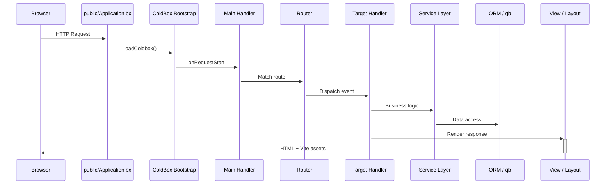

# ⚡ CB Genesis

A production-ready **ColdBox HMVC** starter template for [BoxLang](https://boxlang.io) - the modern, dynamic JVM language. It ships with authentication, role-based permissions, API tokens, dark mode, and an Alpine-powered admin panel, so you spend your first day building features instead of scaffolding auth.

::: cards
::: card title="Get Started in Minutes" icon="phosphor-duotone:rocket-launch" href="getting-started.md"
Install BoxLang, clone the template, run migrations, and be looking at the login screen in under ten minutes.
:::
::: card title="Modern Template Structure" icon="phosphor-duotone:folders" href="architecture.md"
Application code lives in `app/`, fully separated from the public webroot in `public/` - enhanced security by default.
:::
::: card title="Auth & RBAC, Batteries Included" icon="phosphor-duotone:shield-check" href="guides/security.md"
Session auth via cbauth, `@secured` handler annotations, CSRF rotation, JWT support, and a `resource:action` permission model.
:::
::: card title="Hibernate ORM + qb" icon="phosphor-duotone:database" href="guides/database-orm.md"
`BaseEntity`/`BaseService` conventions on top of cborm, migrations via cfmigrations, and qb for anything raw SQL does better.
:::
::: card title="Alpine.js + Bootstrap 5 UI" icon="phosphor-duotone:palette" href="guides/frontend.md"
Server-rendered BXM views, sprinkled with small Alpine components, compiled by Vite with hot module reload.
:::
::: card title="A Real Test Suite" icon="phosphor-duotone:test-tube" href="guides/testing.md"
TestBox unit specs for every entity and service, plus integration specs that exercise real HTTP requests.
:::
:::

## See it, don't just read about it

CB Genesis's request lifecycle, from browser to database and back:

::: columns
::: column
!!! tip "Secured by convention"
    Every admin handler extends `BaseSecureHandler` and carries a `@secured( "resource:action,resource:admin" )` annotation. The firewall enforces it - no hand-rolled `if` checks scattered through your controllers. See [Security & Permissions](guides/security.md).
:::
::: column
!!! faq "Grow it your way"
    New CRUD module? New setting? New scheduled task? [Extending CB Genesis](guides/extending.md) walks through the exact files to touch, in the order the existing code already follows.
:::
:::

## Where to go next

::: cards
::: card title="Getting Started" icon="phosphor-duotone:rocket-launch" href="getting-started.md"
Install, configure, migrate, and run the app locally.
:::
::: card title="Architecture" icon="phosphor-duotone:tree-structure" href="architecture.md"
The modern app/public split, the full project tree, and the request lifecycle.
:::
::: card title="Handlers & Routing" icon="phosphor-duotone:signpost" href="guides/handlers-routing.md"
Every handler, every route, and the conventions tying them together.
:::
::: card title="Security & Permissions" icon="phosphor-duotone:shield-check" href="guides/security.md"
cbsecurity, cbauth, CSRF, JWT, and the `resource:action` permission model.
:::
::: card title="Database & ORM" icon="phosphor-duotone:database" href="guides/database-orm.md"
Entities, services, migrations, and seed data.
:::
::: card title="Frontend" icon="phosphor-duotone:palette" href="guides/frontend.md"
Alpine.js components, SCSS structure, and the Vite pipeline.
:::
::: card title="Extending the App" icon="phosphor-duotone:puzzle-piece" href="guides/extending.md"
Add a CRUD module, a permission, a setting, or a scheduled task.
:::
::: card title="Deployment" icon="phosphor-duotone:cloud-arrow-up" href="deployment.md"
Production build, Docker, BoxLang MiniServer, and a go-live checklist.
:::
:::

## Built with BX Sites

This documentation site is generated with [BX Sites](https://ortus-boxlang.github.io/bx-sites/) - the official BoxLang static site generator - straight from the Markdown in this repository's `docs/` folder, using the default `bootstrap` theme. See [`.github/workflows/docs.yml`](https://github.com/coldbox-templates/cbGenesis/blob/development/.github/workflows/docs.yml) for how it's built and published on every push.
